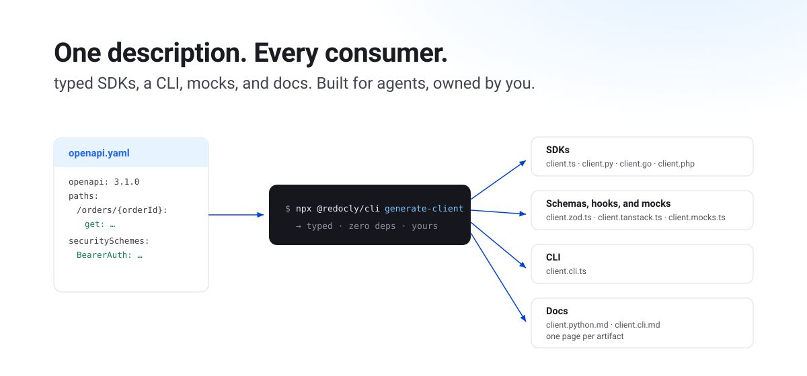

# Open-source, agent-friendly SDKs and tooling from OpenAPI description

As agents become part of engineering teams, more of your API calls are written by one.
Agents hallucinate endpoints, invent response fields, and hand-write API code you then review line by line.
Generated code is the cheapest, safest code an agent can ship, so we built a generator that treats the agent as a first-class user.



Meet `generate-client`: a new command in the [Redocly CLI](https://github.com/Redocly/redocly-cli), powered by a new package, [`@redocly/client-generator`](https://github.com/Redocly/redocly-cli/tree/main/packages/client-generator), that turns one OpenAPI description into typed SDKs in **TypeScript, Python, Go, and PHP**, plus validation schemas, TanStack Query and SWR hooks, test mocks, a ready-to-run **command-line interface**, and reference docs for all of it.
Both the command and the package are open source (MIT), and everything they generate is yours outright.

The SDKs are fully featured with **zero runtime dependencies**: auth, retries, middleware, pagination iterators, typed Server-Sent Events, query-string serialization, and multipart uploads, all built on web-standard `fetch`, `AbortController`, and `URLSearchParams`, emitted as code that imports nothing.
The API code your agent used to hallucinate becomes one deterministic command, and the compiler becomes its fact-checker: operation ids, parameters, and response fields are literal types, so a wrong call fails `tsc` with the exact operation named.

## Up and running in three steps

### 1. Start from your API description

The one you already have: OpenAPI 3.0, 3.1, 3.2, or Swagger 2.0.

```yaml
paths:
  /menu-items:
    get:
      operationId: listMenuItems
      parameters:
        - name: limit
          in: query
          schema:
            type: integer
  /orders/{orderId}:
    get:
      operationId: getOrderById
      security:
        - BearerAuth: []
      parameters:
        - name: orderId
          in: path
          required: true
          schema:
            type: string
components:
  securitySchemes:
    BearerAuth:
      type: http
      scheme: bearer
```

### 2. Run one command

No account, no config file — every option has a default.
Customize with flags or a `redocly.yaml` `client` block when you need to.

```bash
npx @redocly/cli@latest generate-client openapi.yaml --output src/client.ts
```

### 3. Call your API

Every operation is a typed function; every name comes from the description.

```typescript
import { configure, listMenuItems, getOrderById } from './client.js';

configure({ auth: { bearer: token } }); // sent only where an operation requires it

const menu  = await listMenuItems({ query: { limit: 10 } });
const order = await getOrderById({ path: { orderId: 'ord_01khr…' } });
```

That's the whole client.

> One description. One command. Every time your API changes.

## The features you'd otherwise hand-write

Types are a third of the problem.
The behavior is what teams hand-write around generated types, and where drift starts.
The generated client includes it:

- **Auth from your `securitySchemes`**: bearer, basic, and API keys in header, query, or cookie, each sent only where an operation's `security` requires it. Credentials can be async token providers, resolved on every request, so refresh flows need no extra code. Every client instance carries its own.
- **Pagination**: declare your pagination convention once (cursor, offset, page, or `Link` header) and the iterators appear on the operation itself: `listOrders.pages()`, `listOrders.items()`, typed, abortable, with duplicate-cursor loop detection. Delete your pagination loops.
- **Opt-in, abort-aware retries**: exponential backoff, jitter, `Retry-After`, idempotent-only by default, and a custom `retryOn` predicate.
- **Typed Server-Sent Events**: an operation whose `2xx` is `text/event-stream` becomes a typed async iterator with automatic reconnection, payloads typed from OpenAPI 3.2's `itemSchema`.
- **Composable middleware**: `onRequest`, `onResponse`, and `onError`, with operation ids, paths, and tags visible to it as literal types.
- **The fiddly details, handled**: query parameters serialized exactly as the description declares, file uploads from a plain typed object, per-request timeouts, and idempotency keys that make retries safe.
- **Two error models**: exceptions by default, or a typed `{ data, error }` result if you prefer returns over throws.

And it's strict on your behalf: a call with an argument the operation doesn't declare fails before the request leaves the process, with an error that names the operation and says where the argument belongs.

It reads OpenAPI **3.0, 3.1, and 3.2**, plus **Swagger 2.0** (normalized to 3.x before generation).

## Skills first

Every part of this tool assumes an agent will operate it, and each of those decisions helps the humans just as much:

- **The design ships as agent skills.** A skill is a short instruction file that AI agents (such as Claude Code) load before touching related code: it states what a piece of code is for, the rules it must follow, and how to change it safely. Every generator carries its own design document as a skill, and ejecting a generator drops both into your repo beside the generator source:

  ```text
  redocly eject-generator zod

  generators/zod/…                           # the generator source, now yours
  generators/AGENTS.md                       # pointer that leads agents to the skills
  .claude/skills/client-generators/SKILL.md  # the shared authoring guide
  .claude/skills/zod-generator/SKILL.md      # why this generator is built the way it is
  ```

  An agent asked to change generated output loads the rules first and edits the generator, not the output.
- **A discoverable surface instead of prose.** The generated CLI answers `--help` with its commands and `schema <command>` with one operation's whole contract as JSON: method, path, parameters with types, request and response schemas. An agent learns a real API in two commands.
- **Feedback an agent can act on.** Strict types plus runtime unknown-argument errors name the operation and say where the argument belongs.
- **Deterministic ground truth.** The generated mocks are seeded and offline, so tests an agent writes reproduce exactly, with no live API in the loop teaching it wrong lessons.
- **Regeneration over hand-editing.** The client is machine-owned and rebuilt from the description; the generator is human-owned and ejectable. That split tells an agent exactly which file it is allowed to change.

The whole instruction your agents need is one sentence: _never hand-write HTTP code for our APIs - regenerate the client and import the functions, and a wrong call fails the build._

## One description, every consumer

The vocabulary is simple: you select **generators** in one list, each generator emits an **artifact**, and each artifact serves a different consumer of your API.
The SDK is one kind of artifact; here is the whole list, produced from one parse of your description in one command:

| Generator | Artifact | Consumer |
| --- | --- | --- |
| `typescript` (default), `python`, `go`, `php` | the full typed client, in that language | calling your API from any stack |
| `zod` | Zod schemas + validation middleware | runtime contract checks |
| `tanstack-query`, `swr` | query and mutation factories, hooks | React, Vue, Svelte, Solid data fetching |
| `mock` | MSW v2 handlers + typed data factories | tests and demos, offline and deterministic |
| `transformers` | `Date` converters | ISO strings → `Date`, paired with `--date-type Date` |
| `cli` | a bin-ready command-line interface | scripts, CI, agents |
| your own | anything | the long tail |

Every language SDK carries the same behavior, each as a single self-contained file: `httpx` for Python, the standard library for Go, the curl extension for PHP.
And names resolve once: `listOrders` is the operation in the description, the function in every SDK, and the CLI command, so one identifier greps across your whole stack.

Docs are one flag: add `--docs` and every selected generator writes a reference page beside its output.
The docs regenerate with the code, so they cannot drift from it.

## And if you disagree with a built-in, take it

When a tool gets something wrong for you, the traditional move is to fork it, and a fork is a life sentence: you maintain the whole project from that day on, and upstream fixes stop reaching you.
Eject gives you the ownership without the fork:

```bash
npx @redocly/cli@latest eject-generator python
```

That copies the built-in generator into your repository as **TypeScript source you own**: a folder with one readable file per stage (naming, types, models, operations, pagination, client).
It wires your config to it, and, unmodified, it produces byte-identical output.
We verify that byte-identity in our test suite.
Later versions merge into your copy file by file with `--update`.
The generator's design document arrives with it as an **agent skill in your repo**, and the skill is yours to manage: edit it to state your house rules (naming, headers, error style, whatever the built-in got wrong for you), and your AI agent reads the skill first and changes the ejected generator to match.
You maintain a short design document; the agent maintains the code to it.

## Yours to shape

- **Call style**: grouped inputs by default; `--args-style flat` merges them into one object when an operation's inputs can't collide.
- **Output layout**: one `single` file (default), or `split` with schema types in a sibling module.
- **Runtime placement**: inlined into the client by default for a truly single-file artifact, or `--runtime module` to write the runtime as real, readable files beside it, shared between clients.
- **No build step, if you want none**: with `--import-ext ts`, the generated client, the zod module, and the CLI run as they are under plain Node 22.18+, which strips the types itself.
- **Configuration**: CLI flags or a `client` block in `redocly.yaml`, with per-API overrides for monorepos that generate several clients from one config.

## Proven on ourselves first

We didn't design this in the abstract: Redocly's own platform runs on this generator: four internal APIs, hundreds of operations, an in-house codegen deleted in the process, and much of the migration executed by an AI agent working against the generated client.
That migration found real bugs our tests had missed, and it's the subject of the next post.

A quick caveat: the command is still experimental, so flags and output may change between releases — pin your CLI version.
The code it generates is strict-TypeScript clean, exhaustively tested, and already carrying Redocly's production traffic.

## Try it

One command, no account, runs entirely on your machine:

```bash
npx @redocly/cli@latest generate-client openapi.yaml --output src/client.ts
```

Then import a function and call your API.
The whole client is in the file you just generated.

- [Command reference](/docs/cli/commands/generate-client)
- [Write a custom generator](/docs/cli/guides/customize-client-generation)
- [Runnable examples](https://github.com/Redocly/redocly-cli/tree/main/tests/e2e/generate-client/examples)
- [GitHub](https://github.com/Redocly/redocly-cli)
