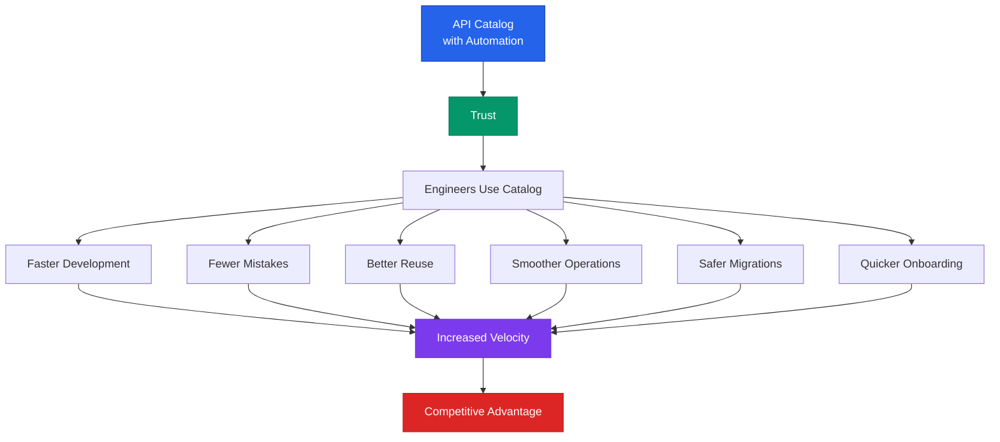

# The unseen economics of an API catalog

_Why modern engineering organizations can't operate without one._

Engineering systems grow faster than most teams realize.
A few services become a few dozen.
A handful of APIs become hundreds.
Pipelines, domains, data assets, dashboards, configs, and repos proliferate until one day someone asks a simple question.

**"Where do I find the truth about how our system actually works?"**

That question is the gateway to understanding the true value of an API catalog—not just as a developer convenience, but as a foundational asset that quietly determines how efficiently a company can build, maintain, and evolve its software.
And the value isn't abstract.
It's measurable in time, money, and engineering capacity.

## The reality: Your system is larger than you think

In a modern organization, it's common to have tens of thousands of interconnected entities.
APIs.
Services.
Functions.
Queues and topics.
Environments.
Data assets.
Repositories.
Configurations.
Dashboards.
Domains.
Add all of these together and it's not unusual to cross **50,000–100,000 catalogable items**.
At that scale, answering basic questions becomes surprisingly expensive.

Consider a typical mid-size engineering organization: 200 engineers, 50 microservices, 300 APIs, 500 repositories, and thousands of supporting infrastructure components.
Each entity has relationships—dependencies, consumers, owners, versions, lifecycle stages.
The combinatorial complexity explodes.
A single service might depend on 20 other services, consume 5 APIs, write to 3 databases, and be monitored by 10 dashboards.
Multiply that across the entire system, and you're dealing with hundreds of thousands of relationships.

At that scale, answering basic questions becomes surprisingly expensive:

- What does this service depend on?
- Who owns this API?
- Which version is safe to use?
- What breaks if we change this?
- Has this been deprecated?
- Is someone already building what we're about to build?

When the answers are scattered or stale, the organization pays for it in ways that compound deeply over time.
A developer spends 30 minutes searching for the right API endpoint.
A team builds a duplicate service because they didn't know one already existed.
An incident takes 4 hours instead of 30 minutes because dependencies weren't clear.
A migration breaks production because the impact analysis was incomplete.

These aren't isolated incidents.
They're systemic costs that scale with system complexity.

## Where the value comes from

The value of an API catalog isn't theoretical—it manifests in five concrete ways that directly impact engineering velocity, cost, and risk.

### Eliminating search hours

Developers spend more time searching than most leaders imagine.
Slack threads.
Tribal knowledge hunts.
Old Confluence pages.
Code spelunking.
"Let me check with that team" messages.
A trustworthy catalog collapses this waste.

Here's the math that makes this compelling: In a 500-engineer organization, if each engineer saves just **20–40 minutes per week** searching for APIs, services, or dependencies, that's:
- **167–333 hours per week** of recovered engineering time
- **8,700–17,300 hours per year**
- At $150/hour fully loaded cost: **$1.3M–$2.6M per year** in recovered capacity

But the real cost is often higher.
Without a catalog, developers don't just search—they make assumptions.
They use deprecated APIs.
They build on unstable services.
They create duplicate functionality.
They miss optimization opportunities.

A well-maintained catalog doesn't just save search time.
It prevents entire classes of mistakes.

### Preventing mistakes caused by outdated information

When ownership, lifecycle, and dependencies aren't clear, work gets duplicated.
Wrong services get extended.
Incidents take longer to resolve.
Migrations break things they shouldn't.

Consider a real scenario: A team needs to add a new feature that requires user authentication.
They find an API endpoint in the codebase that seems to do what they need.
They integrate it.
Three weeks later, production breaks.
The API was deprecated six months ago, but there was no clear signal.
The team that owned it had moved on.
The documentation was outdated.
Now there's a production incident, a rollback, and a scramble to find the correct replacement API.

Every stale or inaccurate entry carries a cost, often **0.5–2 hours of rework per instance**.
But the real cost is often much higher when mistakes cascade:
- A deprecated API integration causes a production incident: **4–8 hours** of emergency response
- Duplicate service development: **40–80 hours** of wasted engineering time
- Wrong dependency assumption breaks a migration: **16–32 hours** of rollback and fix

Multiply that by thousands of entities and the math becomes compelling quickly.
In organizations with 10,000+ catalogable items, even a 1% error rate means 100+ mistakes per year.
At an average of 2 hours per mistake, that's **200+ hours**—or roughly **$30,000+ per year** in preventable rework.
And that's conservative.

### Enabling faster onboarding and cross-team work

A clear system map reduces onboarding time dramatically.
New engineers no longer need months to decode the architecture or figure out "who owns what."

Without a catalog, onboarding a new engineer typically follows this pattern:
- Week 1–2: Reading documentation (often outdated)
- Week 3–4: Code spelunking to understand dependencies
- Week 5–8: Building mental models through trial and error
- Week 9–12: Finally productive on meaningful work

With a trustworthy catalog, that timeline compresses:
- Week 1: Explore the catalog, understand system boundaries
- Week 2: Identify relevant services and APIs for their domain
- Week 3: Start contributing to real work

The difference: **6–9 weeks of productivity recovered per new hire**.
For a team hiring 20 engineers per year, that's **120–180 weeks** of additional productivity—roughly **2.5–3.5 full-time engineers** worth of capacity.

Cross-team features become smoother because the catalog shows exactly which teams and components are involved.
Instead of scheduling meetings to figure out "who owns what," teams can immediately see:
- Which services need to be modified
- Which APIs will be affected
- Which teams need to be consulted
- What dependencies exist that might complicate the change

This reduces coordination overhead by **30–50%** for cross-team initiatives.

### Providing dependency and usage intelligence

A catalog with real relationships unlocks a different level of insight.
Where bottlenecks and single points of failure are.
Which services are safe to reuse.
What depends on what before a change is made.
Which components are unused and ready for sunsetting.

This isn't just documentation.
It's **risk reduction** and **faster architectural decision-making**.

Consider the impact on architectural decisions:

**Before a catalog:** A team wants to deprecate an old service.
They ask around.
They check Slack history.
They look at code.
They're 80% confident it's safe.
They deprecate it.
Two weeks later, a critical production system breaks.
The service was still being used by a team in a different timezone, and the dependency wasn't obvious.

**With a catalog:** The team opens the catalog.
They see the service has 12 direct dependencies and 47 transitive dependencies.
They see exactly which teams own those dependent services.
They can plan a proper deprecation timeline, notify the right people, and execute safely.

The catalog also reveals optimization opportunities:
- Services with high fan-out (many dependencies) that represent single points of failure
- APIs with low usage that are candidates for consolidation
- Unused services consuming infrastructure costs
- Circular dependencies that create technical debt

This intelligence enables proactive architectural improvements rather than reactive firefighting.

### Enabling governance without friction

Compliance, maturity scorecards, API quality rules, and architectural guidelines become much easier when the catalog already knows key metadata.
Who owns each component.
The domain it belongs to.
Its lifecycle stage.
Its usage.
Its dependencies.

Instead of "go update this spreadsheet," governance becomes continuous and nearly invisible.

Traditional governance models rely on manual processes:
- Quarterly reviews where teams update spreadsheets
- Compliance audits that require weeks of preparation
- Architectural reviews that happen after decisions are made
- Quality checks that catch problems in production

An automated catalog flips this model:
- Ownership is automatically tracked from source control
- Lifecycle stages are updated as services evolve
- Usage metrics are continuously collected
- Dependencies are discovered and mapped automatically
- Quality rules are evaluated against real-time data

This enables governance that's:
- **Proactive:** Issues are identified before they become problems
- **Continuous:** Evaluation happens automatically, not quarterly
- **Accurate:** Data comes from systems of record, not memory
- **Scalable:** Works the same way for 100 services or 10,000

The result: Governance that actually improves outcomes rather than creating bureaucratic overhead.

## The critical ingredient: Automation

A catalog that depends on humans to update it will fail.
Slowly and then suddenly.
Manual upkeep doesn't scale.

Even **5 minutes** of annual review per entity means 100,000 entities × 5 minutes = **8,333 hours**, which is roughly **4 full-time engineers**, or **$700k+ per year** for bare-minimum freshness.
With realistic upkeep (15–30 minutes annually), that number rises to **$2–5M per year**.

This is the hidden cost almost every organization silently pays.
But the real cost is even higher when you consider what happens when catalogs go stale:

**The stale catalog death spiral:**
1. Catalog starts with good intentions and manual updates
2. Updates slow down as teams get busy
3. Engineers notice inaccuracies
4. Trust erodes
5. Engineers stop using the catalog
6. Catalog becomes even more outdated
7. Eventually, it's abandoned entirely

At this point, you've not only wasted the initial investment—you've also lost the opportunity to capture value.

Automation—pulling entities and relationships from systems of record—turns a catalog from a documentation project into a living, continuously accurate map.

Automation means:
- **Discovery:** Services, APIs, and infrastructure are automatically discovered from source control, registries, and cloud providers
- **Relationship mapping:** Dependencies are inferred from code analysis, API calls, and infrastructure configurations
- **Metadata enrichment:** Ownership, domains, and lifecycle stages are pulled from existing systems
- **Usage tracking:** Real-time metrics show which APIs are being used and by whom
- **Change detection:** The catalog updates automatically as systems evolve

This isn't just about reducing manual work—it's about creating a system that gets more valuable over time, not less.

It also unlocks the highest-leverage value: **trust**.
When engineers trust the catalog, they use it.
When they use it, the ROI compounds across faster development, fewer mistakes, better reuse, smoother operations, safer migrations, and quicker onboarding.

Trust is the multiplier.
Automation is what makes trust possible.

Without automation, a catalog is a liability.
With automation, it's a competitive advantage.

## The compounding value of visibility

The value of an API catalog compounds in ways that aren't immediately obvious.
It's not just about individual time savings—it's about enabling entirely different ways of working.

*How automation enables trust, which unlocks compounding value across engineering operations.*

Organizations with automated catalogs can:
- **Make architectural decisions faster** because they have complete information
- **Reduce risk** because they understand impact before making changes
- **Optimize continuously** because they can see usage patterns and dependencies
- **Scale governance** because it happens automatically, not manually
- **Onboard faster** because new engineers can explore the system map independently

## Why this matters now

APIs are no longer just integration points.
They are the building blocks of internal and external ecosystems.
Organizations with clear visibility and reliable system maps move faster, make fewer errors, and can evolve their architecture more deliberately.

Those without one operate with friction they don't see.
They pay for it in duplicate projects.
Longer incidents.
Stalled migrations.
Frustrated engineers.
Delayed features.
Architectural drift.
Governance chaos.

As systems grow, the cost doesn't rise linearly.
It rises exponentially.
Every new service adds complexity not just to itself, but to the entire system.
Every new API creates potential dependencies.
Every new team needs to understand the existing landscape.

An API catalog doesn't just organize complexity.
It **tames** it.

It transforms a chaotic system into a navigable map.
It turns tribal knowledge into discoverable information.
It converts reactive firefighting into proactive optimization.

The economics are clear: Organizations that invest in automated API catalogs recover millions in engineering capacity, prevent costly mistakes, and move faster than competitors who operate blind.

The question isn't whether you can afford to build a catalog.
It's whether you can afford not to.