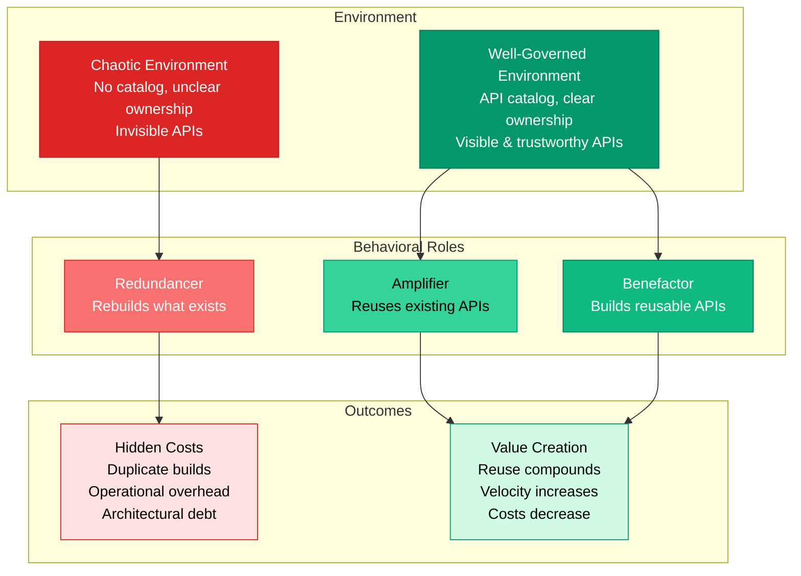

# The three characters in every enterprise API ecosystem

_Why some teams multiply value, some amplify it, and some quietly create drag._

In [The Hidden Cost of an Enterprise API](./hidden-cost-of-an-enterprise-api.md) article, we dug into the hidden costs of enterprise APIs—the search tax, the rebuild penalty, the dependency chaos, the meeting overload.

This week, let's zoom in on the people behind those costs and savings.

Because once you see these three roles, you can't unsee them.

Every enterprise has:

1. **The Benefactor** – builds APIs that many teams rely on
2. **The Amplifier** – reuses existing APIs instead of rebuilding
3. **The Redundancer** – rebuilds what already exists

These aren't job titles.
They're behavioral archetypes—patterns that show up whenever an organization reaches a certain scale.
And they dramatically affect cost, velocity, and architectural health.

Let's break them down.

## The Benefactor: The high-leverage builder

Benefactors build APIs that become reusable foundations.
They think in systems, not tickets.
They write the docs teams actually use, annotate the schema, add examples, clarify versioning, and make integration predictable.

Benefactors don't just ship endpoints—they create capabilities.

When a benefactor builds a clean authentication API, ten other teams never need to build one.
When they build a solid notification service, a hundred downstream features accelerate.
When they maintain a domain model with integrity, the whole company moves faster.

A single benefactor can eliminate millions in duplicated effort and unlock organizational velocity.

They are the quiet force multipliers.

Consider the math: If a benefactor builds a payment processing API that 20 teams reuse instead of building their own, they've saved the organization **$1.2M–$2.4M** in avoided build costs (20 teams × $60,000–$120,000 per API).
Plus **$540,000–$1.08M** in avoided annual maintenance.

That's **$1.74M–$3.48M** in value created by one well-designed API.

But benefactors don't just save money—they accelerate everyone.
Teams that would have spent 3 months building authentication can start building features in week one.
The velocity multiplier compounds across the organization.

## The Amplifier: The cost-saver and opportunity multiplier

Amplifiers look before they build.
They know the catalog, understand what already exists, and trust the ecosystem enough to stand on it.

Instead of rebuilding the wheel, they reuse the wheel—and then race ahead because of it.

An amplifier says:
- "We already have a data enrichment API. Let's extend it."
- "There's a notifications service—we don't need our own."
- "This team solved this problem two years ago; let's reuse their work."

Amplifiers create leverage by making smart choices.
They shrink timelines, reduce maintenance, avoid support overhead, and connect internal capabilities in new ways.

Amplifiers are how organizations turn API sprawl into API ROI.

Here's what amplification looks like in practice:

A team needs to add user notifications to their feature.
**Without an amplifier mindset:** They spend 3 months building a notification service from scratch.
**With an amplifier mindset:** They find the existing notification API in the catalog, integrate it in 2 weeks, and move on to building the actual feature.

The difference: **10 weeks of engineering time saved**.
At $150/hour fully loaded cost, that's **$60,000** saved on a single feature.
Multiply that across hundreds of features per year, and amplifiers are saving millions.

But it's not just about time—it's about focus.
Amplifiers spend their time on differentiation, not duplication.
They build new capabilities instead of rebuilding existing ones.

## The Redundancer: The unintentional value destroyer

Redundancers rebuild the same thing because they couldn't find it, didn't trust it, or didn't look.

They don't mean harm.
In fact, they often think they're being helpful.
But duplicating capability is one of the most expensive behaviors inside large organizations.

Redundancers create:
- Duplicate authentication services
- Duplicate user profile stores
- Duplicate payment processors
- Duplicate notification systems
- Duplicate data pipelines

Each one carries the full cost of development, maintenance, security, compliance, docs, support, and operational overhead.

It's not just inefficiency—it's hidden debt that compounds.

A redundancer may produce beautiful code.
But if the capability already existed, it's negative ROI.

Consider the real cost:

A team builds a new user authentication service because they couldn't find the existing one.
They spend **$80,000** building it.
They spend **$30,000/year** maintaining it.
Over 3 years, that's **$170,000** spent on something that already existed.

But the real cost is higher:
- **Operational overhead:** Two services to monitor, two sets of alerts, two incident response procedures
- **Security risk:** Two attack surfaces instead of one
- **Compliance cost:** Two services to audit, two sets of compliance reports
- **Developer confusion:** Teams don't know which service to use
- **Architectural debt:** The system becomes harder to understand and maintain

In organizations with hundreds of APIs, redundancers create millions in hidden costs.
And because these costs don't show up as line items, they're invisible to traditional cost tracking.

## Why these roles emerge

In chaotic environments, redundancy feels safer than dependency.

In well-governed environments, reuse feels natural.

The roles aren't about individual talent.
They're about the system's clarity:

*How environment shapes behavior, and behavior creates outcomes.*

The roles aren't about individual talent.
They're about the system's clarity:

- **If APIs are visible** → amplifiers flourish
- **If APIs are trustworthy** → benefactors thrive
- **If APIs are invisible or inconsistent** → redundancers proliferate

This is why API catalogs, clear ownership, maturity models, versioning policies, and governance matter.
They move people out of the "rebuild because I can't find it" trap and into multiplier territory.

Consider what happens in each environment:

**Chaotic environment (no catalog, unclear ownership):**
- Teams can't find existing APIs → redundancers multiply
- Teams don't trust what they find → redundancers multiply
- Dependencies feel risky → redundancers multiply
- Result: Millions in duplicate builds, operational overhead, and architectural debt

**Well-governed environment (catalog, clear ownership, trust):**
- Teams can find existing APIs quickly → amplifiers flourish
- Teams trust what they find → amplifiers flourish
- Dependencies are manageable → amplifiers flourish
- Result: Reuse compounds, velocity increases, costs decrease

The environment shapes the behavior.
Change the environment, and you change the roles.

## The ultimate goal

A healthy engineering organization maximizes benefactors and amplifiers, and minimizes redundancers.

The formula looks like this:

- **More benefactors** → stronger foundational APIs
- **More amplifiers** → exponential reuse and velocity
- **Fewer redundancers** → lower hidden costs, less operational drag

When leadership understands these three characters, investment decisions get easier:

- **Better documentation isn't a "nice to have."** It makes amplifiers possible.
- **A centralized catalog isn't overhead.** It prevents multimillion-dollar rebuilds.
- **Clear API ownership isn't bureaucracy.** It creates trust in the ecosystem.

Once you label these roles, teams begin to self-identify.

Nobody wants to be the redundancer.
Everyone wants to be the amplifier.
And benefactors become the heroes they already were.

## The organizational shift

The shift from redundancers to amplifiers doesn't happen by accident.
It requires:

**Visibility:** APIs must be discoverable.
Teams can't reuse what they can't find.

**Trust:** APIs must be reliable.
Teams won't depend on APIs that break their projects.

**Clarity:** Ownership, lifecycle, and dependencies must be clear.
Teams need to know who to contact, what's supported, and what depends on what.

**Governance:** Standards, quality, and versioning must be consistent.
Teams need confidence that APIs will work as expected.

When these four elements come together, something changes.
Teams start checking the catalog first.
They find existing APIs.
They reuse instead of rebuild.
The organization moves from redundancy to amplification.

## Closing thought

APIs aren't just technology—they're organizational leverage.

And leverage comes from people who reuse, people who build reusable things, and systems that make both possible.

The question for every engineering leader is simple:

**Are we designing an environment where amplifiers and benefactors win?**

If not, the redundancers will—and the costs will hide until it's too late.

But when you build the right environment—with visibility, trust, clarity, and governance—amplifiers and benefactors flourish.
Reuse compounds.
Velocity increases.
Costs decrease.

And the organization moves faster than competitors who are still rebuilding the wheel.

