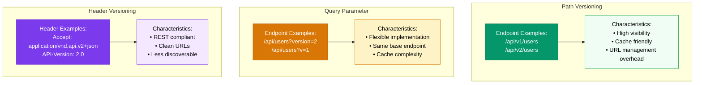
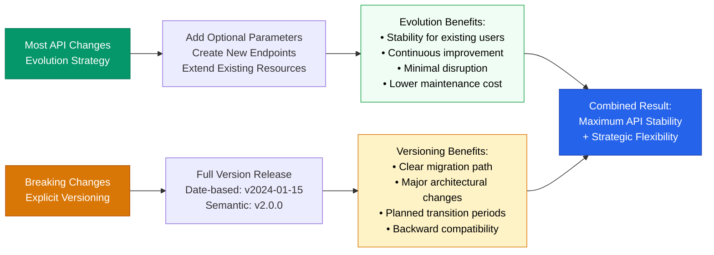

Supporting multiple API versions simultaneously increases costs and operational overhead.
Each version multiplies your support burden - bug reports, troubleshooting, and feature requests must be handled across all supported versions.
This complexity extends beyond developer time to infrastructure requirements, as different versions may need separate deployment environments, database schemas, or monitoring systems.

Version maintenance requires significant resources.
Every additional version increases the surface area for potential issues.
Security patches must be applied across versions, performance optimizations need testing in multiple environments, and feature requests require evaluation for backward compatibility.
Teams often underestimate the long-term cost of maintaining multiple versions when making initial versioning decisions.

Impact assessment is difficult without proper instrumentation.
Understanding which changes will affect customers requires comprehensive API usage analytics.
Without detailed metrics on endpoint usage, parameter adoption, and client behavior patterns, teams make versioning decisions blindly.
This leads to either overly conservative approaches that maintain unnecessary versions or aggressive changes that surprise customers with breaking updates.

## How do I choose between evolution and explicit versioning strategies?

API versioning strategies fall into two main approaches: evolution and explicit versioning.
Each serves different organizational needs and constraints.

API evolution minimizes version proliferation by maintaining a single API version, making non-breaking changes through updates and creating new endpoints only for breaking changes.
Instead of versioning the entire API, you create specific endpoints like `/api/product/create2` when `/api/product/create` needs breaking modifications.
GraphQL exemplifies this strategy through schema evolution, where new fields and types are added without versioning the entire schema.
This approach reduces operational complexity by avoiding multiple complete API versions, though it can make tracking and deprecating old functionality more challenging since changes are distributed across individual endpoints rather than bundled into version releases.

Explicit versioning provides clear boundaries between changes by creating discrete API versions with clear boundaries between modifications.
Implementation options include path versioning (`/api/v1/users`, `/api/v2/users`), query parameters (`/api/users?version=2`), or headers (`Accept: application/vnd.myapi.v2+json`).
Path versioning offers maximum visibility and caching compatibility but requires more URL management.
Header versioning aligns with REST principles but reduces discoverability.
Query parameter versioning provides flexibility at the cost of caching complexity.

### API versioning implementation approaches

*Comparison of three common API versioning implementation patterns, showing endpoint examples and key characteristics for each approach.*

Many successful APIs combine evolution and explicit versioning strategically.
Stripe uses evolution for most changes, adding optional parameters and endpoints as needed, but issues full version releases for significant breaking changes.
This hybrid approach maximizes stability for most consumers while providing clear migration paths for major architectural improvements.

### Hybrid versioning strategy in practice

*Hybrid versioning strategy combining API evolution for most changes with explicit versioning for breaking changes, as demonstrated by successful APIs like Stripe.*

## Deprecation timelines reduce long-term maintenance burden

Effective versioning requires planning for version retirement from the outset.
Establish clear deprecation policies that specify maintenance periods for older versions and endpoints.
Typical timelines might include a 6-month announcement period, 12 months of active migration support, and 18-24 months total before removal.

Clear deprecation schedules help both internal teams plan resource allocation and external customers plan their development cycles.
Consistent execution of these timelines builds trust and ensures customers understand expectations for version lifecycle management.

OpenAPI specifications support structured version management.
OpenAPI provides standardized approaches for documenting versioned APIs.
For evolution strategies, maintain a single OpenAPI document and add new endpoints as your API grows.
For explicit versioning, create separate specification files for each major version, potentially using versioned filenames like `api-v1.yaml` and `api-v2.yaml`.

[Redocly's CLI tools](https://redocly.com/docs/cli) simplify working with OpenAPI specifications across multiple versions.
The structured nature of OpenAPI documents enables automatic generation of client SDKs, validation code, and mock servers for different versions, reducing manual maintenance work.
[Redocly's documentation tools](https://redocly.com/docs/redoc) can help automate many of these processes across your versioned APIs.

Clear communication prevents integration surprises.
Successful API versioning depends on systematic communication with consumers.
Establish multiple channels to reach both internal and external users, including developer newsletters, documentation announcements, and direct outreach for major changes.
Communicate deprecation plans during customer onboarding so expectations are clear from the beginning.
When releasing new versions, provide specific migration guidance with code examples and explain the benefits of upgrading.
Send follow-up communications as deprecation dates approach, and use monitoring data to verify that deprecated endpoints are truly unused before removal.

### Systematic version change communication

*Streamlined communication workflow for API version changes, showing the essential steps from planning to safe deprecation.*

## Documentation platforms must accommodate version switching

Your documentation infrastructure needs to support multiple API versions simultaneously.
Consumers using different versions require access to appropriate reference materials until their version reaches end-of-life.

Choose documentation platforms that support intuitive version switching through dropdown menus or clear navigation paths.
Your API catalog should handle whatever versioning strategy you implement without creating administrative overhead.
[Redocly's API management platform](https://redocly.com/docs/realm/) provides comprehensive capabilities for [handling complex API documentation scenarios across multiple versions](https://redocly.com/docs/realm/content/versions).

Redocly makes maintaining versioned APIs straightforward with comprehensive API catalog and documentation generation capabilities.
The platform supports whatever versioning strategy you decide to implement, providing the flexibility and tooling you need to keep your API documentation organized and accessible across all supported versions.

Ready to streamline your API versioning and documentation workflow? [Sign up for Redocly](https://app.redocly.com/signup) and discover how you can see the value of professional API management in just 5 minutes with our [quick start guide](https://redocly.com/docs/api-registry/guides/api-registry-quickstart/).
