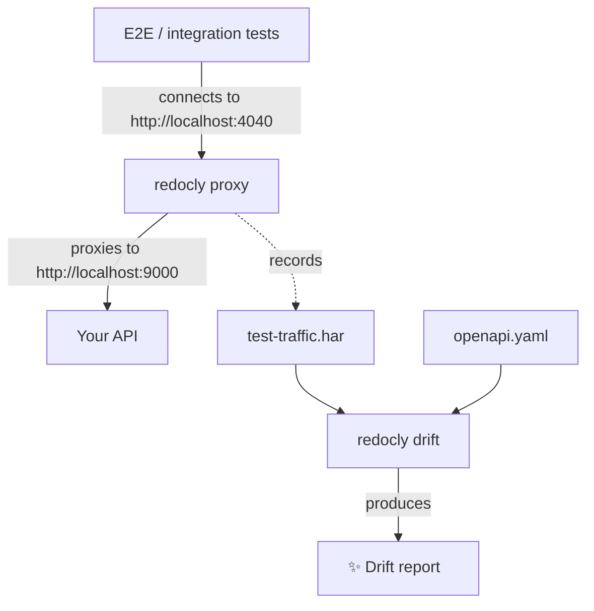

Your OpenAPI description says one thing.
Your API does another.
Nobody notices, because nothing fails - until an SDK generated from that description breaks in a customer's build, or a partner integration chokes on a field that was "documented" but never returned.

The gap between what you describe and what you ship has a name: drift.
It accumulates quietly, one hotfix and one forgotten field at a time.

Redocly CLI ships two commands that work together to close this gap: `proxy` records what your API actually does, and `drift` compares it against what your OpenAPI description claims.

## Record first, judge later

The `proxy` command starts a local reverse proxy in front of your API.
Point any client at it - a browser, a test suite, a curl script - and every request and response that passes through is captured into a standard HAR file.

The `drift` command takes that traffic and replays it against your OpenAPI description.
It matches each exchange to a documented operation and reports the discrepancies: undocumented endpoints, undocumented parameters, missing required fields, response bodies that don't match their schemas.

Because the two commands meet at a plain HAR file, you don't have to use them together.
Traffic exported from browser DevTools, Kong, or Nginx/Apache JSON logs works with `drift` too.
And if you prefer immediate feedback, `proxy` accepts an `--api` flag and validates traffic live, as it flows.


A HAR file is a full capture: request and response headers, cookies, tokens, and bodies all land in it verbatim.
Run `proxy` and handle the recorded HAR files in closed sandboxes - a local machine or an isolated e2e environment exercised with synthetic accounts and test credentials - so no real user data or production secrets end up in the recording.
If you do record traffic that touches real credentials, treat the HAR file like a secret: keep it out of version control, redact it before sharing, and delete it when you're done.


## Put it in your test pipeline

Here is the setup we like most: you probably already have e2e or integration tests that exercise your API.
That traffic is a free, realistic sample of how your API actually behaves - you're just letting it evaporate after every run.

Instead, start `proxy` before the test run, route the tests through it, and stop it when they finish.
The proxy sits between your tests and the API: requests and responses pass through it unchanged, and every exchange is captured on the way.



In a script, the whole setup fits in a few lines:

```bash
redocly proxy --target http://localhost:9000 --har ./test-traffic.har &
PROXY_PID=$!
# run your e2e or integration tests against http://localhost:4040
kill "$PROXY_PID" && wait "$PROXY_PID"
redocly drift ./test-traffic.har --api ./openapi.yaml
```

The `kill` step matters: `proxy` streams captured exchanges to a temporary file and assembles the final HAR only on a clean shutdown, so `drift` finds nothing to read until the proxy has stopped.

The `drift` command exits with a non-zero code when it finds error-level problems, so it slots into CI as a gate.
Every test run now doubles as a contract check, with zero extra test code to maintain.

## Try it on the Cafe API

You don't need your own API to see it work.
Redocly Cafe is our public demo API, and its OpenAPI description is published along with the docs.

Start a proxy in front of the live Cafe API:

```bash
redocly proxy --target https://api.cafe.redocly.com --har ./cafe.har
```

```
Proxy listening on http://localhost:4040 → forwarding to https://api.cafe.redocly.com/
Recording traffic to ./cafe.har
Press Ctrl+C to stop.
```

Send some traffic through it:

```bash
curl http://localhost:4040/menu
curl "http://localhost:4040/menu?category=dessert"
```

Press <kbd>`Ctrl`</kbd> + <kbd>`C`</kbd> and the proxy writes the HAR file:

```
Captured 2 exchange(s) to ./cafe.har
```

Now grab the Cafe OpenAPI description:

```bash
curl -s https://cafe.redocly.com/page-data/shared/oas-openapi/cafe.yaml.json \
  | jq .definition > cafe-openapi.json
```

To simulate drift, open `cafe-openapi.json` and make the description lie:
in the `Page` schema, change the type of the `total` property from `integer` to `string`.
Then replay the recorded traffic against it:

```bash
redocly drift ./cafe.har --api ./cafe-openapi.json
```

```
┃ Exchanges: total=2 documented=2 undocumented=0
┃ Findings: total=3 error=2 warning=1 info=0

✖ ERROR ×2 → Response field "page.total" must be string.
  ↳ sample exchange=0 GET /menu (200) listMenuItems
    expected: type "string"
    actual: 5

▲ WARN → Undocumented query parameter in traffic: "category"
  ↳ sample exchange=1 GET /menu (200) listMenuItems
```

The error is the discrepancy we planted: the API returns a number where the description now promises a string.
The warning is a bonus we didn't plant at all. 
The `category` query parameter we sent isn't documented anywhere in the Cafe description.
Two requests of traffic, and drift already surfaced something real.

## More than schemas

Findings come from built-in rules that you can select with the `--rules` flag:

- `undocumented-endpoint` flags traffic that doesn't match any documented operation.
- `schema-consistency` validates parameters, headers, and request/response bodies against your schemas.
- `security-baseline` checks that requests actually satisfy the security requirements your description declares, and flags things like credentials sent over plain HTTP.
  Loopback hosts such as `localhost` and `127.0.0.1` are exempt from the transport check, so sandboxed recordings against a local target stay warning-free.
- `owasp-api-top10` scans recorded traffic with heuristics based on the OWASP API Security Top 10 - enable it with `--rules owasp-api-top10`. It looks for credential-like query parameters, insecure CORS (wildcard origin with credentials enabled), weak cookie attributes, sensitive-looking fields in response payloads, and large unpaginated responses.

One caveat before you wire `owasp-api-top10` into a CI gate: it inspects each exchange in isolation.
It has no notion of user identity or ownership across requests, so it cannot detect authorization logic flaws like Broken Object Level Authorization.

Reports come out as human-readable text, JSON, CSV, or SARIF, so the same run can feed a terminal, a dashboard, or a code-scanning integration.


Both commands are experimental.
Flags, output formats, and behavior may change - including breaking changes - in upcoming releases while we shape them with your feedback.


## Get started

The `proxy` and `drift` commands are available now in the latest [Redocly CLI](https://redocly.com/docs/cli).
Check out the [drift](https://redocly.com/docs/cli/commands/drift) and [proxy](https://redocly.com/docs/cli/commands/proxy) command references, run them against your own traffic, and tell us what you find - feedback and ideas are welcome on the [Redocly CLI GitHub repository](https://github.com/Redocly/redocly-cli/issues).

Your API and its description should tell the same story.
Now you can check.
