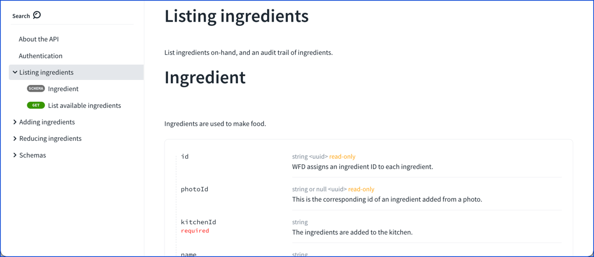

# Display schemas separately from operations

## Question

> One concern that our users have is that they are missing a "data dictionary" for our API objects.
> For example, in our old API reference documentation, we have a section that I can link to that provides the values and descriptions for an object.
> Is there a way to configure Redocly to present object value/definition information more directly? I know I can browse down into the body parameter and response definitions for each endpoint.

## Context

The "data dictionary" refers to schemas in OpenAPI.

People have asked about this feature fairly often over the years.
The implementation in our product is [quite raw](https://github.com/Redocly/redoc/commit/9bf45d810e145b5867e54d63bf8ce38821c0fa9b) and dates back a few years.
It's hard to use and tedious if you want to display multiple schemas or organize them neatly.

```html
<SchemaDefinition schemaRef="#/components/schemas/Planet" />
```

This could be added to any tag or info description and the corresponding schema would display.
This is fine if you want to render one schema in a one-off way.
However, this approach isn't good if you want to display your entire data dictionary.

So how could Redocly improve this further?

## Answer

Two divergent approaches seemed valuable to implement:
- Display all of the schemas in a sidebar group.
- Display schemas grouped with their operations (like how Stripe does it).

### All schemas grouped together

Use the feature `schemaDefinitionsTagName` to group all of the schemas together.
They display with a tag name that appears in the sidebar.

This is a configuration setting to place into your Redocly configuration file:

**`redocly.yaml`**
```yaml
theme:
  openapi:
    schemaDefinitionsTagName: Schemas
```


### Schemas grouped with operations
Use [`x-tags` specification extension](../docs-legacy/api-reference-docs/specification-extensions/x-tags.md) to tag specific schemas with the tag names that should appear in the sidebar.
You can have a single schema appear multiple times.

```yaml
compomnents:
  schemas:
    Ingredient:
      x-tags:
        - Listing ingredients
        - Adding ingredients
```




It's important to note that these features shipped in the Developer portal 1.1.0-beta.95. If you're using a prior version, update it to take advantage of this feature.

## Conclusion

Schemas don't need to be displayed outside of operations' request or response descriptions very often.
In case they do, Redocly offers two main options for that:
- display all of the schemas together using `schemaDefinitionsTagName`; or
- tag specific schemas to display alongside operations with `x-tags`.

If you found this helpful, please share it on social media and let us know (tag @Redocly).
