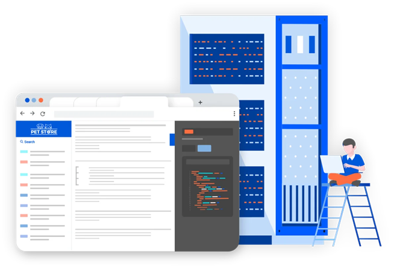

2020. Enough said. No doubt, this year will go down as one of the most challenging years in recent times.

We hope you are doing ok and have survived this brute of a pandemic. At Redocly, we have had a busy but exciting year with our mission of adding to our range of API products using these guiding principles:
- Developer friendly tool
- Fully customizable
- No vendor lock-in

This post highlights some of the most interesting and useful features (and products!) we delivered this year in a continued effort to positively impact how developers, businesses and documentation teams use our API products.

## Workflows

Who doesn't love automation, especially when it comes to enhancing the developer experience?

Redocly released their web-based application _Workflows_ in 2020 and it has totally changed the game for API documentation. While it was previously possible to create reference docs for API definitions using Redocly, _Workflows_ brings a powerful set of DocOps to your docs-like-code practice, helping teams throughout the API lifecycle.

**API registry**: Redocly's API registry validates and bundles your OpenAPI definitions and keeps track of them. It also tracks usages and dependencies which helps automate modern cascading previews.

With built-in linting and bundling, Redocly's API registry serves as the single source of truth for API definitions. It also acts like the glue between your API definitions to other elements of your API lifecycle such as reference docs and the developer portal.

**Integration with multiple source control providers**: Redocly connects to your source control to offer continuous validation and delivery of your API definitions, reference docs, and the developer portal.

Connect your Redocly account to GitHub (or GitHub Enterprise), Azure Repos, Gitlab or Bitbucket. Redocly also supports other non-git-based sources such as file uploads, URLs, and CI/CD (coming soon).

For more information, check out our docs on [Source Control](https://redocly.com/docs-legacy/workflows/sources/).

## Developer portal

Taking inspiration from static site generators, we built our own developer portal. Redocly's developer portal is a one stop shop for all your API documentation, how-to guides, tutorials, examples and code samples.

Tech writers and documentation teams can greatly benefit from using the developer portal, by getting your product to market faster with a complete set of API definitions, reference documentation, and a fully functional documentation portal.

**Role Based Access Control (RBAC)**: This one was a big one for us, and a lot of our customers. We introduced RBAC so that you can protect your production or previews (or both) via role based access control mechanisms. With RBAC, you can define permissions for accessing specific parts of your developer portal, and assign those permissions to different types of users (roles).

**Component library**: Using our new component library, you can re-use JSON schema, request, response, and examples from API definitions, which makes it easy to keep content consistent and up-to-date.

## API Reference docs

With Redocly's Reference Docs, developers and technical writers can render OpenAPI definitions as interactive API documentation in seconds.

**Automated code sample generation**: You can now add request code samples for every API operation. Redocly supports curl, Node.js, JavaScript, Python, Java, and C#.

**Advanced search**: We supercharged the search across the reference docs. The enhanced search functionality provides fast and detailed results including request parameters, response parameters, descriptions, and examples.

**Try It console**: The API console allows your users to test out requests and responses directly from the API docs. It also works across multiple servers and supports OAS3 security schemes.

**Document webhooks**: OpenAPI 3.1 introduces webhooks. Redocly backported that concept in prior versions of OpenAPI by using the `x-webhooks` specification extension.

**Version switcher**: We added a version switcher feature to our Reference docs, which allows you to switch between different versions of an API with a select menu.

**Customizable sidebar navigation**: The sidebar is completely customizable, which essentially means you have total control how your information is structured, navigable and organized for your users.

**CORS proxy configuration**: If your server(s) can't be configured to allow CORS ([Cross-Origin Resource Sharing](https://developer.mozilla.org/en-US/docs/Web/HTTP/CORS)), you can use Redocly's CORS Proxy feature to prevent issues with unsuccessful requests from the API console. With the CORS Proxy feature enabled, all requests sent from the API console are routed through the CORS proxy server.
_Redocly does not collect or store any traffic logs routed through the CORS proxy server._

## openapi-cli

We completely overhauled our open-source command line `openapi-cli` tool, and added a lot of new and shiny stuff like custom rules and decorators.

**Custom rules**: With custom rules, you can extend linting responsibility to identify deviations from your API design standards.

**Decorators**: Decorators allow you to modify content to the API definition during the bundle process, such as adding code samples and corporate links, or removing internal paths and specification extensions.
Read more about what [features Redocly OpenAPI CLI supports](../docs/cli).

## What would you like to see in 2021?

What features are you most excited about, around API documentation? Let us know on [Twitter](https://twitter.com/redocly).
