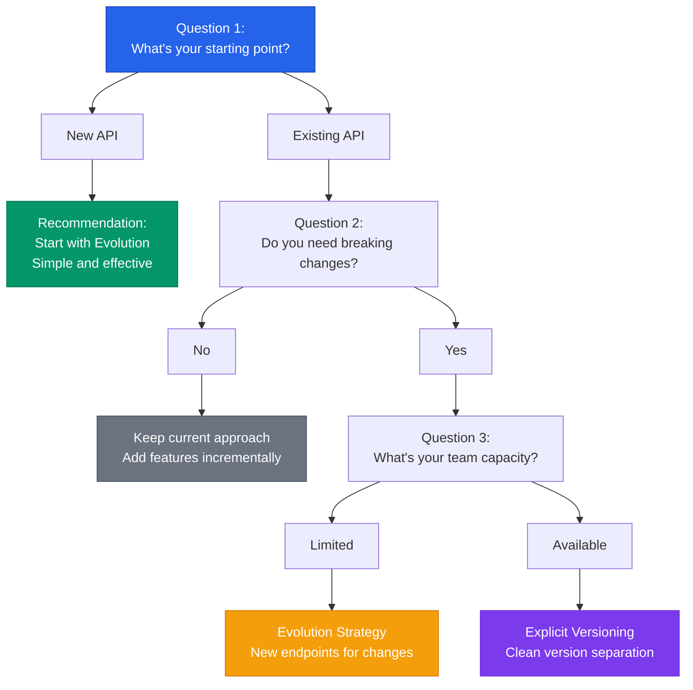
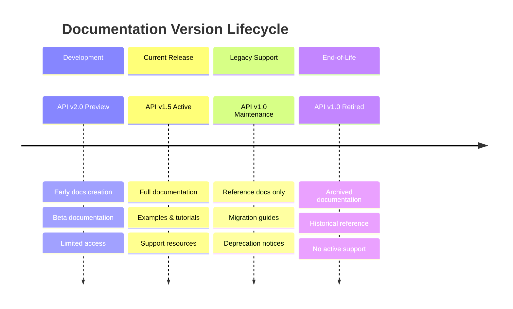

Successfully implementing API versioning requires a systematic approach across five key areas:

1. Define an API versioning strategy
2. Create an API versioning deprecation plan
3. Configure your CI/CD pipeline for versioning
4. Enable versioning for documentation
5. Establish clear communication channels for releases and deprecation timeframes

## Choose Your Approach

Before diving into implementation details, use this decision guide to determine which versioning strategy fits your situation:

*Question-based decision path to help you choose the right API versioning strategy for your specific situation and team resources.*

## Define an API versioning strategy

Our recommendation: API evolution. This approach maintains a single version of the API, applying non-breaking changes by overwriting the existing version and creating new endpoints for breaking changes (such as `/api/product/create2`). This strategy, also adopted by <a href="https://graphql.org/learn/best-practices/" target="_blank">GraphQL</a>, eliminates the complexity of supporting multiple versions simultaneously.

However, API evolution can make it more challenging to track and consistently deprecate older API calls, since changes are distributed across different endpoints rather than cleanly separated by version numbers.

Alternative approaches include explicit versioning through URL paths (`/api/v1`, `/api/v2`), query parameters, or headers. Many organizations blend these strategies—for instance, Stripe uses evolution for most changes but issues new versions for significant breaking changes.

## Define an API versioning deprecation plan

Reduce your internal support burden by establishing clear timelines for deprecating older versions, whether full API versions or individual legacy endpoints. This planned obsolescence approach prevents the accumulation of technical debt while giving consumers adequate time to migrate.

## Set up your CI/CD pipeline for API versioning

Most API producers specify their APIs using the <a href="https://www.openapis.org/" target="_blank">OpenAPI format</a>. Your pipeline configuration will depend on your chosen versioning strategy:

- For API evolution: Use the same OpenAPI document and version, simply adding new endpoints as needed
- For full separate versions: Explicitly version OpenAPI filenames for documentation and API catalog publication purposes

Consider whether to version by branch, repository, or filename based on your team's workflow and tooling requirements.

## Enable versioning for docs

Documentation must be versioned alongside your APIs so consumers can navigate between different versions. Users of older versions need access to previous documentation as reference material until the API reaches end-of-life.

Ensure your documentation publishing tools and API catalog support version discovery and switching, typically through dropdown menus or similar navigation elements.

### Documentation Version Lifecycle

*Timeline showing the complete documentation lifecycle from preview through retirement, illustrating how different versions receive different levels of support and documentation depth.*

## Communicate releases and deprecation timeframes clearly to consumers

Establish reliable communication channels for both internal and external API consumers. Key communication touchpoints include:

- Onboarding: Share your deprecation and versioning policies when consumers first integrate with your API
- New releases: Send notifications whenever you publish a new version
- Deprecation warnings: Provide clear timelines and send follow-up communications as deprecation deadlines approach
- Usage monitoring: Use analytics to verify that deprecated endpoints are no longer in use before officially removing them
