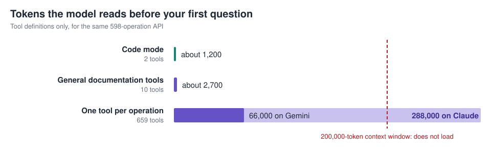
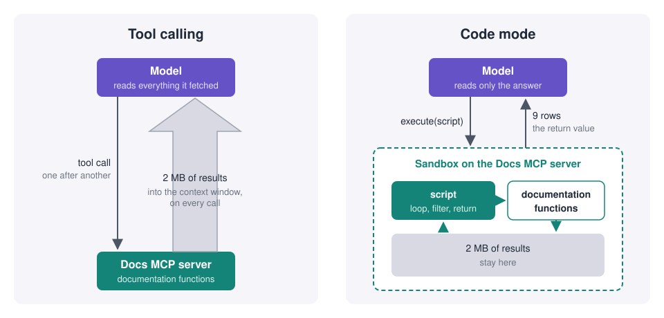

# Code mode: the problem was never the number of tools

Ask an AI agent a small question about a large API.

"Which operations in this API are deprecated?"

Rebilly's API documents 598 operations.
Nine of them are deprecated.
The answer fits on a napkin.

Here is what it cost the same model, Claude Opus 5, to find it two different ways from the same documentation.



- How the agent reads the docs
- Answer
- Input tokens
- Cost

---

- Tool calling: list the APIs, get the endpoints, describe each one
- Wrong
- 313,000
- $1.61

---

- Code mode: one short script
- Correct
- 8,800
- $0.07



The right answer cost less than three percent of the tokens.
This post is about why, and about what it means for anyone who wants agents to work with their API.

## Two ways an MCP server gets too big

An MCP server gets too big for a model in two ways.
The industry talks about only one of them.

The first is tool count.
The obvious way to turn an OpenAPI description into an MCP server is one tool per operation.
It is easy to generate, and it grows with the API.
Our test catalog needs 60 tools for six small APIs.
Add Rebilly, and it needs 659.
That tool list alone is about 66,000 tokens on Gemini and about 288,000 on Claude, before anyone asks anything.
On a model with a 200,000-token context window, it does not load at all.



The fix everyone reaches for is fewer, more general tools.
Redocly's Docs MCP server took that approach from day one: about ten tools that list APIs, list endpoints, describe one endpoint, read security schemes, or search the docs.
That handles the first problem.

It does not handle the second.
The second way a server gets too big is what comes back.
A single "describe this API" call on Rebilly returns two megabytes of JSON.
With tool calling, every byte of that lands in the model's context, and the model reads all of it to find nine deprecated flags.
Every follow-up question in the same conversation pays for it again.

That is where the 313,000 tokens in the table came from.
Not from too many tools.
From a lean tool set that has no choice but to hand the model everything it fetched.

## Let the server do the reading

Code mode changes who reads.

In code mode, the Docs MCP server exposes two tools.
`describe-tools` returns the TypeScript signatures of the documentation functions.
`execute` runs a short JavaScript program that calls those functions and returns a result.

The agent still uses the same documentation functions.
It calls them from inside a script, and the script runs in a sandbox on the server.
Whatever the script fetches stays in the sandbox.
Only what the script returns travels back to the model.



Here is the kind of script an agent writes for the deprecated-operations question:

```javascript
const { definition } = await tools.getFullApiDescription({ name: 'Rebilly API' });
const deprecated = [];

for (const [path, operations] of Object.entries(definition.paths)) {
  for (const [method, operation] of Object.entries(operations)) {
    if (operation.deprecated) {
      deprecated.push({
        method: method.toUpperCase(),
        path,
        operationId: operation.operationId,
      });
    }
  }
}

return deprecated;
```

Two megabytes go into the sandbox.
Nine rows come out.
The model reads nine rows and writes the answer.

Models are good at this.
They have read more JavaScript than any of us.
A loop and a filter against a typed function is an easier task for a model than deciding, call after call, which tool to try next and what to do with the pile of results.

The script runs in an isolated JavaScript sandbox with limits on time, memory, and output size.
It reaches the documentation through the same functions and the same access rules as the classic tools.
An agent sees what its user is allowed to see, and nothing else.

## What we measured

One dramatic example shows what an architecture can do, not what it does on an ordinary Tuesday.
So we also ran 28 everyday documentation questions through both modes on five models from two vendors: endpoint lookups, authentication questions, comparisons across APIs, GraphQL exploration, and short conversations with follow-ups.

Answer quality was the same.
On every model, the two modes scored within a fraction of a percent of each other.
The tokens were not the same.



- Model
- Fewer input tokens with code mode

---

- Gemini 3 Flash
- 40%

---

- Gemini 3.8 Flash
- 73%

---

- Claude Haiku 4.5
- 32%

---

- Claude Sonnet 5
- 24%

---

- Claude Opus 5
- 52%



The pattern behind the averages is simple.
On a single lookup, one endpoint, one field, code mode is a wash.
Writing a script to fetch one thing costs about the same as fetching it.
The gap opens as the question grows: more operations, more APIs, more to compare.
On questions about a large API, code mode used between five and ninety times fewer tokens, depending on the model.

The one-tool-per-operation server, where it fit at all, used two and a half to five times more tokens than code mode on the same questions.

It shows in real traffic too.
Across a month of production sessions, code mode sent about a third as much data back into the agent's context as tool calling did, for the same number of round trips.

## What this means for your API

Large APIs are the ones that need agents most, and they are the ones tool calling handles worst.
The more your API documents, the more a model has to read to answer anything, until the answer costs more than it is worth or does not fit at all.

Code mode breaks that link.
The model reads the answer.
The server reads the API.
Your documentation can grow, and the cost of a question about it does not have to.

It also raises the value of the documentation itself.
A script can only find the deprecated operations you marked as deprecated.
The agent is now a precise reader of your OpenAPI description, so every field you fill in is a question it can answer.

## Try it

Every Redocly project already serves its Docs MCP server at `/mcp`, and it already runs in code mode.
[Connect your AI tool](https://redocly.com/docs/realm/customization/mcp-server) and ask it something that spans more than one page of your reference:

- "Which operations in this API are deprecated?"
- "Compare the authentication requirements across our APIs."
- "How many operations return a 429, and which of them are GET?"

Redocly's AI Assistant uses the same code mode when it answers questions about your APIs.

Next, the same script will be able to call your API, not only read about it.
More on that soon.
