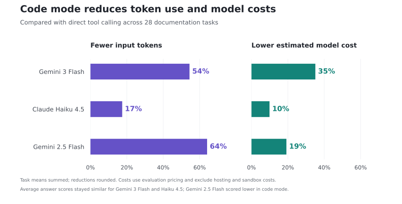

# Code Mode: the next evolution of the MCP server

Ask an AI agent to compare authentication across three APIs.
Before it can explain the differences, it needs to find the APIs, retrieve their security schemes, and bring that information together.
Your question takes one sentence, but answering it involves a small workflow.

Code mode lets the agent write a program to carry out that workflow.
The program calls the tools, works with their results, and returns the information the agent needs to answer you.
You still ask questions in ordinary language; the agent writes the code.

This approach is becoming part of how AI agents work with MCP servers, including Redocly's MCP server.

## What code mode changes

Model Context Protocol, or MCP, gives AI applications a standard way to discover and call tools.
For documentation, a tool might list APIs, retrieve an endpoint’s details, or look up a GraphQL type.

With **direct tool calling**, the model chooses a tool and its arguments, receives the result, and decides what to do next.
It may repeat that process several times before answering.
When the next step is “filter this list” or “repeat this lookup for each API,” the model is coordinating work that a program could perform.

With **code mode**, the agent writes that program.
It can call tools, loop over results, combine information, and select what to return.
Intermediate results can stay inside the execution environment instead of entering the model’s conversation.

This still uses MCP.
In Redocly’s implementation, the client calls an MCP tool named `execute` with the generated code.
Redocly runs that code in a sandbox on the server.
The person using the agent asks a normal question; they do not need to write the program themselves.

[Cloudflare’s code mode](https://blog.cloudflare.com/code-mode/) and [Anthropic’s code execution with MCP](https://www.anthropic.com/engineering/code-execution-with-mcp) describe related approaches.

## Bring back the information the question needs

An AI model's context contains the conversation, instructions, and information it receives from tools.
Those inputs consume tokens.
When a large tool result is added to the conversation, it can also be included in later model calls as the agent continues working.

Consider a small question about a large API:

> Which HTTP methods are documented for `/invoices/{id}`?

An endpoint-list tool may return hundreds of entries, even though the answer involves only one path.
With direct calls, the model reads that list to find the matching entries.
With code mode, a program can filter the list before it enters the conversation.
The model receives the entries it needs to answer: GET and PUT.

We tested that lookup against an API description containing **598 operations**.
With Gemini 3 Flash, the median run used **49,928 input tokens with direct calls and 4,160 with code mode**: about **12× fewer input tokens**.

That is the value of processing data close to the tools.
The agent can consult a large source without making the model read all of it.
For someone integrating with your API, a narrow question can stay narrow even when the documentation behind it is extensive.

## Fewer calls to coordinate an audit

Code mode also helps with work that repeats the same operation across several items.
Instead of asking the model to select each successive lookup, the program can handle the sequence and collect the results.

In our response-audit task, the agent had to find every operation missing a documented 400 response across three APIs.
Here is the comparison using Gemini 3 Flash:

| Response audit | Direct tool calling | Code mode |
| --- | ---: | ---: |
| Average client-visible tool calls | 27 | 9 |
| Average input tokens | 232,175 | 38,338 |
| Average estimated model cost | $0.0537 | $0.0251 |
| Average answer score | 1.000 | 1.000 |

Code mode completed the audit with **67% fewer client-visible calls**, approximately **6× fewer input tokens**, and **53% lower estimated model cost**.
Calls made inside the program still run; the agent's client no longer has to coordinate each one separately.

For API teams, this makes questions that span reference pages a useful part of everyday work.
An agent can help review response coverage, compare authentication schemes, or assemble an inventory of operations across APIs.
The output is a set of findings the team can review, with the repetitive retrieval handled by the program.

## Lower model costs across a broader workload

The full comparison covered 28 tasks: endpoint lookups, API inventories, response audits, GraphQL questions, and conversations with follow-up questions.
Across that set, code mode reduced both input-token use and estimated model cost for each of the three models we tested on every task.

*Reductions relative to direct tool calling, calculated by averaging trials within each task and then summing those task averages.
Model costs use the evaluation's pricing and include input and output usage.*

The biggest opportunities are tasks with substantial intermediate data or repeated lookups.
A direct tool that already returns exactly what the question needs can still be cheaper for a simple lookup.
For an API team choosing how to support agents, the useful comparison is the work those agents need to complete.

## What this means for your API documentation

API users increasingly ask agents questions that cross the boundaries of individual reference pages:

- Which operations require a particular authentication scheme?
- What changed between two versions of this API?
- Which endpoints are missing a documented error response?

Code mode gives agents a way to turn those questions into retrieval and comparison workflows over the documentation you publish.
Your API descriptions remain the source material, so accurate schemas, clear descriptions, and identifiable versions still determine how useful the result can be.

For Redocly customers, the starting point is the [MCP server](https://redocly.com/docs/realm/customization/mcp-server) at your project's `/mcp` endpoint.
Connect a compatible agent using the setup instructions, then ask a question that spans a few endpoints or APIs.
Your project's configuration and access rules determine which capabilities are available.

The experience should feel familiar: ask a question, examine the answer, and follow up.
Code mode changes how the agent does the work in between, giving it a programmatic way to gather the evidence your question needs.
