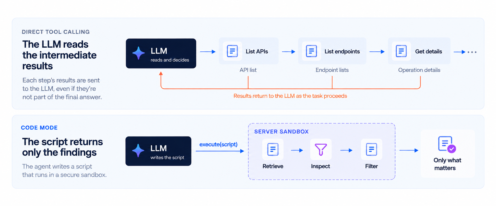
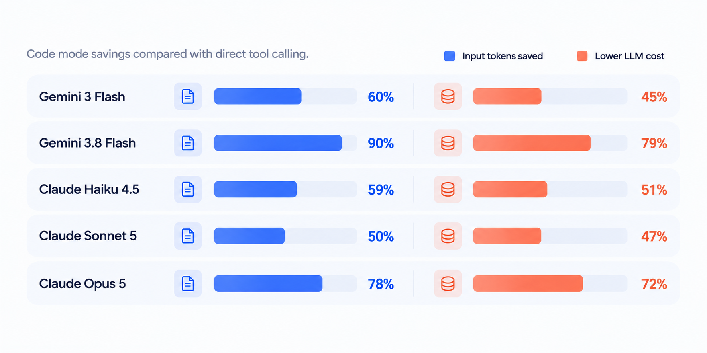

# Code mode for MCP: up to 80% lower LLM costs

Ask an AI agent a question about your API documentation:

> Which operations across these three APIs don't document a 400 response?

The answer might be five lines.
Getting there takes more work: find the APIs, inspect their operations, check the responses, and collect the exceptions.
With **direct tool calling**, the LLM reads the results as the agent works through the task.
Most of that information will never appear in the answer.

**Code mode** lets the agent write a JavaScript script to do that work.
The script calls the documentation tools, checks their results, and returns the findings.
You ask the question in ordinary language.
The agent writes and runs the code.

Redocly's MCP server now supports this approach.
In our measurements, code mode reduced LLM costs by **up to 80%**, making it **up to 5x cheaper**, with equivalent or better answer quality.

Here's what changes, and why it matters for your APIs.

## How code mode works

Model Context Protocol connects AI applications to tools and data.
A documentation tool can list APIs, describe an operation, or retrieve its security requirements.

With **direct tool calling**, the LLM chooses a tool and supplies its arguments.
The result enters its context, the information it can use to produce its next response.
For a task with several dependent steps, the LLM reads each result and decides what to call next.
Those results consume input tokens and can be processed again in later steps.

**Code mode** gives the LLM another way to use those same capabilities.
It writes the sequence as code, including loops, conditions, and calculations.
[Cloudflare pioneered code mode for MCP](https://blog.cloudflare.com/code-mode/), and [Anthropic has described the benefits of code execution with MCP](https://www.anthropic.com/engineering/code-execution-with-mcp).
Redocly brings that approach to your documentation.

Our MCP server exposes two tools for this:

- **`describe-tools`** gives the agent the function signatures it needs, including inputs and result types.
- **`execute`** runs the agent's JavaScript in a sandbox on the server.

Documentation functions are available inside the script through `tools`.
Their results stay inside the sandbox unless the script returns them.
The LLM can request a small answer from a large source.

## Code mode in action

Consider that question about missing 400 responses.
A direct tool workflow can list each API's endpoints, request the details of each operation, and pass those results to the LLM for inspection.
Code mode can combine the retrieval and inspection in one script.



Here is an example script for three APIs, using their full descriptions:

```javascript
const names = ['Redocly Museum API', 'Warp API', 'Portal API Functions'];
const methods = ['get', 'post', 'put', 'patch', 'delete', 'head', 'options', 'trace'];
const findings = [];

for (const name of names) {
  const { definition } = await tools.getFullApiDescription({ name });

  for (const [path, item] of Object.entries(definition.paths ?? {})) {
    for (const method of methods) {
      const operation = item[method];
      if (operation && !operation.responses?.['400']) {
        findings.push({
          api: name,
          method: method.toUpperCase(),
          path,
          operationId: operation.operationId,
        });
      }
    }
  }
}

return findings;
```

The script reads three API descriptions.
Only the matching operations come back.

For this audit, Claude Sonnet 5 answered correctly in both modes:



- Average per audit
- Direct tool calling
- Code mode

---

- Client-visible tool calls
- 39
- 3.5

---

- Input tokens
- 114,000
- 22,500

---

- LLM cost
- $0.27
- $0.06



That is **91% fewer client-visible calls, 80% fewer input tokens, and 79% lower cost**, with the same or better answer quality.
The agent may use more than one script to finish a task, and calls inside each script still run.
It no longer needs a separate LLM decision for every step.

## Why code makes the difference

One tool per API operation creates an obvious scaling problem.
An API with hundreds of operations brings hundreds of tool definitions for the agent to navigate.
Adding APIs expands the list further.

Redocly's documentation tools already cover many operations through a small set of functions.
Code mode adds something that reducing the tool count alone cannot: the ability to compose those functions and process their results.

**The LLM can use its coding skills.**
JavaScript gives it familiar ways to express a task: loop through the APIs, check a field, collect the matches.
A new question can become a new script without your team building another specialized MCP tool.

**The script controls what enters context.**
An operation's details can include parameters, schemas, examples, and descriptions.
A response-code audit needs only a fraction of that information.
Filtering it on the server leaves more context available for the developer's actual task.

**Code handles the counting.**
If the question asks how many operations match, the script can return `findings.length`.
The JavaScript runtime computes the total from the collected results.
The LLM can explain the findings without having to tally a long list during inference.

These benefits apply to inventories, comparisons between API versions, authentication reviews, and other questions that span reference pages.
Your documentation becomes something an agent can work through systematically.

## Savings across five models

The benefit extends beyond that audit.
Across a range of API documentation questions, code mode saved **50–90% of input tokens** and reduced LLM costs by **roughly 45–80%**, depending on the model.
Measured answer quality was equivalent or better.



A simple lookup can cost about the same in either mode.
The biggest savings come when a question needs more retrieval and filtering.

Production usage also shows smaller responses.
Across a month of real-word usage, code mode sent about a third as much data back into the agent's context as tool calling did.
The number of round trips dropped, while the quality of answers improved or, at worst, remained the same.

## How we measured it

We compared token usage, LLM cost, and answer quality across the five models shown above.
The questions covered endpoint lookups, authentication, API comparisons, inventories, and response audits.
For the chart, each question started a fresh conversation and used the same OpenAPI descriptions in both modes.

We repeated the questions and checked answers against expected facts using automated checks and LLM judges.
The percentages compare totals of the per-question averages.
Costs include both input and output tokens at the rates used for the measurements, with cache discounts where reported.

## Try it

Code mode is enabled for all organizations using Redocly's MCP server.

Redocly's AI Assistant also uses code mode to answer API questions directly in your docs.

Open `/mcp` on your Redocly project and follow the setup instructions to connect your AI tool.
You can also explore [Redocly's own MCP server](https://redocly.com/mcp) or read the [connection guide](https://redocly.com/docs/realm/customization/mcp-server).

Then ask something that spans your documentation:

- Which operations are deprecated?
- What changed between these two API versions?
- Which operations don't document a 400 response?

Your users bring the questions.
Code mode gives their agents a cheaper way to work out the answers.

Next, we're extending code mode so agents can call your APIs, too.
Stay tuned.

Useful links:

- [Redocly MCP server setup guide](https://redocly.com/docs/realm/customization/mcp-server)
- [Try Redocly's MCP server](https://redocly.com/mcp)
- [Code mode: the better way to use MCP, by Cloudflare](https://blog.cloudflare.com/code-mode/)
- [Code execution with MCP, by Anthropic](https://www.anthropic.com/engineering/code-execution-with-mcp)
