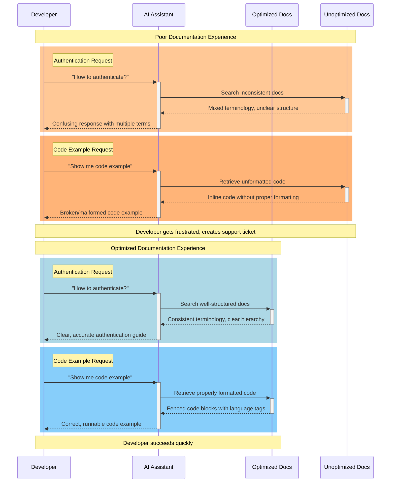

# How to optimize your docs for LLMs

Let's be honest: developers probably aren't reading your documentation the way they used to. They're asking AI agents instead of digging through your carefully crafted API reference. And if your docs aren't optimized for these AI tools, your developers are getting incomplete or wrong answers about your APIs.

You've probably already realized this isn't some distant future problem; it's happening right now. Your support team might be already seeing tickets that could have been avoided if AI tools could properly understand your documentation. Your developer onboarding could be taking longer because AI assistants can't parse your getting started guides effectively. In fact, A new Stack Overflow Developer Survey (2025) shows that 84% of developers now use—or plan to use—AI tools in their workflows. Yet, trust is faltering: 46% say they don’t trust the accuracy of AI outputs—up from just 31% in 2024. Nearly half!

Just about every developer has experienced the frustration shown in the orange sections in the diagram below: asking an AI assistant for help, only to receive confusing or incorrect guidance. When documentation lacks consistent terminology and proper formatting, even sophisticated AI tools struggle to provide useful answers.

The blue sections represent the developer experience we should strive for: clear questions get clear answers, code examples actually work, and developers can focus on building rather than debugging documentation problems.



The good news? Improving how LLMs consume your docs isn't particularly complex. It just requires a little rethinking about how you structure and format your documentation with AI consumption in mind.


## Common challenges with API docs and LLMs

AI models don't read documentation like humans do. They can't look at your beautiful layout, understand visual hierarchy, or fill in context gaps the way a developer can. Instead, they process text in a very specific way that documentarians may not have considered in the past.

AI systems organize information into chunks, usually paragraph-sized sections. When you mix different topics in the same section (like putting rate limiting info in your authentication section), the AI can't separate the concepts. So when someone asks about authentication, they get rate limiting details mixed in, making the answer less useful.

### Similar sections lead to retrieval errors

AI tools use vector embeddings to find relevant information. If your documentation has similar-sounding sections that cover different topics, the AI might return the wrong section entirely. This is especially common with API docs that have multiple types of authentication or similar endpoint names.

## How to write LLM-friendly documentation

After testing dozens of documentation approaches with various AI tools, here's what we've found seems to consistently produce improved results:


### 1. Keep your heading structure predictable

AI systems use your headings like a roadmap. When you skip levels or use inconsistent patterns, they get lost.

**This confuses AI:**

```
# API Reference
### Rate Limits
#### Authentication
## Error Codes
```

**This works better:**

```
# API Reference
## Authentication
### API Key Setup
### Token Management
## Rate Limits
### Request Limits
### Error Handling
## Error Codes
```

The predictable structure helps AI understand how concepts relate to each other. When developers ask about authentication, the AI knows exactly where to look and what context to include.

If you're using modern API documentation platforms (like Redocly), this structure gets generated automatically from your OpenAPI specs. This automation frees up your team to focus on higher-value quality control tasks like ensuring clarity, accuracy, and overall developer experience.

> **Why this matters:** [LLMs build mental maps from heading hierarchy](https://www.searchenginejournal.com/how-llms-interpret-content-structure-information-for-ai-search/544308/). Skipped levels (H1→H3) break this cognitive model, sometimes causing the AI to misunderstand content relationships and retrieve irrelevant sections when answering questions.

### 2. Stick to one term for each concept

This might feel repetitive, but AI systems get confused when you use different words for the same thing. Pick one term and use it consistently throughout your docs. Modern documentation platforms (like Redocly) offer linting capabilities that can automatically detect and flag terminology inconsistencies, making this easier to maintain at scale.

**Confusing for AI:**

```
Configure the API key, then use your access token to authenticate requests, and include the auth credential in the header.
```

**Clear for AI:**

```
Configure the API key, then use your API key to authenticate requests, and include the API key in the header.
```

Yes, perhaps it reads a bit awkwardly to humans, but AI systems will give much more accurate answers when you're consistent with terminology.

> **Why this matters:** [LLMs struggle with consistency](https://arxiv.org/pdf/2505.00268) and must infer whether different terms are synonyms or distinct concepts. When you use "API key," "access token," and "auth credential" interchangeably, the AI creates probabilistic guesses about their relationships, leading to incorrect responses.


### 3. Format code examples properly

This is probably the biggest quick win.
Inline code without proper formatting can be parsed ambiguously by AI systems, causing commands to get merged or altered when they appear in AI-generated responses.


**Bad for AI:**

```
Install the SDK with npm install @company/api-client@2.1.0 and then import it.
```

**Good for AI:**

```
Install the SDK:

npm install @company/api-client@2.1.0


Then import it in your code:


import { ApiClient } from '@company/api-client';
```

Properly formatted code blocks ensure AI systems can provide accurate code examples when developers ask for them.

> **The real cost:** Unformatted code often gets mangled during AI processing. A developer asking "Show me the install command" might receive `npm install @company/api-client@2.1.0 and then import it` as a single broken command instead of two separate steps.


### 4. Provide text alternatives for visual content
The AI being used on your docs probably can't see your diagrams, screenshots, or videos. If those elements contain important information, you likely benefit from describing them in text.

**AI likely can't parse this context effectively:**

```

The diagram shows the complete authentication process.
```

**AI can benefit from this:**

```

**Authentication Flow:**
1. Client sends credentials to `/auth/login`
2. Server validates credentials and returns JWT token
3. Client includes token in Authorization header for subsequent requests
4. Server validates token and processes request
The diagram above illustrates these four steps with arrows showing the request/response flow between client and server.
```

> **Why this matters:** Even if some multimodal LLMs use vision encoders to process images, their understanding is heavily dependent on accompanying text. Rich alt text provides semantic hooks that allow the AI to connect visual information with textual concepts. Maybe think of it likek describing images to AI is like being a radio announcer describing a sports game. The audience can't see what's happening, so you need to paint the complete picture with words.

### 5. Be explicit about what you're referring to

Pronouns and vague references create ambiguity that AI systems struggle with. Being explicit reduces confusion.

**Ambiguous:**

```
Update the configuration file and restart the server. If it fails, check the logs.
```

**Explicit:**

```
Update the `config.yaml` file and restart the application server. If the application server fails to start, check the application server logs.
```

> **Why this matters:** [Coreference resolution is challenging for LLMs](https://spotintelligence.com/2024/01/17/coreference-resolution-nlp/). Vague references like "it" force the AI to make probabilistic guesses about what entity is being referenced, often incorrectly.

## Watch out for terminology drift

If you've ever gotten weird answers from AI about your own documentation, semantic drift might be the culprit. One critical aspect often overlooked in LLM optimization is semantic drift, which refers to the gradual divergence between your documentation's current terminology and the language patterns that embedding models understand. If you've been using LLM assistance for docs or development, you probably have already come across this problem.

This happens often, and especially with:
- Feature names that evolve over time
- Deprecated functionality that's still mentioned in older docs
- New terminology that hasn't been updated everywhere

It's helpful to monitor semantic drift because inconsistent terminology compounds over time, creating an increasingly unreliable AI experience that erodes developer trust.

Do any of these sound familiar?
- **Cumulative confusion**: Small inconsistencies adding up to major comprehension problems
- **Support ticket inflation**: Developers getting conflicting information from AI assistants
- **Onboarding friction**: New developers encountering multiple terms for the same concepts
- **Competitive disadvantage**: Poor AI experience driving developers to better-documented alternatives

> **For example**: If your API evolves from using "master branch" to "main branch" but older documentation remains in your vector index, developers asking about "main branch workflows" might receive outdat   ed instructions about "master branch" operations, causing confusion and potential errors.

The fix? Periodically audit your docs for consistency and update anything that's drifted from your current product language.

**Quick check:** Ask an AI tool about a key feature using your current terminology. If it responds with old feature names or outdated processes, you've got drift.

## Testing your documentation with LLMs and AI tools

The best way to know if your optimization efforts are working is to test them the same way your developers do: by asking AI tools directly.

Pick a few critical workflows (authentication, key endpoints, error handling) and test them with ChatGPT, Claude, or whatever AI tools your team uses. Ask questions like:

- "How do I authenticate with the Company API?"
- "Show me a curl example for the users endpoint"
- "What does a 403 error mean in this API?"

If the AI gives you accurate, complete answers, your structure is working. If it's confused, missing steps, or mixing up concepts, you've found areas that need improvement.

## The practical path forward

Here's a suggested path to implementing this without disrupting your entire documentation workflow:

- **Start with your highest-impact content.** Don't try to optimize everything at once. Focus on your authentication docs, key endpoints, and getting started guide. In other words, the context developers hit most often.
- **Use your OpenAPI description as the foundation.** If you're maintaining API documentation manually, you're making this harder than it needs to be. [Tools like Redocly can generate consistently structured documentation](https://redocly.com/) from your OpenAPI description, automatically handling most of the formatting issues that confuse AI systems.
- **Test incrementally.** As you make changes, test them with AI tools. This gives you immediate feedback on whether your optimizations are actually improving the experience.
- **Track the impact.** Monitor your support tickets and developer onboarding metrics. As your documentation becomes more AI-friendly, you should see fewer basic questions and faster time-to-first-success for new developers.

## Why specification drives LLM-optimized documentation

What we've learned from working with enterprise teams of all sizes is the most successful approach to AI-optimized documentation is generated from structured specifications rather than manually written directions.

Your developers are already using AI to understand your APIs. Optimizing for AI doesn't necessarily mean sacrificing the human experience, it just means creating documentation that works well for both. Clean structure, consistent terminology, and proper formatting benefit everyone who interacts with your docs.

When your documentation comes from OpenAPI specs, you get a solid foundation for AI-friendly formatting. Code examples are consistently formatted, terminology stays consistent across endpoints, and the structure remains predictable.

## The best of both worlds: AI efficiency + human insight

The most effective documentation teams don't choose between automation and human oversight, they use automation to enhance human expertise. Redocly's approach automates repetitive tasks like structural validation, and formatting consistency, freeing your team to focus on what humans do best: ensuring clarity, accuracy, and developer experience.

## Ready to make your API documentation work better with AI?

[Redocly](https://redocly.com/) automatically generates LLM-optimized documentation from your OpenAPI specs, ensuring consistent structure and formatting that both developers and AI systems can navigate effectively. It even [automates the creation  of an llms.txt file](https://redocly.com/blog/updates-2025-05) to help LLMs and agents navigate your docs more intelligently.

> [See how specification-driven documentation can transform your developer experience](https://redocly.com/docs/) while preparing for the AI-first future of development.
>
> [Start your free 30-day trial](https://auth.cloud.redocly.com/registration)
