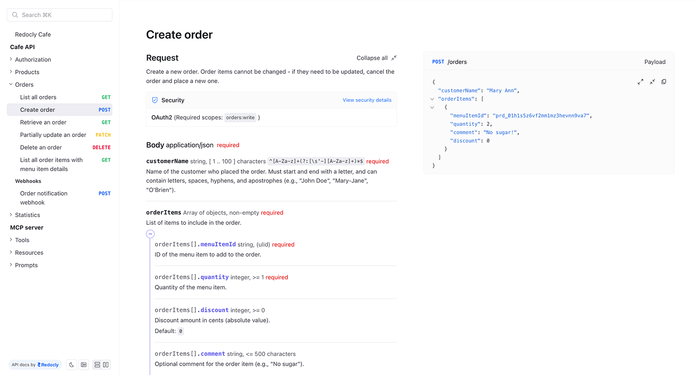
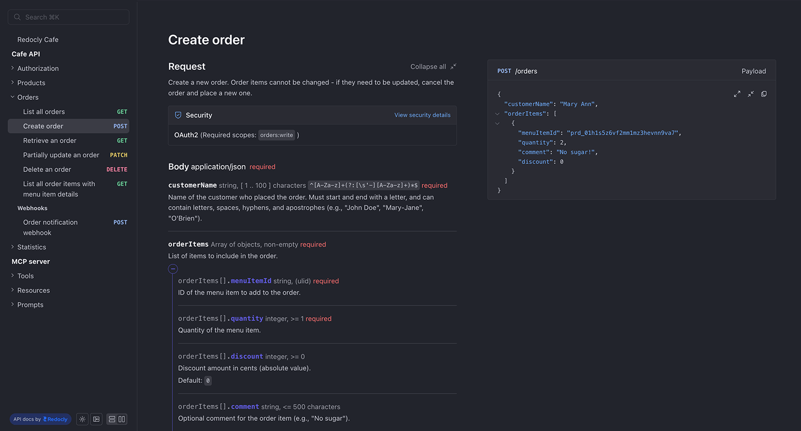

# What's coming in Redoc CE 3

For more than a decade, [Redoc CE](https://redocly.com/redoc-ce) has turned OpenAPI
specifications into something people can actually read. Point it at a YAML or JSON file, get documentation. That simplicity is a big part of why it's so widely used: around **1.5 million downloads a week**
on [npm](https://www.npmjs.com/package/redoc) and **25k+ stars**
on [GitHub](https://github.com/Redocly/redoc). It runs as a React component, as static HTML built by the CLI, from a container, or as a single `<redoc>` tag in a page you already have.

Redoc CE 3 is the biggest change to the project since 2.0, and it isn't released yet. This post is the preview: what's coming, why we restarted the release to
get there, and what to plan for before it lands. The next release candidate is `rc.1`, stable 3.0 follows it, and a separate post will announce the release itself.

We're publishing this preview to gather your feedback, which can still shape the final release.

The short version:



-
- Redoc 2
- Redoc 3
---
- Specifications
- OpenAPI 2.0, 3.0, 3.1
- Adds OpenAPI 3.2, AsyncAPI, GraphQL, and MCP (via `x-mcp`)
---
- Theming
- Nested JavaScript `theme` object
- CSS custom properties
---
- Options
- 40+
- ~20
---
- Dark mode
- None
- Built in
---
- Large specifications
- Whole document rendered up front
- Only what's near the viewport
---
- Linking
- Scroll positions on one long page
- A separate route per operation, tool, and schema; hash or history routing
---
- Bundle
- UMD
- ESM, loaded with `<script type="module">`
---
- Minimum versions
- React 16.8, Node 6.9
- React 19, Node 22



The published `rc.0` is a different engine: an earlier, OpenAPI-only build we set aside in January (more below). Everything in this post is in `rc.1`, which hasn't shipped. Use [the demo](https://redocly.github.io/redoc/3.x?url=cafe.yaml) to try it.


## The limits of Redoc 2

The design looked its age. There was no dark mode. Customization meant handing Redoc a deeply nested JavaScript `theme` object, and every styling request that object couldn't satisfy arrived as a GitHub issue asking for one more option. We kept adding them, and forty-odd options later it was clear that adding options doesn't scale: there was always one more thing the `theme` object couldn't style.

Large specifications were a bigger problem. Redoc 2 rendered the entire document up front, which made an API with a few hundred endpoints effectively unusable. And specifications have only grown.

Under the hood, technical debt was slowing us down. Dependency upgrades got harder, which made security patches harder. Then OpenAPI 3.2 shipped, and we had no good way to support it. We had been among the first renderers to support 3.1, so falling behind on 3.2 hurt.

## Why we started over

We began Redoc 3 in September 2025 with a straightforward brief: fresh design, real theming, viewport-aware rendering, OpenAPI 3.2. By December it worked, and `3.0.0-rc.0` went to npm. The stable release never followed.

API documentation stopped being OpenAPI-only years ago. Teams describe event-driven
systems in AsyncAPI, ship GraphQL alongside REST, and now use `x-mcp` to describe MCP servers. Documenting all of that usually means stitching together three or four tools that each look and behave differently. We wanted to support all of it in one renderer, but couldn't on the engine we had just finished. So in January 2026 we set the release candidate aside and started again.

The rebuild rests on one structural change: **the API specification is parsed into structured data before any React component renders.** Redoc 2 built a model tree in the browser and rendered one long scrolling page. Per-page routes, rendering only what's near the viewport, a search index built ahead of time: all of that depends on having the document as data first.

So parsing moved out of the render path. Adapters, one each for OpenAPI, AsyncAPI, and GraphQL, turn a specification into a flat item tree plus shared stores for schemas, examples, and security schemes. React just renders it. UI state moved from one global store to fine-grained atoms scoped per item.

Everything below builds on that change.

## What actually changed

### One renderer, four kinds of API

[OpenAPI](https://www.openapis.org/), [AsyncAPI](https://www.asyncapi.com/), and [GraphQL](https://graphql.org/) are different formats, but documentation for them needs the same things: what an entity is, what it accepts, what it returns, and how you authenticate. Everything below the adapter is shared: layout, navigation, schema rendering, deep links, search, and theming. That's why AsyncAPI and GraphQL support arrive together instead of as separate plugins years apart, and why adapters initialize on demand: point Redoc at a GraphQL schema and the OpenAPI and AsyncAPI adapters are never evaluated.

To be clear about [MCP](https://modelcontextprotocol.io/): Redoc CE documents an MCP server, but doesn't run one. When your OpenAPI specification includes an `x-mcp` section, the tools, resources, and prompts become first-class entities with their own pages, input schemas, and generated examples. These are grouped by tag alongside your REST operations.


Redoc CE renders the `x-mcp` section of your specification.
Serving an MCP server that agents can call is a different job, and Redocly projects do it from your documentation.
[Read the Docs MCP server documentation](https://redocly.com/docs/realm/customization/mcp-server).


Supporting other formats like OpenRPC or gRPC later means writing a new adapter, not another rewrite.

### OpenAPI 3.2

3.2 support is in the OpenAPI adapter, including the parts of the [3.2 specification](https://spec.openapis.org/oas/v3.2.0.html) that change how a document is structured rather than just what it contains:
- `additionalOperations` on a path item, so methods beyond the fixed HTTP verb set get
 rendered as real operations.
- `querystring` parameters.
- `itemSchema` for sequential media types: server-sent events and newline-delimited
 JSON render as streams of items rather than one opaque blob.
- Richer tags: `summary`, `parent`, and `kind`, which turn a flat tag list into an
 actual navigation hierarchy.

For a fuller tour of the specification itself, see [our take on OpenAPI 3.2](./openapi-3-2.md).

### CSS theming and dark mode

The `theme` object is gone. Design tokens are CSS custom properties now, so restyling
Redoc is a stylesheet instead of a nested JavaScript literal:

```css 
:root {
 --color-primary-500: #0f766e;
 --link-color-primary: var(--color-primary-500);
 --text-color-primary: #1f2933;
 --font-family-base: 'Inter', sans-serif;
 --border-radius: 8px;
}
```

Most of the old options existed to work around the limits of the `theme` object, which is why the option list got shorter (more on that below).

Dark mode is now built in, so you don't have to create a theme yourself.


 
 

 
 
 

 



There is no compatibility shim for the `theme` object. If you pass one today, plan to migrate it to CSS custom properties.


### Performance on large specifications

Only what's near the viewport is rendered. The few-hundred-endpoint specification that froze Redoc 2 scrolls smoothly now, because the document is data before it's components, so the renderer can decide what to skip.

### Search

Search covers schema fields, parameters, and response codes, not just operation titles. It's built from the same item tree everything else renders from, which is what makes indexing the whole document practical in the first place.

### Routes and deep links

Redoc 2 was one long scrolling page, so every "link" was really a scroll position.
In Redoc 3 each operation, tool, resource, and schema has its own route, and you pick how it appears in the URL bar:

```text
https://example.com/api.html#/docs/openapi/cafe/placeorder   hash (default, works anywhere)
https://example.com/docs/openapi/cafe/placeorder             history (router="history")
```

History routing needs the usual single-page-app rewrite on your server, or deep links will 404 on refresh. Hash routing needs nothing.

Deep links also got more precise. Redoc 2 could link to an operation; Redoc 3 can link to a specific field inside a specific response code, even through the discriminator variant that contains it. Any of these links can be shared and will open in the right place.

### Four ways to run it

HTML drop-in, React component, [Redocly CLI](https://redocly.com/docs/cli), and Docker.
Same engine and the same options across all four, each expressed the way that platform expects: an attribute, a prop, a CLI flag, or `REDOC_OPTIONS`:


 
 ```html
 <script type="module" src="redoc.standalone.js"></script>
 <redoc spec-url="https://redocly.github.io/redoc/museum.yaml"></redoc>
 ```

 
 
 ```tsx
 import { RedocStandalone } from 'redoc';

 <RedocStandalone specUrl="https://example.com/openapi.yaml" />;
 ```

 
 
 ```sh
 npx @redocly/cli build-docs openapi.yaml
 ```

 
 
 ```sh
 docker run -p 8080:80 \
   -e SPEC_URL=https://api.example.com/openapi.json \
   -e REDOC_OPTIONS='only-required-in-samples="true" hide-schema-titles="true"' \
   redocly/redoc
 ```

 


### Always up to date with commercial Redoc

In Redoc 2, open-source Redoc and the renderer behind our commercial products were separate codebases. They drifted apart, and the open-source one fell behind.

In Redoc 3 there is one codebase. The CE package is generated from the same engine we ship to paying customers, by a build step that strips the commercial pieces. It's not a fork that someone has to keep in sync: a fix that lands for commercial customers lands in CE too, because it's the same code. CE can't fall behind again.

A few pieces stay commercial: Try It, the interactive request console, and a handful of
options that support it. Redoc 2 didn't include Try It either, so nothing that was open
source before is becoming commercial.

## Caught up with modern JavaScript

Two things in Redoc 3 will show up in your upgrade diff. Both are the project catching up with modern JavaScript and cleaning up its own configuration.

**The bundle is ESM.** Redoc 2 shipped a UMD bundle, a format from before browsers had native module support. Every runtime and bundler in the current support matrix speaks ES modules natively, so that's what we ship: one format, no dual-build, and a `<script type="module">` tag instead of a global.
Alongside it, React 19 and Node 22 become the minimum versions. Dropping the old compatibility layers finally let us upgrade the dependency tree, which makes security patches routine again.

If those minimum versions rule you out today, you're not stuck: Redoc 2 keeps receiving security and critical fixes after stable 3.0 ships, so you can stay on it while you plan the upgrade.

**The configuration got smaller on purpose.** Forty-something options became around 20. We didn't remove features: most of the dropped options were sorting flags and hide/show toggles whose behavior is now either the default or a single CSS custom property.
The full migration list from Redoc 2 to 3 comes with the release.

## A note on telemetry

This is new in Redoc 3 (Redoc 2 never sent anything), so we want to be upfront about it: Redoc CE 3 sends anonymous usage data, on by default.
Here is the whole list of what goes in it:
- **Which format you're rendering**: `openapi`, `asyncapi`, or `graphql`, attached to every event. This is the one we most want, because it tells us where to spend the next six months.
- **How you're running it**: `html`, `cli`, `react`, or `docker`, and which layout you're in.
- **Core Web Vitals**: CLS, LCP, FCP, TTFB.
- **Which features get used**: layout switches, language selection, example switching, expand/collapse, snippet copying, downloads.

We use this to find what's broken and to decide what to build next. Redoc is deployed in far more places than ever file an issue, so telemetry is often the only way a bug reaches us at all.

It travels as standard OpenTelemetry traces, so you can open your browser's network tab and see exactly what leaves the page.

If you'd prefer not to send data, you can turn it off with one flag: `disable-telemetry` in HTML, `disableTelemetry` in React and the CLI, or through `REDOC_OPTIONS` in Docker. Turning it off doesn't change anything else about how Redoc works.

## Try it before we lock it in

None of this is on npm. The build published there is still `3.0.0-rc.0`, the OpenAPI-only engine we set aside, so installing it won't show you any of the above.
`rc.1` will be the first release with the new engine, and stable 3.0 follows it. We're not attaching dates to either until the feedback from this preview settles. We'll post again when it's out.

Until then, the demo runs the new engine, and now is the best time to try to break it: a report filed today can change what ships in `rc.1`.

- [The Cafe API demo](https://redocly.github.io/redoc/3.x?url=cafe.yaml) - the new engine on a real specification.
- [The Redoc CE product page](https://redocly.com/redoc-ce) - what Redoc CE is and where it's going.
- [Our take on OpenAPI 3.2](./openapi-3-2.md) - a fuller tour of the new specification version.

The most useful thing you can do is point the demo at your own specification, especially if it's large or unusual. Those are the reports we want most: tell us in [the Redoc 3 issue](https://github.com/Redocly/redoc/issues/2829), or [open a new one](https://github.com/Redocly/redoc/issues).

Everything described here is open source under MIT, and it's the same engine we run ourselves.
If we got something wrong, now is the time to tell us.