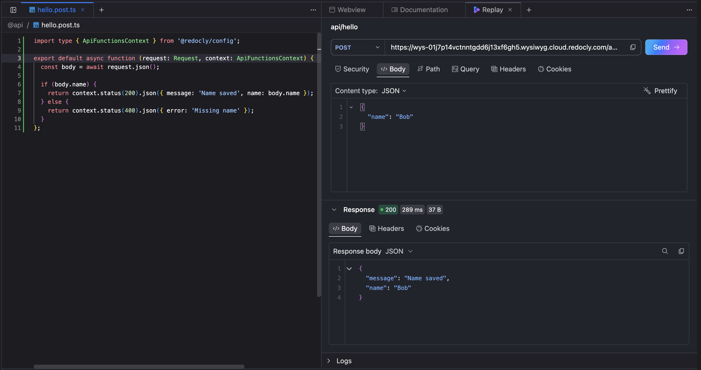
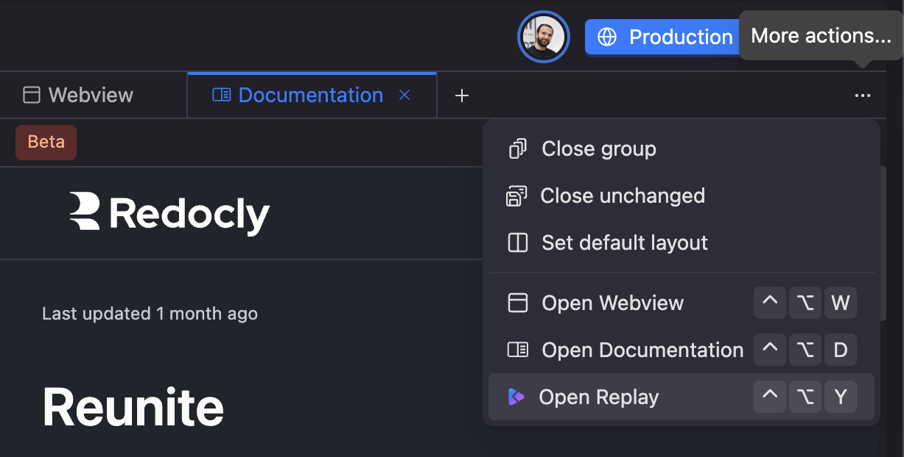

You wrote an API function, you want to know if it works, and the next thing you do is leave.
You copy a token, switch to an API client or a terminal, paste a URL, send a request, read the response, then come back to the editor to make a change.
Repeat that twenty times a day and the round-trip starts to feel like the actual job.

We wanted to close that loop.
The **Replay** tab is now available in the **Reunite** editor, so you can send real requests to your API functions and read the responses without leaving your project.

## Test where you already are

Replay opens as a tab in the editor pane, right alongside your file tabs.
Open an API function file, open the **Replay** tab, and Replay loads the request that matches the file you are looking at.
Add the path, query, header, or body values you want to try, send the request, and review the response, all in the same window.

There is nothing to wire up.
If the file you have open is an API function, Replay already knows which request to prepare.

## Open it in one move

The tab is easy to reach:

- Click the **More actions** icon on the right of the tabs header and select **Open Replay**.
- Click the **+** button on the tabs header and select **Replay** in the new tab.
- When a tab group is empty, click the **Replay** shortcut shown under **Tools**.
- Use the keyboard shortcut: <kbd>`Ctrl`</kbd> + <kbd>`Alt`</kbd> + <kbd>`Y`</kbd> on Windows, or <kbd>`⌃ Ctrl`</kbd> + <kbd>`⌥ Opt`</kbd> + <kbd>`Y`</kbd> on macOS.

## Authentication that just works

Because Replay runs inside Reunite, it uses the session you are already signed in with.
Requests to your API functions are authenticated the same way the rest of your project is, so there are no tokens to copy out of one tool and paste into another.
You send the request as you, from where you work.

## Try it in your project

If you have API functions, the Replay tab is waiting in your editor.
Open a function file, switch to Replay, and send your first request.

For a step-by-step walkthrough, see [Test API functions](https://redocly.com/docs/realm/reunite/project/test-api-functions) in our docs.
New to API functions?
Start with the [Create API functions](https://redocly.com/docs/realm/customization/api-functions/create-api-functions) tutorial.

