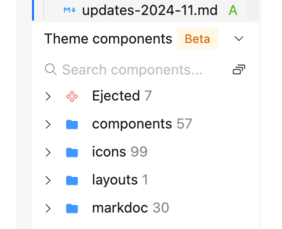

December was a productive month for Redocly as we closed out the year with significant progress. In addition to 37 bug fixes and minor enhancements, we’ve rolled out new features and continued refining our roadmap for 2025.

Here’s a quick look at the highlights:

---

## `img` Markdoc tag

We added an `img` Markdoc tag that lets you size and style images directly in Markdown. This enhancement provides more control over image presentation, helping users create cleaner and more visually appealing documentation.

---

## Shiki code highlighter

We’ve updated the code highlighter to [Shiki](https://shiki.style/), which unlocks exciting new customization options. With Shiki, you can now:
- Highlight specific lines of code.
- Emphasize words or symbols within the code.

These features allow for better clarity and emphasis in your documentation, making complex code easier to follow.

Look at [some of the highlighting examples in our docs](https://redocly.com/docs/realm/author/how-to/configure-code-snippets).

---

## `iconPosition` property for Markdoc card tag

We introduced the `iconPosition` property to the Markdoc card tag. This gives you the flexibility to position icons independently of card alignment, enabling more precise control over the visual layout of your content.

---

## `ignore` flag for scorecard config

The new `ignore` flag in the scorecard configuration allows users to skip scorecard calculations for specific files or directories. This makes it easier to fine-tune your workflows and focus on the files that matter most.

---

## Roadmap sneak peek

As always, we’re focused on usability when developing new features. This month, we’re offering early access to some exciting updates:

### Ready for early access
- Eject components from within Reunite
  
- **AI search**
- Advanced search filters and more facets
- Alternative search engine (**Typesense**)

Interested in trying these out? [Contact us](https://redocly.com/contact) for early access.

### Upcoming features include
- **Code walkthrough**
- Performance enhancements
- API monitoring and contract testing
- Information architecture changes to our docs

Last month, we shared that we’d spend at least 600 hours on internal usability testing for **Code walkthroughs**, but we’ve now surpassed 1000 hours as we fine-tune the feature for launch.

---

## Insights from our sidebar tree test

In December, we conducted a sidebar tree test to better understand how users navigate our sidebar. With over 1000 responses, here are some key findings:

- A higher number of items in the sidebar increases the time it takes to make a first click.
- However, the number of items does not affect the accuracy of navigation, even when accounting for guessing.

Based on these results, we’re planning another round of tests using the top 2-3 variations to further refine the user experience.

---

## Build Redocly with us!

We’re [hiring software engineers](https://redocly.com/careers#software-engineer) to help us take Redocly to the next level. If you’re passionate about APIs and want to join a team dedicated to innovation, we’d love to hear from you.
