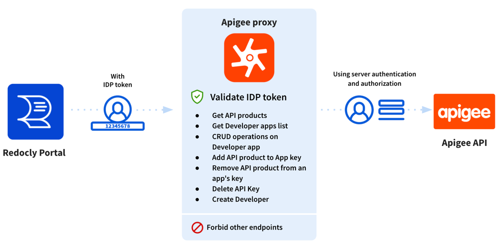

---
seo:
  title: Overview of the Apigee integration portal
excludeFromSearch: true

---

# Overview of the Apigee integration portal

[Apigee](https://cloud.google.com/apigee/docs/api-platform/get-started/what-apigee) is a platform for developing and managing APIs, and API proxies.


Using the Redocly portal starter repository, you can integrate your Developer portal with the Apigee via a special authorization proxy.

Redocly provides the proxy source code that you can host in your own Apigee account.


Using the Redocly portal, organization owners can:

- Write contextual documentation in Markdown (or MDX).
- Integrate interactive API samples right into the contextual descriptions.
- Generate high-quality API reference pages with a try it console and code samples.
- Style and theme it to match your brand guidelines.
- Control the navbar, footer and sidebar navigation.

With this Apigee integration, portal users can leverage Redocly's portal features and integrate with your Apigee APIs to build a great developer onboarding experience.

- Create a new app to generate an API key.
- Manage API keys.
- Manage apps.
- Use the **Try it** console to test the APIs.

To see the developer experience, read our sample developer documentation to [manage apps and API keys using the developer portal](./manage-apps-keys.md).

## How does the Redocly Portal work with an Apigee API?

```mermaid
flowchart TD
    subgraph Apigee
    pr[Apigee authorization proxy]
    api[Apigee API]
    pr -- set up for --> api
    end
    subgraph dp[Portal]
    app1[App 1]
    pr1[Product 1]
    pr2[Product 2]
    pr3[Product 3]
    app1 -- pairs with --> pr1
    app1 -- pairs with --> pr3
    app2[App 2]
    app2 -- pairs with --> pr2
    app2 -- pairs with --> pr3
    end
    dp[Developer portal] -- integrates with --> Apigee
```

## Why set up a proxy?

The proxy is required because Apigee's API is not designed to be consumed directly from the browser by a developer.
The proxy adds logic to verify the developer's identity, and restrict usage of Apigee's backend API as appropriate to a developer.
This diagram shows the architecture.

You can also add capabilities such as security-related logging and monitoring and case-specific logic using the API proxy.

For more information, refer to Apigee's documentation on [Understanding APIs and API proxies](https://docs.apigee.com/api-platform/fundamentals/understanding-apis-and-api-proxies).

## Steps to set up the Apigee integration

Before users can start creating apps and managing API keys using the Developer portal, you must:

1. [Add a Developer portal](../../connect-developer-portal.md).
   To configure the Developer portal, see our [Configuration](../../configuration/index.md) guide.
   **Note**: You can use an existing Developer portal for the Apigee integration.

2. [Connect your identity provider](../../../settings/identity-providers.md) on Redocly Workflows (if your organization hasn't already done so).

3. [Set up and configure the Apigee proxy](setup-apigee-proxy.md).

4. [Enable the developer UI components](enable-ui-components.md) in your portal, to show `Apps` under the profile.

<!-- 5. Set up users with appropriate scopes/permissions to access the Apigee API. Apigee API requires specific scopes and permissions like `apigee.developerapps.get` to enable access to all developer apps.

:::attention Note

Organization owners can restrict access using their own identity provider with OpenID Connect.

When portal users sign up using the Developer portal, Redocly creates a corresponding developer in Apigee.

::: -->
