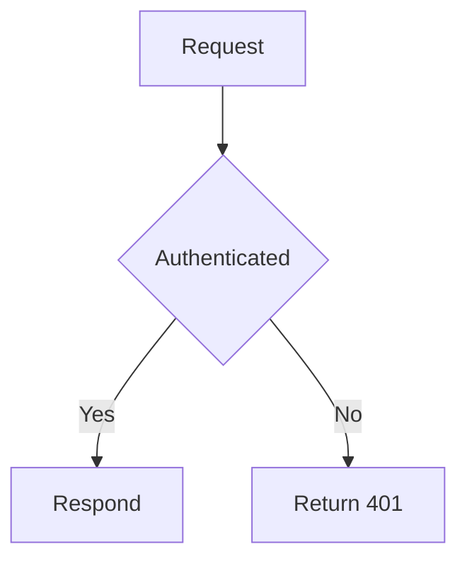

# Write documentation with Redocly

## When to use this skill

Use this skill when the project contains at least one of the following:
- `redocly.yaml` file.
- `sidebars.yaml` file.
- `package.json` file with any `@redocly` dependency.
- Markdown pages that contain `` tags.
These are Redocly projects.

Do not guess option names.
Redocly option names are specific.
Wrong names can fail silently
or stop the build.
When you are not sure, use the checks in [Check your work](#check-your-work).

## Run the project

Do not assume one command.
Find the correct one in this order:

1. **A script in `package.json`.**
   If `scripts` has an entry that starts the project, use it.
   This is the usual case, and the script can carry necessary options such as a port.

   ```json
   {
     "scripts": {
       "start": "realm develop -p 3000"
     }
   }
   ```

   Run it with the package manager of the project: `npm run start`, `pnpm start`, or
   `yarn start`.
   Choose the package manager from the lock file — `package-lock.json` for
   npm, `pnpm-lock.yaml` for pnpm, `yarn.lock` for yarn.
   Use npm when there is no lock file.

2. **The product binary.**
   A product dependency with no start script supplies its own command.
   The command has the same name as the product: `realm`, `revel`,
   `reef`, `redoc`, `redoc-revel`, `redoc-reef`, or `revel-reef`.
   Run
   `npx realm preview` for a project that depends on `@redocly/realm`.
   `develop` is the
   same command as `preview`.

3. **Redocly CLI.**
   If `package.json` does not exist, or has no Redocly dependency, use
   `npx @redocly/cli preview`.
   Redocly CLI supplies the product itself, so the project needs
   no dependencies.

Use an active Node.js LTS release.
Current product versions need v22.22.0 or later.

Install the dependencies first when `package.json` exists: `npm install`, `pnpm install`, or
`yarn`.
This step also reports an `engines` error when the Node.js version is too low.

Install before you use the command in step 2.
The command `realm` and the package
`@redocly/realm` have different names, so `npx realm` finds the local binary only after the
you install the package.
Without it, npx searches the registry for a package called `realm`,
which is not this product.

All three ways start a local preview server on `http://localhost:4000`, unless a script or
a `-p` option sets another port.
The server reloads when you save a file.

### The two kinds of package

- `@redocly/cli` supplies commands.
  A project does not have to depend on it.
- `@redocly/realm` (or `@redocly/revel`, `@redocly/reef`, `@redocly/redoc`,
  `@redocly/redoc-reef`, `@redocly/redoc-revel`, `@redocly/revel-reef`) is the product.
  Add
  it to `dependencies` in `package.json` to pin the version.
  Projects usually wrap its
  command in a `package.json` script, which is why step 1 comes first.
  Call it directly only
  when the project has no script.

### Check your work

| Command | Purpose |
| --- | --- |
| `npx @redocly/cli check-config` | Validate `redocly.yaml` against the config schema. It names unknown keys. |
| `npx @redocly/cli lint` | Lint the API description files. |

These commands do not read your page content.
`check-config` reads `redocly.yaml`, and
`lint` reads API descriptions.
A wrong Markdoc tag name, a broken relative link, or a page
that no sidebar lists appears only when the page renders.
Open the preview and look at the page you changed.
The pull request checks catch broken links later, but the preview is
the faster loop.

Do not run a production build on your machine.
The local preview is for authoring.
Redocly
builds and hosts the production site — see [Production builds](#production-builds).

## Project structure

Only one content file is necessary.
All other files are optional.

```treeview
my-project/
├── redocly.yaml            # Main configuration. Optional, but necessary for most customization.
├── package.json            # Optional. Pins the product version and adds dependencies.
├── sidebars.yaml           # Optional. Defines the left navigation.
├── index.md                # Landing page for the site root (/).
├── guides/
│   ├── index.md            # Landing page for /guides
│   ├── authentication.md
│   └── images/
│       └── diagram.png
├── apis/
│   └── cafe-api.yaml       # OpenAPI description. Renders at /apis/cafe-api.
├── _partials/              # Reusable content. Not published as pages.
│   └── rate-limits.md
├── images/                 # Shared images.
├── static/                 # Copied to the build output root without processing.
│   └── robots.txt
├── @theme/                 # Theme overrides.
│   ├── styles.css          # Global CSS. Loaded automatically.
│   └── markdoc/            # Custom Markdoc tags and functions.
├── @l10n/                  # Locale folders.
├── @api/                   # API functions.
└── @skills/                # Agent skills that the project publishes.
```

Realm reserves four `@` folders — `@theme`, `@l10n`, `@api`, and
`@skills` — and hold no pages.
Any other `@` folder is a content version folder, and it does
hold pages.
See [Versioned content](#versioned-content).

## File-based routing

The path of the file sets the URL.
The build removes the file extension.

| File | URL |
| --- | --- |
| `index.md` | `/` |
| `guides/authentication.md` | `/guides/authentication` |
| `guides/index.md` | `/guides` |
| `apis/cafe-api.yaml` | `/apis/cafe-api` |
| `changelog.page.tsx` | `/changelog` |
| `_partials/rate-limits.md` | No page. |
| `static/robots.txt` | `/robots.txt` |

Rules:

- A file named `index` is the default page of its folder.
  This applies to `index.md`,
  `index.page.tsx`, and `index.yaml`.
- To change a URL, move or rename the file.
  This is also true for API description files.
- To add a URL without moving the file, set `slug` in the front matter.
- An underscore prefix does not exclude a file from routing.
  Only these stay out of the routes:
  the partials folders (`**/_partials/**` by default), paths in the `ignore` configuration,
  and the reserved `@` folders.
- When more than one file resolves to the same route, the build appends `-1`, `-2`, and so on.
  For example, `payments/index.md`, `payments.md`, and `payments.yaml` become `/payments`,
  `/payments-1`, and `/payments-2`.

### Content file types

| Type | Extension | Notes |
| --- | --- | --- |
| Markdown page | `.md` | Markdoc syntax. This is the usual page type. |
| React page | `.page.tsx` | For custom layouts and interactive pages. |
| API description | `.yaml`, `.json`, `.graphql` | OpenAPI, AsyncAPI, or GraphQL. |

`.mdx` is not supported.
Use `.md`.

### Versioned content

The reserved `@` folders are `@theme`, `@l10n`, `@api`, and `@skills`.
Every other folder
that starts with `@` is a content version, for example `@v1` and `@v2`.
A misspelled
reserved name, such as `@themes`, becomes a version folder and causes no error.
Check the
spelling.

The path of the default version omits the version segment:

- `config/@v1/guide.md` becomes `/config/v1/guide`
- `config/@v2/guide.md`, when `v2` is the default, becomes `/config/guide`

## Page anatomy

A page has optional YAML front matter, and then Markdown content.
A page needs none of this.
A `.md` file with no front matter, no heading, or no content is still a valid page.
It still gets a URL.
The structure below is the usual shape, not a rule.

```markdown
---
seo:
  title: Rate limits
  description: The request limits of the API, and how to handle a 429 response.
excludeFromSearch: true
---

# Rate limits

Introductory sentence.

## First section

Content.
```

### How Redocly finds the page title

The title and the automatic navigation label come from `seo.title` in the front matter.
If `seo.title` is not set, they come from the **first H1 heading in the file**.

A plain `title:` key in the front matter does **not** set the page title or the navigation
label.
Use `seo.title`, or rely on the H1.

An H1 is not required.
A page with no H1 and no `seo.title` still builds.
But it has no title and no navigation label, so give it one of the two.
As a convention,
use one H1 per page and start section headings at H2.

### Front matter reference

These options are available only in the front matter:

| Option | Type | Purpose |
| --- | --- | --- |
| `excludeFromSearch` | boolean | Remove the page from keyword search, AI search, `llms.txt`, and the sitemap. |
| `slug` | string or [string] | Custom URL path. Give a list to serve the page at more than one URL. |
| `sidebar` | object | Choose the sidebar file for this page with the `path` sub-option. See the example below. |
| `template` | string | Path to a custom page template. Omit the extension. |
| `keywords` | object | Curate search results with `includes` and `excludes`. Markdown pages only. This option needs the Typesense search engine. |
| `search` | object | React pages (`.page.tsx`) only. Set the search entry of the page with `title`, `description`, and `keywords`. Unrelated to the `search` options in `redocly.yaml`. |
| `navigation` | object | Set the `page` and `label` of the next and previous buttons. |

These options exist in `redocly.yaml` and the front matter.
The front matter value wins:

`breadcrumbs`, `codeSnippet`, `colorMode`, `feedback`, `footer` (`hide` only), `markdown`,
`metadata`, `navbar` (`hide` only), `navigation`, `rbac`, `redirects`, `seo`.

`banner` is the exception.
Realm adds a front matter banner to the global banners, and does not replace them.
The banner needs no `target`, because it already belongs to its page.

Three option names cause frequent errors:

- The front matter `sidebar` option only chooses which sidebar file to use.
  Its one
  sub-option is `path`.
  See the example in [Common front matter tasks](#common-front-matter-tasks).
  It has no `label` and no `hide`.
  To hide the sidebar area, use `sidebar.hide` in
  `redocly.yaml`, which is not available in the front matter.
- `search` means two different things.
  In `redocly.yaml` it configures the search dialog for the whole site
  (`engine`, `hide`, `shortcuts`, `suggestedPages`, `filters`), and the front matter cannot
  override any of that.
  In the front matter of a React page it describes that page's search
  entry.
  On a Markdown page it does nothing: use `excludeFromSearch` and `keywords`.
- `navigation` appears in both lists because its sub-options are split.
  `page` and `label`,
  which set the target of the next and previous buttons, work only in the front matter.
  The
  other `navigation` options work in both places.

### Common front matter tasks

Remove a page from the search of the site:

```yaml
---
excludeFromSearch: true
---
```

`excludeFromSearch` controls keyword search, AI search, `llms.txt`, and the sitemap.
It does not add a `noindex` rule, so a search engine can still index the page.
To stop
external search engines, add the `robots` meta tag as well:

```yaml
---
excludeFromSearch: true
seo:
  meta:
    - name: robots
      content: noindex
---
```

When the request is only "do not index this in Google", use the `robots` meta tag alone.
When the request is only "keep this out of our search", use `excludeFromSearch` alone.

Serve one page at two URLs:

```yaml
---
slug:
  - /pricing
  - /subscribe
---
```

Choose the sidebar for a page that no sidebar file lists:

```yaml
---
sidebar:
  path: ./guides/sidebars.yaml
---
```

## Markdown and Markdoc

Redocly pages use [Markdoc](https://markdoc.io/), which is Markdown plus tags.
All standard
Markdown syntax operates: headings, lists, tables, links, images, blockquotes, bold, italic,
strikethrough, inline code, and fenced code blocks.

### Markdoc tag syntax

- A tag with content: `` ...
  ``
- A self-closing tag: ``
- Indentation inside a tag is for readability only.
  It has no effect.
- String values use double quotes.
  Numbers and booleans have no quotes: `columns=2`,
  `withLightbox=true`.
- Markdoc treats only `undefined`, `null`, and `false` as false.
  `0`, an empty string, and
  an empty array are true.

### Code blocks

Add a title and highlight lines with fence attributes:

````markdown
```javascript 
function processData() {
  const data = fetchData();
  return data;
}
```
````

Line annotations also operate: `// [!code highlight]`, `// [!code error]`, `// [!code ++]`,
and `// [!code --]`.
For every way to highlight lines and words, see
[Highlight lines and text](https://redocly.com/docs/realm/content/markdoc-tags/code-snippet#highlight-lines-and-text).

Use the `treeview` language for file trees, and `mermaid` for diagrams:

````markdown
```treeview
.
├── index.md
└── redocly.yaml
```


````

### Tag library

The table below lists the available tags.
The sections after it give the syntax of the ones
you write most often.
For every tag, with all attributes and rendered examples, see the
[Markdoc tag library](https://redocly.com/docs/realm/content/markdoc-tags/tag-library).

| Tag | Purpose |
| --- | --- |
| `admonition` | Callout box. |
| `tabs` / `tab` | Tabbed content. |
| `code-group` | Tabbed code blocks. |
| `code-snippet` | Code from an external file. |
| `code-walkthrough` | Stepped explanation of a code sample. |
| `cards` / `card` | Card grid with links. |
| `accordion` / `accordion-group` | Collapsible sections. |
| `table` | Table from a list, which accepts rich content in cells. |
| `img` | Image with a lightbox, sizing, and a caption. |
| `inline-svg` | An SVG in a line of text. |
| `icon` | An inline icon. |
| `partial` / `raw-partial` | Reused content. |
| `if` / `else` | Conditional content. |
| `diagram` | Mermaid, PlantUML, or Excalidraw from a file. |
| `json-schema` | Render a schema. |
| `openapi-code-sample` | Request sample for an operation. |
| `openapi-response-sample` | Response sample for an operation. |
| `replay-openapi` | Interactive API console. |
| `markdoc-example` | Show source and output together. |
| `numbered-list` | Numbered steps with rich content. |
| `login-button` | Login button for users that are not authenticated. |
| `connect-mcp` | Connection details for the project MCP server. |

### Admonition

The title attribute is `name`, not `title`.
The types are `info`, `warning`, `success`,
and `danger`.

```markdoc

The API returns `429` when you go above the limit.
Read the `Retry-After` header before you send the request again.

```

### Tabs

The label attribute is `label`.

```markdoc

  
  Content for the first tab.
  
  
  Content for the second tab.
  

```

### Code group

For code samples in more than one language, use `code-group`.
Put fenced code blocks in the
tag.
The tab name comes from the `title` attribute of the fence.
There is no `` tag.

````markdoc

  ```bash 
  curl https://api.example.com/v1/items -H "Authorization: Bearer $TOKEN"
  ```
  ```js 
  await fetch('https://api.example.com/v1/items', {
    headers: { Authorization: `Bearer ${token}` },
  });
  ```

````

Set `mode="dropdown"` to show a dropdown instead of tabs.

### Cards

```markdoc

  
  Send your first request.
  
  
  Get an API key.
  

```

Card variants: `filled`, `outlined`, `elevated`, `ghost`.

### Table

Use the `table` tag when a cell must contain a list, a code block, or another tag.
Each
list item is a cell.
Three hyphens start a new row.
The first row is the header row.

Cells accept the `width`, `align`, and `colspan` attributes, for example
`- Description {% width="40%" %}`.

```markdoc

- Option
- Type
- Description
---
- `limit`
- integer
- The maximum number of items.
  Default: `20`.
---
- `cursor`
- string
- The pagination cursor.

```

### Images

```markdoc

A caption below the image.

```

Use `srcSet` for one image per color mode:

```markdoc

```

### Conditional content

Markdoc variables include `$frontmatter`, `$rbac`, and `$userClaims`.

```markdoc

Enterprise-only content.

Pro content.

Upgrade to read this section.

```

## Reuse content with partials

Put the reusable file in a partials folder.
The default is `_partials` at any depth.
Files
in a partials folder do not become pages.

```markdoc

```

The path can be absolute from the project root, as above, or relative to the page, for
example `../_partials/rate-limits.md`.

To use different folder names, configure them.
Each entry is a folder path or a glob.
This
replaces the default, so include `_partials` if you still need it:

```yaml 
markdown:
  partialsFolders:
    - _partials
    - snippets
```

`partial` renders the partial after Realm processes the page.
`raw-partial` inserts the text
first, before any other processing, so the content behaves as if you typed it in the page.
Use `raw-partial` when the partial supplies rows of a ``, or when it must resolve
in the context of the page.
It takes the same `file` attribute:

```markdoc

- Option
- Description
---


```

Reference-style Markdown links do not resolve in a `partial`.
Use inline links, or use
`raw-partial`.

A partial has no front matter and needs no H1.
Keep the H1 in the page that includes it.

## Links

Write links relative to the page that contains them, and keep the file extension:

```markdown
[Authentication](./authentication.md)
[Glossary](../glossary.md)
[A section](./page.md#section-name)
[External site](https://example.com)
```

### How a path resolves

A `page` value in a navigation file follows the same idea, but the base is the file that
contains the value, not the page:

| Where the path is written | Base of a relative path |
| --- | --- |
| A Markdown page | The folder of that page |
| `sidebars.yaml` | The folder of that sidebar file |
| `redocly.yaml` (`navbar`, `footer`) | The project root |

A path that starts with `/` always resolves from the project root.
Use this form when a
relative path becomes hard to read.

So a sidebar at `products/platform/sidebars.yaml` points to a page below its own folder as
`guides/authentication.md`, and the same page from `redocly.yaml` is
`products/platform/guides/authentication.md`.

In a React page, use the theme `Link` component so that the path prefix and the locale
stay correct:

```javascript
import { Link } from '@redocly/theme/components/Link/Link';
```

## Sidebars

Realm generates the sidebar from the folder structure when no sidebar file exists.
Items sort
in natural order, and `index.md` comes first.

To control the sidebar, create a `sidebars.yaml` file.

Rules that are easy to get wrong:

- The build scans the project for every file whose name ends with `sidebars.yaml`.
  The name accepts a prefix.
  Separate the prefix with a dot, for example `guides.sidebars.yaml`.
  `sidebar.yaml` and `sidebars.yml` do not work.
- No entry in `redocly.yaml` is necessary.
  Realm finds the file automatically.
- After the first sidebar file exists, nothing is automatic any more.
  A page shows a sidebar
  only when a sidebar file lists that page, or lists its folder with `directory`.
  This covers every page you add later.
  A sidebar does not apply to a folder because it sits in
  that folder.
- To hide the sidebar on a landing page, leave that page out of every sidebar file.
  This
  works only once a sidebar file exists, because the automatic sidebar covers every page.
- The label comes from the `label` option.
  Without `label`, it comes from the page title.

### Link options

| Option | Type | Purpose |
| --- | --- | --- |
| `page` | string | Path to the file, extension included. Mutually exclusive with `href`. |
| `href` | string | URL. Mutually exclusive with `page`. |
| `label` | string | Link text. |
| `external` | boolean | Open in a new tab and add the external link symbol. |
| `icon` | string or object | Font Awesome name, or a path to an image. |
| `badges` | [object] | Badges beside the label. Each has `name`, and optional `color`, `position`, `icon`. |
| `rbac` | object | Access control for the link. |
| `disconnect` | boolean | Show the link, but do not assign this sidebar to that page. |
| `additionalProps` | object | Arbitrary data for custom theme components. |

### Group options

| Option | Type | Purpose |
| --- | --- | --- |
| `group` | string | **Required.** The group name. |
| `items` | [object] | **Required.** The items in the group. |
| `page` | string | The page that opens when a user selects the group. |
| `directory` | string | Path to a folder, resolved like `page`. Its files, and the files of its subfolders, are added automatically in natural order. |
| `expanded` | `true`, `false`, or `always` | Start expanded, start collapsed, or always expanded. Default: `false`. |
| `selectFirstItemOnExpand` | boolean | Open the first item when the group expands. |
| `menuStyle` | string | `drilldown` shows only the items of the selected group. |
| `icon`, `badges` | | Same as the link options. |

### Separators and references

| Option | Purpose |
| --- | --- |
| `separator` | Static text between items. |
| `separatorLine` | A horizontal line. |
| `$ref` | Path to another sidebar file. Its entries expand in place. |

### Example

```yaml 
- page: index.md
  label: Overview
- group: Guides
  page: guides/index.md
  expanded: true
  selectFirstItemOnExpand: true
  items:
    - page: guides/authentication.md
      label: Authentication
    - page: guides/rate-limits.md
      badges:
        - name: New
          color: green
    - group: Advanced
      items:
        - directory: guides/advanced
- separatorLine: true
- separator: Reference
- page: apis/cafe-api.yaml
  label: Cafe API
- href: https://community.example.com
  label: Community forum
  external: true
```

## Navbar

The navbar is at the top of every page.
Configure it in `redocly.yaml`.

A dropdown is an item that has `group` and `items`.
`group` supplies the text on the navbar.
The default theme supports one level of dropdown only.

Always use `group` for a dropdown.
An item that has `label` and `items` is not valid.
`label` belongs to a link, and Realm ignores the `items` list.
The entry then renders as a plain link, or not at all.

```yaml 
navbar:
  items:
    - page: index.md
      label: Home
    - group: Products
      items:
        - page: platform/index.md
          label: Platform
        - separator: Developer tools
        - page: cli/index.md
          label: CLI
    - page: apis/cafe-api.yaml
      label: API reference
    - label: Support
      href: https://support.example.com
      external: true
```

Use `linkedSidebars` on a top-level item to add that item to the breadcrumbs of a sidebar:

```yaml 
navbar:
  items:
    - page: product-a/index.md
      label: Product A
      linkedSidebars:
        - product-a/sidebars.yaml
```

To hide the navbar, set `navbar.hide: true` in `redocly.yaml` or in the page front matter.

## Footer

Each entry in `footer.items` is one column.
Use a `group` with `items` for a column of
links.
An entry that is a plain link becomes a column that holds that one link.

```yaml 
footer:
  copyrightText: © 2026 Example, Inc. All rights reserved.
  items:
    - group: Documentation
      items:
        - page: guides/index.md
          label: Guides
        - page: apis/cafe-api.yaml
          label: API reference
    - group: Company
      items:
        - href: https://example.com/about
          label: About
          external: true
        - href: https://example.com/careers
          label: Careers
          external: true
    - group: Legal
      items:
        - page: privacy.md
          label: Privacy
        - page: terms.md
          label: Terms
```

`copyrightText` is a plain string.
It does not interpolate a year.

To hide the footer, set `footer.hide: true` in `redocly.yaml` or in the page front matter.

## redocly.yaml essentials

`redocly.yaml` configures the site and the API linting in one file.

```yaml 
logo:
  srcSet: './images/logo.svg light, ./images/logo-dark.svg dark'
  altText: Example
  link: '/'
  favicon: ./images/favicon.svg

seo:
  description: Guides and API reference for the Example platform.
  projectTitle: Example

navbar:
  items:
    - page: index.md
      label: Home

footer:
  copyrightText: © 2026 Example, Inc.

search:
  engine: typesense

feedback:
  type: sentiment

redirects:
  '/old-path/':
    to: '/guides/authentication/'
    type: 301

ignore:
  - 'drafts/**'

apis:
  cafe-api@v1:
    root: ./apis/cafe-api.yaml
```

Common option groups:

| Area | Options |
| --- | --- |
| Navigation | `navbar`, `footer`, `sidebar`, `navigation`, `search`, `aiAssistant` |
| Appearance | `logo`, `colorMode`, `breadcrumbs`, `codeSnippet`, `markdown`, `banner`, `userMenu`, `removeAttribution` |
| Content | `products`, `l10n`, `metadata`, `metadataGlobs`, `versionPicker` |
| APIs | `apis`, `openapi`, `graphql`, `asyncapi`, `catalogClassic`, `mockServer`, `rules`, `extends`, `scorecardClassic` |
| Access | `requiresLogin`, `rbac`, `sso`, `idps`, `corsProxy` |
| SEO | `seo`, `redirects`, `ignore`, `analytics` |
| Extension | `plugins`, `scripts`, `env`, `apiFunctions`, `mcp`, `skills`, `responseHeaders` |

Use environment variables in the config with `{{ process.env.VAR_NAME }}`.

Notes on options that cause errors:

- `logo.image` and `logo.srcSet` are mutually exclusive.
  Use `srcSet` for one logo per
  color mode.
- `seo.title` is the title of one page.
  `seo.projectTitle` is the name of the site, and
  every page gets it as a suffix: `Rate limits | Example`.
- A `redirects` source is an absolute path that starts with `/`.
  Use a `*` wildcard
  only as the last segment.
  Leave the `index` segment out of the path of an `index.*` page:
  `guides/index.md` is `/guides/`, not `/guides/index/`.
- `ignore` changes take effect only after you restart the preview server.

## API reference documentation

Put the OpenAPI, AsyncAPI, or GraphQL file anywhere in the project.
The build finds it and
renders reference documentation with its own sidebar, which comes from the tags and
operations.
No configuration is necessary.

**The URL comes from the file location, not from the `apis` configuration.**
Realm serves `apis/cafe-api.yaml` at `/apis/cafe-api`.
To change the URL, move the file.

Link to the reference the same way you link to a page.
Use the file path, extension included:

```yaml 
navbar:
  items:
    - page: apis/cafe-api.yaml
      label: Cafe API
```

```yaml 
- group: Cafe API
  items:
    - page: apis/cafe-api.yaml
```

### The apis configuration

Use `apis` to set lint rules and rendering options for one API.
The key is `name` or
`name@version`.

```yaml 
apis:
  cafe-api@v1:
    root: ./apis/cafe-api.yaml
    extends:
      - recommended
    rules:
      operation-summary: error
    openapi:
      excludeFromSearch: true
```

Set options under the top-level `openapi` key to apply them to every API.
Set them under
`apis.<name>.openapi` to apply them to one API.
Useful options include `hideReplay`,
`hideDownloadButtons`, `hideInfoMetadata`, `codeSamples`, `downloadUrls`,
`generatedSamplesMaxDepth`, and `excludeFromSearch`.

### API content in a Markdown page

To put one operation in a guide, use the OpenAPI tags:

```markdoc



```

## Customization

This skill covers content and configuration.
For appearance, see these entry points:

- `@theme/styles.css` — global CSS.
  Realm loads it automatically.
  Set the
  [CSS variables](https://redocly.com/docs/realm/branding/css-variables) here.
- `@theme/` component overrides — replace a theme component.
  Get a copy of the source with
  `npx @redocly/cli eject component 'Footer/**'`.
- `@theme/markdoc/` — build custom Markdoc tags and functions.
- `.page.tsx` files — full React pages.

## Production builds

Your machine runs the preview.
Redocly builds, hosts, and publishes the production site on
Reunite, its platform.
Do not try to produce or serve a production build locally.
That path needs credentials the project does not carry, and it is not how a Redocly site
ships.

When someone asks to publish, deploy, or "build for production", point them at Reunite
instead of a local command.

**How a change reaches production.**
Reunite uses Git, and the flow is the same whether you
edit in the Reunite browser editor or locally:

1. Check the page in the local preview.
   A new page needs a sidebar entry when a
   `sidebars.yaml` file exists — see [Sidebars](#sidebars).
2. Create a branch.
3. Commit your changes.
4. Open a pull request.
   Reunite builds a deployment preview of the branch and runs checks,
   which include a broken-link check.
   Review the change on that preview URL.
5. Merge the pull request.
   The merge to the main branch starts the production build.

**A project that does not exist yet** starts in Reunite, not from a command line.
In
Reunite, select **Create new project**, then choose either a Redocly-hosted repository, or
an existing repository on GitHub, GitLab, Bitbucket, or Azure DevOps.

**Hosting the output somewhere else** — a bucket, your own server, an air-gapped network —
is a licensing question, not something to solve with a local command.
Tell the user to raise
it with Redocly rather than improvising a build.

## Common mistakes

| Mistake | Correct approach |
| --- | --- |
| `search: {exclude: true}` or `noSearch: true` in the front matter | `excludeFromSearch: true` |
| `title:` in the front matter to set the page title | `seo.title`, or the first H1 |
| `seo.noindex: true` | `seo.meta: [{name: robots, content: noindex}]` |
| `sidebar: {label: ...}` or `sidebar: {hide: true}` in the front matter | Set the label with `label` in `sidebars.yaml`. To drop the sidebar from one page, leave that page out of every sidebar file. `sidebar.hide` exists, but only in `redocly.yaml`, and it hides the sidebar everywhere. |
| `sidebar.yaml` or `sidebars.yml` | The name must end with `sidebars.yaml` |
| A sidebar file applies to its folder and subfolders | A page gets a sidebar only when a sidebar file lists that page or its folder |
| A navbar dropdown made from `label` plus `items` | A dropdown is `group` plus `items` |
| `` tags inside `code-group` | Fenced code blocks with a `title` fence attribute |
| `` | `` |
| Building or hosting the production site locally | Preview locally; production builds happen in Reunite. See [Production builds](#production-builds). |
| Assuming one run command | Check `package.json` scripts first, then the product binary, then `npx @redocly/cli preview`. See [Run the project](#run-the-project). |
| An `apis` entry sets the reference URL | The file location sets the URL |
| An underscore prefix keeps a file out of the routes | Only partials folders, `ignore` paths, and the four reserved `@` folders are excluded |
| `.mdx` pages | `.md` |
| A link that omits the extension, such as `./authentication` | Keep the extension: `./authentication.md` |
| A path in a nested `sidebars.yaml` written from the project root | A relative path in a sidebar file starts at the folder of that sidebar file. Start the path with `/` to use the project root. |
| Reference-style links inside a partial | Inline links |

## Products and plans

The Redocly products share this content model.
The differences are in scope:

| Product | Scope |
| --- | --- |
| **Realm** | Full product. Markdown content, API reference, and all customization. |
| **Revel** | Markdown content and customization. |
| **Reef** | API reference. |
| **Redoc** | API reference for a single API description. |

Redoc does not use `sidebars.yaml`, Markdoc tags, or multi-product configuration.

Plans also gate features.
The Markdoc tag library needs Revel, Reef, or Realm on the Pro
plan or higher.
`products` needs Pro or higher.
RBAC, SSO, and access control for a skill
need Enterprise or higher.
Each documentation page states the products and plans that its
option needs.
Check that page when the plan matters.

## Resources

- **[Project structure](https://redocly.com/docs/realm/content/project-structure)** - the folders of a project, and how a file becomes a URL
- **[Markdown in Redocly](https://redocly.com/docs/realm/content/markdown)** - the supported Markdown and Markdoc syntax
- **[Markdoc tag library](https://redocly.com/docs/realm/content/markdoc-tags/tag-library)** - every tag, with its attributes and examples
- **[Front matter configuration](https://redocly.com/docs/realm/config/front-matter-config)** - the full list of page-level options
- **[Sidebars](https://redocly.com/docs/realm/navigation/sidebars)** - the complete `sidebars.yaml` reference
- **[`navbar` configuration](https://redocly.com/docs/realm/config/navbar)** - navbar items, groups, and icons
- **[`footer` configuration](https://redocly.com/docs/realm/config/footer)** - footer columns and copyright text
- **[Configure Redocly](https://redocly.com/docs/realm/config)** - every `redocly.yaml` option, grouped by area
- **[Add OpenAPI descriptions](https://redocly.com/docs/realm/content/api-docs/add-openapi-docs)** - render an API reference and link to it
- **[Get started locally](https://redocly.com/docs/realm/get-started/start-local-dev)** - build a project step by step
