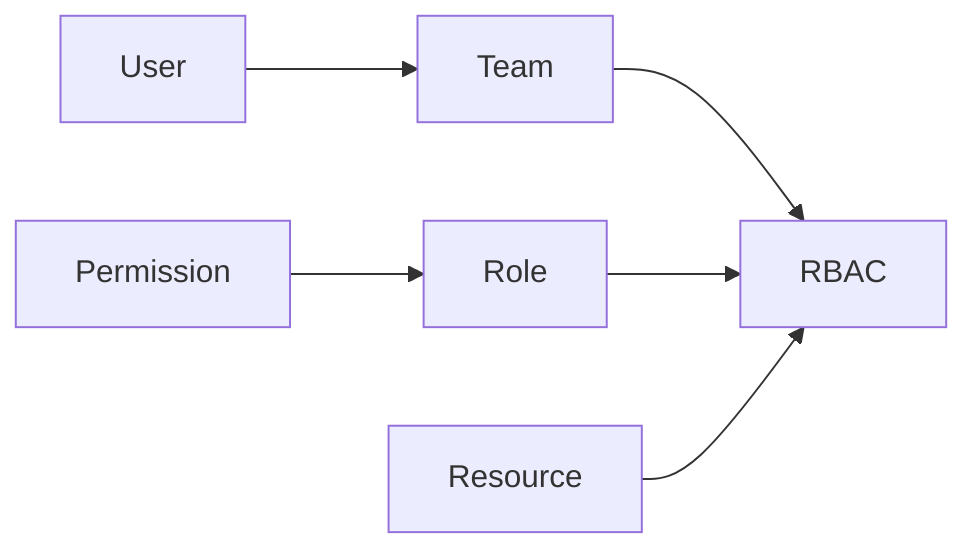

# Role-based access control (RBAC)

Role-based access control (RBAC) controls the **authorization** (what you can access) based on your roles and team membership.

## Authentication vs Authorization

**Authentication** identifies who you are through your identity provider (SSO).

**Authorization** determines what you can access based on:
- **Organization roles** from identity provider claims/attributes (when using SSO) or manual assignment (when using Redocly login)
- **Project roles** assigned to teams you belong to
- **Team membership** managed through identity provider (SSO teams) or through Redocly's Teams page (Reunite-managed teams)

After authentication, users are granted access to resources based on the permissions included in their assigned roles.

There are many components to setting up RBAC, the diagram below gives an overview of these components and how they relate to one another.



RBAC is declared as configuration.
Each configuration entry describes a [resource](#resource-identifiers), and a list of [teams](../reunite/organization/teams.md) with [role](./roles.md) assignments.
You can apply these configurations to [individual pages](./page-permissions.md) or [navigation elements](./links-and-groups-permissions.md).

User authentication is handled through [SSO (single sign-on)](../reunite/organization/sso/sso.md), and authorization is determined by the roles and team memberships provided by your identity provider.

## Resource identifiers

When configuring RBAC, you specify access for particular resources using resource identifiers.

A resource identifier may be any of the following:

- a path to a file, for example, `docs/configuration.md`
- a route, such as, `/catalog/`
- a [glob pattern](<https://en.wikipedia.org/wiki/Glob_(programming)>), for instance, `**/*.tsx` will match all `.tsx` files recursively
- a special identifier, such as, `**`
  The `**` special identifier sets the default role for a team for any content that isn't specified as a resource identifier.

For every resource identifier, your RBAC configuration specifies a team and assigns a project role for that team, for example, `Developers: read`.
Resource identifiers define the scope for the team and role combination.

## Example configuration

The following is an example of a `rbac` configuration in a `redocly.yaml` file:

```yaml
rbac:
  reunite:
    authenticated: read
    Admins: admin
    Developers: maintain
    Writers: write
  content:
    '**':
      authenticated: read
      Admins: admin
      Developers: maintain
      Writers: write
    'docs/developer-keys.md':
      Developers: read
      Writers: read
    'docs/*.md':
      Developers: write
      Writers: write
    'public/**':
      Developers: write
      '*': read
```

In this example in the `content` option `**`, `docs/developer-keys.md`, `docs/*.md`, `**/*.tsx` are resource identifiers.
For every resource identifier, the configuration specifies a team and assigns a project role for that team, for example, `Developers: read`.
The `**` key describes the project role assignments to teams for resources that are not specified in this configuration.
For example, a user that belongs to the `authenticated` team will have `read` permission for the `index.md` file, which is not included in the three resource identifiers listed.

Assigning the `*` symbol means that a given project role is assigned to the rest of the teams that are not specified for the resource.
In the example, the `Developers` team has the `write` project role for everything under `public/`.
All other teams have `read` permission for those files.

If a resource matches with more than one pattern described in the RBAC configuration, only the rules for the best match are applied to that resource.
For example, the `docs/developer-keys.md` file matches both `docs/developer-keys.md` and `docs/*.md` entries in the RBAC configuration, but only rules from the first instance are applied.

Under the `reunite` option, it describes the project role assignments to teams for access to the project.
In this example, the `Writers` team has a `write` project role and can contribute or write comments on reviews.

## Related how-tos

- Use the step-by-step instructions to [configure RBAC](./index.md) in your project with additional information and examples for projects, pages, and navigation.

## Resources

- **[Roles and permissions](./roles.md)** - Explore the different user roles and permissions available for controlling access to your organization and projects
- **[Teams and users management](../reunite/organization/teams.md)** - Configure teams and manage user assignments, including adding users to multiple teams for flexible access control
- **[RBAC configuration reference](../config/rbac.md)** - Complete configuration details and options for implementing role-based access control in your projects
- **[OpenAPI RBAC extension](../content/api-docs/openapi-extensions/x-rbac.md)** - Apply RBAC permissions to specific objects and sections within your OpenAPI description files
