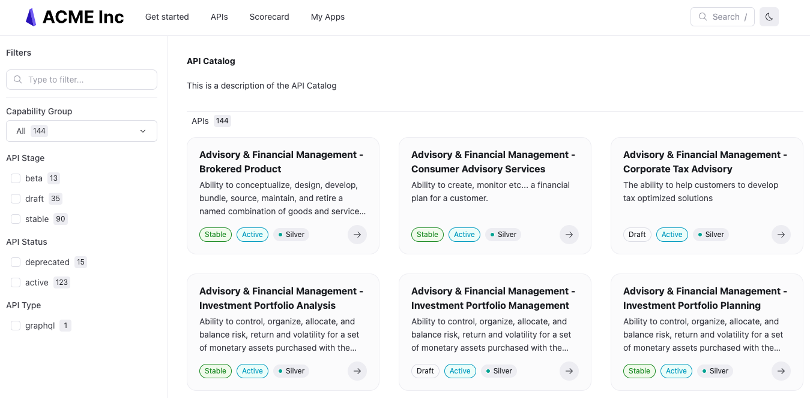

# Add a classic catalog to your project

If you have many API description files in your project, you can use the classic version of the catalog to display the APIs in a more organized way.



## Before you begin

Make sure you have the following before you begin:

- finalized versions of your API description files
- a `redocly.yaml` file in the root of your project

## Organize files

To add a classic catalog to your project, organize your API description files into one or more folders.

You can include however many folders you need and name your folder or folders anything you like.
See [Names](../../setup/concepts/names.md) for advice on naming.

The following is a sample file structure:

```treeview
my_catalog/
├── product-1/
│   ├── api-1.yaml
│   ├── api-2.json
│   └── api-3.yaml
├── product-2/
│   ├── api-a.yaml
│   └── api-b.json
├── redocly.yaml
└── sidebars.yaml
```

After organizing your API description files into folders, configure your catalog.

## Configure redocly.yaml

Once you have organized your API description files into one or more folders,
you must configure the `catalogClassic` and `navbar` options in your `redocly.yaml` file.

### Configure classic catalog

To configure the `catalogClassic` object:

1. Add a name for your catalog under the `catalogClassic` object. It does not appear anywhere in your project.
   ```yaml
   catalogClassic:
     acme-catalog:
   ```
2. Add the following required options under your catalog name:
   - `title`: This title is the main heading on the catalog page.
     ```yaml
     catalogClassic:
       acme-catalog:
         title: Acme API catalog
     ```
   - `description`: This description displays directly under the title on the catalog page.
     ```yaml
     catalog:
       acme-catalog:
         title: Acme API catalog
         description: Discover how our APIs can support your business.
     ```
   - `slug`: This is the path where you want the catalog to render.
     It can be anything as long as it matches the `page` or `href` option in the `navbar` object.
     Include a leading and trailing slash.
     ```yaml
     catalogClassic:
       acme-catalog:
         title: Acme API catalog
         description: Discover how our APIs can support your business.
         slug: /acme-apis/
     ```
   - `items`: This object is a list of what files to include in the catalog. Add the following options:
     - `directory`: This required option is the path to the directory with files that should be included in the catalog.
     - `flatten`: (Optional) If set to `true` all API description files, even those in subdirectories are included in the catalog.
       If set to `false` only top-level API description files are included in the catalog as well as the first file from every subdirectory.
       By default, this option is set to `false`.
     - `includeByMetadata`: (Optional) This is a map of metadata properties used to restrict what files are included in the catalog.
       See [Categories](../concepts/categories.md) for more information.
       ```yaml
       catalogClassic:
         acme-catalog:
         title: Acme API catalog
         description: Discover how our APIs can support your business.
         slug: /acme-apis/
         items:
           - directory: ./catalog
             flatten: true
             includeByMetadata:
               type: [openapi]
       ```
3. (Optional) Add the following options under your catalog name:
   - `titleTranslationKey`: This option is the key you would use to translate the title for the catalog page.
     See [Localize labels using translation keys](../how-to/config-l10n/localize-labels.md) for more information.
   - `descriptionTranslationKey`: This option is the key you would use to translate the description for the catalog page.
     See [Localize labels using translation keys](../how-to/config-l10n/localize-labels.md) for more information.
   - `filters`: This object includes a set of options for filtering your APIs.
     See [Categories](../concepts/categories.md) for more information.
   - `separateVersions`: This option allows you to separate APIs with multiple versions into their own catalog items.
     This option defaults to `false`.
   - `groupByFirstFilter`: This option allows you to group APIs by the first filter they belong to.
     See [Categories](../concepts/categories.md) for more information.

### Configure navbar

For your classic catalog to appear in the navbar at the top of the page, you must include it in the `navbar` configuration in your `redocly.yaml` file.

To configure the `navbar` item to include your catalog:

1. Add the `navbar` object.
   ```yaml
   catalogClassic:
     acme-catalog:
       title: Acme API catalog
       description: Discover how our APIs can support your business.
       slug: /acme-apis/
       items:
         - directory: ./catalog
    navbar:
   ```
2. Add the `items` object under the `navbar` object.
   ```yaml
   catalogClassic:
     acme-catalog:
       title: Acme API catalog
       description: Discover how our APIs can support your business.
       slug: /acme-apis/
       items:
         - directory: ./catalog
    navbar:
      items:
   ```
3. Add either the `page` or `href` option with the value of your catalog's `slug` option.
   If you use the `page` option, and do not include the `label` option,
   the text for the button on the navbar will match the catalog's `title` option's value.
   If you use the `href` option, and do not include the `label` option,
   the text for the button on the navbar will match the `href` option's value.
   Otherwise, you can specify the text by using the `label` optional option.
   ```yaml
   catalogClassic:
     acme-catalog:
       title: Acme API catalog
       description: Discover how our APIs can support your business.
       slug: /acme-apis/
       items:
         - directory: ./catalog
    navbar:
      items:
        - page: /acme-apis/
   ```
4. (Optional) Add the following options:
   - `label`: This option is the text that appears on the button on the navbar for your catalog.
     If you do not include it, the value for the `title` option of your catalog is used.
   - `labelTranslationKey`: This option is used if you are translating the button text into a different language.
     See [Localize labels using translation keys](../how-to/config-l10n/localize-labels.md) for more information.
   - `icon`: This option is where you can put the path to an icon you want to appear next to your catalog's button text in the navbar.
   - `external`: This option causes a new tab to open when the user clicks the item in the navbar.
     This option is `false` by default.
   - `linkedSidebars`: This option allows you to add this item to pages on a specified sidebar or multiple sidebars.
     It is an array of relative paths to these sidebar files.

### Example classic catalog and navbar configuration

The following `catalog` and `navbar` configuration includes a single catalog, with two filters, pulling descriptions from the `catalog` folder in the root directory:

```yaml
logo:
  image: ./images/logo.svg
  altText: My logo
  link: https://example.com
  favicon: ./images/logo.svg
catalogClassic:
  acme-catalog:
    title: Acme API catalog
    description: 'Discover how our APIs can support your business.'
    slug: /acme-apis/
    items:
      - directory: ./catalog
        flatten: false
    filters:
      - title: Content type
        property: tags
        options: [Cats, Learning]
        type: checkboxes
      - title: API type
        property: REST
        missingCategoryName: SOAP
        type: select

  navbar:
    items:
      - page: /acme-apis/
        icon: ./images/logo.png
        external: true
        linkedSidebars:
          - ./catalog/sidebars.yaml
      - label: Other docs
        href: https://redoc.ly/docs/developer-portal/introduction/
        external: true
```

## Resources

- [Configure your scorecard](../../setup/how-to/configure-scorecard.md) so that each API is checked against appropriate standards.
- Use [categories](../../author/concepts/categories.md) to filter APIs in the classic catalog.
- Learn more about [API Governance](https://redocly.com/docs/cli/api-standards).
