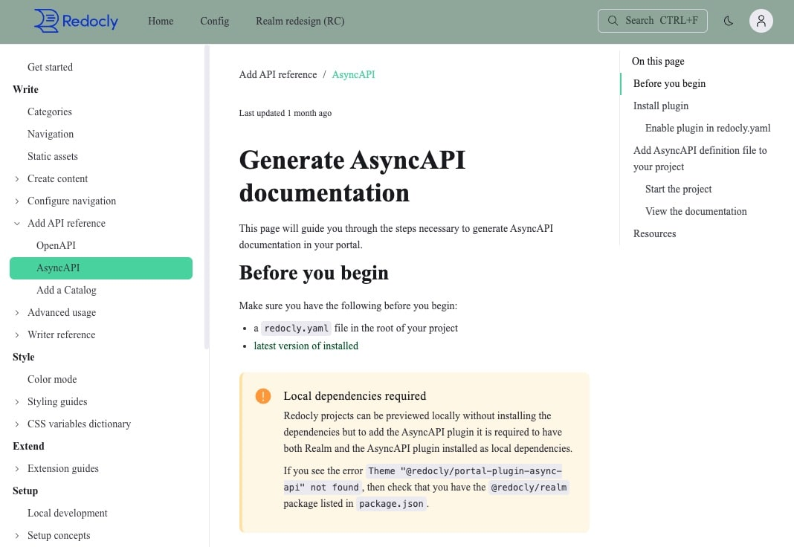

# Customize styles

You can apply custom styling to change the appearance of your project.
For example, things like typography, colors, and spacing.

The core theme is built using [CSS variables](./css-variables/index.md).
You can override those variables to add custom styling while benefiting from the theme's existing structure.

## Create a theme stylesheet

You need a `@theme/styles.css` file to customize the styling of your project.

To add a `@theme/styles.css` file to your project:

1. Add a folder named `@theme` to the root of your project.
1. Create a `styles.css` file inside the `@theme` folder.

Your project structure should look similar to the following example file tree:

```treeview 
your-awesome-project/
├── @theme/
│   └── styles.css
├── other-content.md
├── redocly.yaml
└── sidebars.yaml
```

## Override CSS variables

Add custom styling to your project by overriding CSS variables in your `@theme/styles.css` file. The following example shows a complete custom styling setup:

```css 
/* Light mode styling (default) */
:root {
  /* Brand colors */
  --color-primary: #2563eb;
  --color-primary-hover: #1d4ed8;
  
  /* Layout colors */
  --navbar-bg-color: #ffffff;
  --sidebar-background-color: #f8fafc;
  --content-background-color: #ffffff;
  
  /* Typography */
  --h1-text-color: #1f2937;
  --text-color: #374151;
  --link-text-color: #2563eb;
  
  /* Spacing and borders */
  --border-color: #e5e7eb;
  --spacing-unit: 1rem;
}

/* Dark mode styling */
:root.dark {
  /* Brand colors for dark mode */
  --color-primary: #60a5fa;
  --color-primary-hover: #3b82f6;
  
  /* Layout colors */
  --navbar-bg-color: #0f172a;
  --sidebar-background-color: #1e293b;
  --content-background-color: #0f172a;
  
  /* Typography */
  --h1-text-color: #f1f5f9;
  --text-color: #cbd5e1;
  --link-text-color: #60a5fa;
  
  /* Spacing and borders */
  --border-color: #374151;
}

/* Custom font configuration */
@font-face {
  font-family: 'CustomBrand';
  src: url('../static/fonts/custom-brand.woff2') format('woff2');
  font-weight: 400;
  font-display: swap;
}

:root {
  --font-family-headings: 'CustomBrand', system-ui, sans-serif;
  --font-family-body: 'Inter', system-ui, sans-serif;
}
```

When you save this file and run your project in development mode, the styling changes will be visible immediately.
Toggle between color modes to see the differences.

**Steps for customizing your project styling:**

1. **Choose elements to style** - Identify which components or sections you want to customize (see [table styling](./customize-tables.md) or [font customization](./customize-fonts.md) for specific guides)
2. **Find the CSS variables** - Use browser developer tools or the [CSS variables reference](./css-variables/index.md) to identify the relevant variables
3. **Override variables** - Add your custom values to the `@theme/styles.css` file
4. **Test in both modes** - Ensure your styling works well in both light and dark modes using [color mode customization](./customize-color-modes.md)

## Apply custom classes or IDs

You can apply custom CSS classes or IDs included in your `styles.css` file to many Markdown or Markdoc block level elements such as table cells, list items, quotes, and headers using Markdoc annotation syntax.

To apply a custom class to a Markdown element:

1. Add the custom class to your `styles.css` file, as in the following example:

   ```css 
   .highlight, p:has(.highlight) {
     background-color: yellow;
     color: red;
    }
   ```
1. Add the annotation syntax to the element in the Markdown document, as in the following example:

    

    ```markdown 

      Introduction to unordered list:

      - unordered list item 1
      - unordered list item 2 
      - unordered list item 3

      Introduction to ordered list: 

      1. ordered list item 1
      1. ordered list item 2
      1. ordered list item 3
    ```
    

    Rendered output:

      Introduction to unordered list:

      - unordered list item 1
      - unordered list item 2 
      - unordered list item 3

      Introduction to ordered list: 

      1. ordered list item 1
      2. ordered list item 2
      3. ordered list item 3


You may need to restart the Webview or commit your changes to your branch to see the updates.

## Examples

Use the examples in this section as starter themes to quickly add styling to your project.


   Have a request for a styling example?
   Please use the feedback form at the bottom of the page and tell us.


### Example theme - "Full corporate"

The "Full corporate" styling uses a business font, has teal accents, and is very deliberate about spacing.

```css 
:root {
  --teal-primary-1: #62D7A6;
  --teal-primary-2: #9BB0A5;
  --dark-green-primary-1: #384B42;
  --dark-green-primary-2: #005A23;
  --font-family-base: Times New Roman;

  --md-container-max-width: 860px;
  --md-container-padding-vertical: 18px;
  --md-container-padding-horizontal: 5px;
  --md-paragraph-margin-vertical: 6px;
  --h1-margin-top: 12px;
  --h2-margin-top: 8px;

  --menu-item-bg-color-active: var(--teal-primary-1);
  --toc-item-border-color-active: var(--teal-primary-1);
  --breadcrumbs-text-color-active: var(--teal-primary-1);

  --navbar-bg-color: var(--teal-primary-2);
  
  --search-trigger-color: var(--dark-green-primary-1);

  --link-color-primary: var(--teal-primary-1);
  --link-color-visited: var(--dark-green-primary-2);

}

:root.dark {
  --teal-primary-dark: #CDFBE4;
  --text-color-dark: #22232B;

  --navbar-text-color: #364133;

  --menu-item-color-active: var(--text-color-dark);
  --menu-item-text-color: var(--teal-primary-dark);
}
```

The following screenshots show the styling rules applied:


  
   
  
  
   
  


### Example theme - "Trendy startup"

The styling for the "Trendy startup" example combines shocking pink and teeny tiny font sizes.
Note the increased specificity used to style `.menu-item-type-separator` in dark mode.
This approach can be used for styling elements that may not have a CSS variable defined yet.

```css 
:root {
  --font-size-base: 12px;
  --font-size-sm: 10px;
  --font-size-lg: 14px;
  --font-size-xl: 20px;

  --pink-primary-1: #F15483;
  --pink-primary-2: #FAAEBD;
  --pink-primary-3: #FFE3ED;
  --purple-primary: #905B9F;

  --h1-text-color: var(--pink-primary-1);
  --heading-text-color: var(--pink-primary-2);
  
  --search-trigger-bg-color: var(--pink-primary-3);
  --sidebar-bg-color: var(--pink-primary-3);

  --toc-item-text-color-active: var(--purple-primary);
  --breadcrumbs-text-color-active: var(--purple-primary);
}

:root.dark {
  --purple-primary-dark: #BD9BF4;

  --menu-item-text-color: #22232B;
  
  --toc-item-text-color-active: var(--purple-primary-dark);
  --breadcrumbs-text-color-active: var(--purple-primary-dark);
}

:root.dark .menu-item-type-separator {
  --menu-item-text-color: #22232B;
}
```

The following screenshots show the styling rules applied:


  
   
  
  
   
  


### Example theme - Personal wellness

The "Personal wellness" example uses styling that emphasizes pastel colors and lots of space between elements.
Note that the only spacing change in the following example is for `--spacing-unit`, but space between elements is increased throughout the theme.

```css 
:root {
  --pastel-green: #d2e7d6;
  --pastel-green-secondary: #00A84E;
  --pastel-blue: #94B5E3;
  --pastel-purple: #B9C3FC;
  --pastel-active: #FFDF82;
  --text-color-dark-green: #3B4A3F;

  --navbar-bg-color: var(--pastel-green);  
  --navbar-item-bg-color-hover: var(--pastel-active);
  --navbar-item-bg-color-active: var(--pastel-active);
  --navbar-border-color: var(--pastel-purple);
  --search-trigger-border-color: var(--pastel-purple);
  --search-input-placeholder-color: var(--pastel-purple);

  --sidebar-bg-color: var(--pastel-blue);
  --menu-item-bg-color-hover: var(--pastel-active);
  --menu-item-bg-color-active: var(--pastel-active);

  --toc-bg-color: var(--pastel-blue);
  --toc-border-color: var(--pastel-purple);
  
  --text-color-secondary: var(--text-color-dark-green);
  --link-color-primary: var(--pastel-green-secondary);
  --link-color-visited: var(--pastel-purple);

  --spacing-unit: 6px;
}

:root.dark {
  --pastel-green-dark: #728576;
  --pastel-green-secondary: #00A84E;
  --pastel-blue-dark: #2F4858;
  --pastel-purple: #B9C3FC;
  --pastel-active-dark: #386C5F;
  --text-color-light-grey: #ECFEEF;

  --navbar-bg-color: var(--pastel-green-dark);
  --navbar-item-text-color-active: var(--pastel-green-dark);
  --navbar-item-text-color-hover: var(--pastel-green-dark);
  --navbar-item-bg-color-hover: var(--pastel-green);
  --navbar-item-bg-color-active: var(--pastel-green);

  --sidebar-bg-color: var(--pastel-blue-dark);
  --menu-item-color-active: var(--pastel-green-dark);
  --menu-item-color-hover: var(--pastel-green-dark);
  --menu-item-bg-color-active: var(--pastel-green);
  --menu-item-bg-color-hover: var(--pastel-green);
  --toc-bg-color: var(--pastel-blue-dark);

  --text-color-secondary: var(--text-color-light-grey);
}
```

The following screenshots show the styling rules applied:


  
   
  
  
   
  


## Resources

- **[Color mode customization](./customize-color-modes.md)** - Create custom styling for light and dark modes with mode-specific color schemes and advanced CSS rules
- **[Branding overview](./index.md)** - Explore all available branding and customization approaches from basic configuration to advanced component ejection
- **[Color mode concepts](./color-mode.md)** - Understand how the color mode feature works and its CSS variable-based implementation
- **[CSS variables reference](./css-variables/index.md)** - Complete dictionary of available CSS variables for comprehensive styling customization