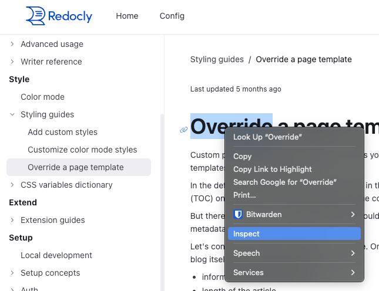
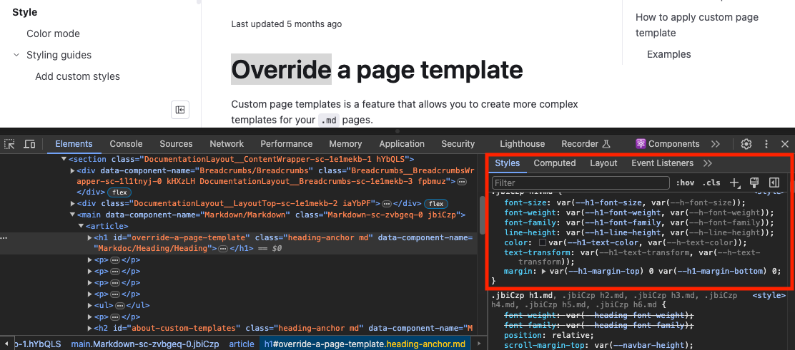

# Custom Styling

You can customize the styling and theme of your documentation using CSS. This page provides an in-depth explanation of how styling works in a Redocly project and how CSS variables can be used to create flexible, maintainable styling rules for your documentation.

## Customize your documentation

The behavior and appearance of your documentation is controlled by a customizable theme. There are two types of customizations:

1. **Functional** - The [Redocly configuration file](../config/index.md) can be used to enable, disable, or customize features in your documentation.
2. **Aesthetic** - The visual appearance of your documentation, such as the colors, fonts, and spacing, can be customized using CSS styling rules.

### The role of @theme/styles.css

Custom styling rules must be defined inside your project's `@theme/styles.css` file. During the rendering of your docs, the styles in this file are applied to all the pages in your project.

## Fundamentals of styling

This section contains foundational styling knowledge that will help style your documentation more effectively.

### Core CSS concepts

Some concepts in CSS provide important context for how styling works in your Redocly documentation. For a more comprehensive explanation, we recommend reading MDN's page on [CSS basics](https://developer.mozilla.org/en-US/docs/Learn/Getting_started_with_the_web/CSS_basics).

#### Selectors

Selectors are used to target the HTML elements you want to style. There's many types of selectors; they can be based on IDs, classes, element names, attributes, and more.

<details>
  <summary>See example: Selectors</summary>
  
  Here are some of the most basic CSS selectors:

  ```css 
  #some-element {
    /* ID selector */
  }
  .section-heading {
    /* class selector */
  }
  h2 {
    /* tag selector */
  }
  ```
</details>

#### Properties and values

Properties are the aspects of the element you want to change. Values are the settings for those properties. They're used together inside the selector.

<details>
  <summary>See example: Properties and values</summary>

  ```css 
    h1 {
      /* property: value */
      color: blue;
      font-size: 26px;
    }
  ```
</details>

#### Inheritance

Some (but not all) property values set on parent elements are inherited by their child elements. That means styling rules are inherited by an element's descendent.

<details>
  <summary>See example: Inheritance</summary>
  
  The following example sets the text color to red inside the body tag selector:

  ```css 
  body {
    color: red;
  }
  ```

  When the following HTML renders, the text is red:

  ```html 
  <body>
    <section>
      <p> Hello, World!</p>
    </section>
  </body>
  ```

  The text is red because the `p` tag _inherited_ the styling rule defined on the `body` tag.

</details>

#### The role of specificity

CSS means Cascading Style Sheets. It's named that because the styles "cascade" downward (yes, like a waterfall) to other elements, but CSS doesn't just flow downwards. It cascades in order of importance, which is controlled by the _specificity_ of your selector. When styling rules conflict, the rule with higher specificity is always applied.

<details>
  <summary>See example: Cascading styles and specificity</summary>
  
  Consider the following CSS, which changes text color:

  ```css 
  h2 {
    color: green;
  }
  .section-heading {
    color: yellow;
  }
  ```

  With this styling, `<h2>` elements on the page have green text. However, because class is a more specific selector, that style is overridden and the text is yellow.

  ```html 
  <h2>Green heading</h2>

  <h2 class="section-heading">Yellow heading</h2>
  ```

</details>

### CSS variable concepts

CSS variables, aka "custom properties", are a way to store values you want to reuse throughout your CSS. They have some major benefits when it comes to styling your documentation: reusability, dynamic updates, theming, and overall modularity.

#### CSS variable syntax

CSS variables are defined as custom properties with a `--` prefix and used with the [var() function](https://developer.mozilla.org/en-US/docs/Web/CSS/var). The `var()` function accepts a custom property and resolves to that property's declared value.

<details>
  <summary>See example: CSS variable syntax</summary>

  ```css 
  :root {
    --primary-heading-bg-color: #5b4ccc;
  }

  th {
    background-color: var(--primary-heading-bg-color);
  }
  ```

</details>

CSS variables can _only be used as values_. They don't work as property names, classes, or in any other context.

#### Fallback values

The `var()` function accepts a second parameter: a fallback value. The fallback value provides a default option in case the variable isn't set or can't resolve.

<details>
  <summary>See example: Fallback values</summary>

  In the following example, the text color in the `.display-banner` isn't defined, so it falls back to black.

  ```css 
  :root {
    --text-color-primary: #1a1c21;
  }

  .display-banner {
    color: var(--text-color-secondary, #000000 );
  }
  ```

</details>

Fallback values ensure your styling works when a CSS variable isn't defined or [supported by the browser](https://caniuse.com/css-variables). Use them to define default styles for older systems or unexpected situations.

#### Reusability

One of the biggest benefits of CSS variables is their reusability. You define a value once, then reuse it multiple times, providing consistency across your styles.

<details>
  <summary>See example: Reusability</summary>

  The following example defines variables in the `:root` selector, then reuses them in other selectors:

  ```css
  :root {
    --background-color: #3498db;
    --text-primary: #161616;
    --text-secondary: #525252;
    --heading-margin-top: 1.25em;
  }

  h1 {
    color: var(--text-primary);
    margin-top: var(--heading-margin-top);
  }

  body {
    color: var(--text-color-secondary, #000000);
    background-color: var(--background-color, #FFFFFF);
  }
  ```

</details>

#### Scope and inheritance

CSS variables are scoped to the selector where they're defined, but [CSS inheritance](#inheritance) rules also apply to CSS variables. When a variable is defined within a selector, it's _inherited_ by the child elements unless overridden.

Inheritance allows you to create relationships between variables to make your styling more consistent and maintainable.

<details>
  <summary>See example: Scope and inheritance</summary>

  The following example defines a variable in the `:root` selector, then uses it to style children elements:

  ```css 
  :root {
    --base-font-size: 16px;
  }

  body {
    font-size: var(--base-font-size);
  }

  h1 {
    font-size: calc(var(--base-font-size) * 2);
  }
  ```

</details>

## Custom styles in Realm

Realm provides a comprehensive set of pre-defined [CSS variables](#css-variable-concepts), which can be overridden in your `@theme/styles.css` file. You can define custom CSS rules, too, but we recommend using the CSS variables where possible. Styling with CSS variables has two distinct benefits for styling your documentation:

1. Smaller, one-off customizations are more streamlined and provide more control. You can override an element-specific variable or something farther up the inheritance chain.
2. Theme-level styling customizations are more consistent and maintainable.

### CSS variables in Realm

There are two ways to identify Realm's CSS variables:

1. Looking at the [list of CSS variables](./css-variables/index.md) in our documentation.
2. [Using browser developer tools](#find-variables-with-browser-dev-tools) to inspect elements.

For practical examples of using CSS variables, see the [custom styles guide](./customize-styles.md) which demonstrates comprehensive styling setups.

CSS variable overrides will typically go inside the `:root` or `:dark` selector (see Color mode), but some may be scoped to specific classes.

The following example shows the format:

```css 
:root {
  --text-primary: #656255;
  --heading-text-color: #000000;
}

:dark {
  --text-primary: green;
  --heading-text-color: #FFFFFF;
}

/* Scoped to button-primary class for both color modes */
.button-primary {
  --button-active-border-color: red;
}

/* Scoped to button-primary in light mode */
:root .button-primary {
  --button-color: #00008B;
}

/* Scoped to button-primary in dark mode */
:dark .button-primary {
  --button-color: #ADD8E6;
}

```

### Find variables with browser dev tools

When styling Realm, the browser developer tools can help you identify which CSS variables to use. These tools allow you to inspect HTML elements and see which CSS variables are applied. You can also explore how the variable may be nested.

1. Open developer tools - Right click the element you're interested in and select **Inspect** or press **F12**.
    

2. View styles - In the **Elements** panel, you'll see the styles applied to the selected element.
    

3. Identify variables - Find the CSS variable to override to apply your styling. You can also click the variable to explore it's relationship to other variables.

### Nested CSS variables

Realm's CSS variables can be described as "nested". A core, low-level set of variables are defined around things like colors, fonts, and spacing, which are then used to create other variables. There are multiple layers of abstraction.

When overriding a variable, you need to consider the relationship with other variables or your styling change could impact a downstream variable.

For example, let's say we want to change the background color of the in-browser error message. We used dev tools to identify the variable, `background: var(--detailed-error-message-background);`. Here's how that variable is nested:

```css
:root {
  --bg-raised: #fafafa;
  --code-block-background-color: var(--bg-raised);
  --detailed-error-message-background: var(--code-block-background-color);
}
```

Overriding variables closer to the root value are theme-level changes. The styling change will trickle down to any nested variables.For example, changing the value for either `--bg-raised` or `--code-block-background-color` will also change the styling of any variables built on top of them.

Overriding variables at the bottom of the nesting hierarchy will impact something more specific. For example, overriding `--detailed-error-message-background` will only change the styling for the error message background.

### Inheritance-powered styling

Consider the `:root` selector (used in many examples on this page), which applies to the root HTML element. Variables defined in `:root` are "globally" available because every other HTML element is a child, which means they inherit the CSS variables.

It's the [scope and inheritance](#scope-and-inheritance) behaviors of CSS variables that make this approach to styling so effective for building and managing themes.

CSS variables in Realm are defined on `:root`, which means they're globally available via inheritance. Overriding the wrong [nested variable](#nested-css-variables) in `:root` can have downstream implications. However, by overriding that same variable _inside a different scope_, you can ensure predictable, consistent behavior throughout your theme.

For example, let's say we have an element with a custom class called `.blog-display` and we want to style the text color.

This is text is currently styled:

```css
:root {
  --color-warm-grey-8: #3b3c45;
  --text-color-secondary: var(--color-warm-grey-8);
  --base-font-size: 14px;
}

p {
  font-size: var(--base-font-size);
  color: var(--text-color-secondary);
}
```

One approach is using a class selector and setting the property values:

```css
.blog-display {
  font-size: 18px;
  color: black;
}
```

This works, but any CSS variables related to `font-size` and `color` are still controlled by `:root`. If the `.blog-display` class contains other elements styled by those, then our new styles won't match.

When styling a theme, a better approach is to override the lower-level CSS variables inside the scope of the `.blog-display` class:

```css
.blog-display {
  --text-color-secondary: black;
  --base-font-size: 18px;
}
```

Overriding CSS variables in the correct scope allows you to preserve the relationships between variables and logic defined in the core theme.  

## Resources

- **[Custom styles guide](./customize-styles.md)** - Customize your project's appearance using CSS variables and custom stylesheets for precise brand control
- **[Color mode customization](./customize-color-modes.md)** - Create custom styling for light and dark modes with mode-specific color schemes
- **[Color mode concepts](./color-mode.md)** - Understand how the color mode feature works and its implementation using CSS variables
- **[CSS variables reference](./css-variables/index.md)** - Complete dictionary of available CSS variables for styling your documentation
