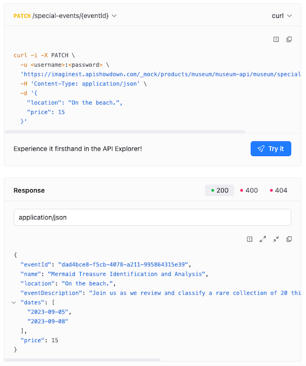

---
products:
  - Redoc
  - Revel
  - Reef
  - Realm
plans:
  - Pro
  - Enterprise
  - Enterprise+
---
# `codeSnippet`

Code snippets are small sections of code you can include in your Markdown and OpenAPI documents.
In Markdown code snippets are formatted by wrapping the text in two sets of three backticks, placed at the start and end of the text block.

For example, the following is a code snippet with yaml:

````markdown 
```yaml
codeSnippet:
  copy:
    hide: true
```
````

Markdown code snippets include a report and copy icon in the top right corner.

In OpenAPI reference documentation, code snippets are generated based on the information in the description.
The following is an example of a request and response code snippet in OpenAPI reference documentation:



OpenAPI reference documentation code snippets include report, copy, and expand and collapse icons in the top right corner.

You can configure the `codeSnippet` element to hide the copy, expand, and collapse buttons.
You can also configure the report element's tooltip and dialog label text.



## Options



- Option
- Type
- Description

---

- elementFormat
- string
- A value that specifies the style for the control icons. Possible values: `icon`, `text`. Default: `icon`

---

- copy
- [Copy](#copy-object)
- An object with the list of specific settings for a code snippet's copy button.

---

- report
- [Report](#report-object)
- An object with the list of specific settings for a code snippet's report button.

---

- expand
- [Expand](#expand-object)
- An object with the list of specific settings for a code snippet's expand button.

---

- collapse
- [Collapse](#collapse-object)
- An object with the list of specific settings for a code snippet's collapse button.



### Copy object

Users can use copy button to put code snippet raw content into the clipboard.



- Option
- Type
- Description

---

- hide
- boolean
- Specifies if the copy button should be hidden.
  Default value: `false`.

---



### Report object

Users can use the report button to send problem feedback about the code snippet's content.
When users click the report button or text, they are provided a comment feedback form.



- Option
- Type
- Description

---

- hide
- boolean
- Specifies if the report button should be hidden.
  Default value: `true`.

---

- label
- string
- Label inside the report dialog form. Default value: `What is wrong with the code?`.

---

- tooltipText
- string
- Text of the tooltip of the report button. Default value: `Report a problem`.



### Expand object

Use the expand button to show all the nested properties inside a JSON object that is included as a sample request or response in an OpenAPI definition.



- Option
- Type
- Description

---

- hide
- boolean
- Specifies if the expand button should be hidden.
  Default value: `false`.



### Collapse object

Users can use collapse button to hide all the nested properties inside a JSON object that is included as a sample request or response in an OpenAPI definition.



- Option
- Type
- Description

---

- hide
- boolean
- Specifies if the collapse button should be hidden.
  Default value: `false`.



## Configuration scope

Configure code snippets globally in your `redocly.yaml` file or for individual pages using front matter.

### Global configuration

Configuration added to the `redocly.yaml` file applies to all Markdown and API reference pages:

```yaml
codeSnippet:
  elementFormat: text
  report:
    label: Please tell us what is wrong with this code sample.
    tooltipText: Send feedback about this code sample
```

### Page-level configuration

Configure code snippets for individual pages in the front matter. Front matter configurations take precedence over global settings:

```yaml
---
codeSnippet:
  report:
    label: What is wrong with this code sample?
---
```

## Examples

### Hide or customize icons

Hide the copy button:

```yaml
codeSnippet:
  copy:
    hide: true
```

Display all icons as text instead of icons:

```yaml
codeSnippet:
  elementFormat: text
```

Hide all icons:

```yaml
codeSnippet:
  copy:
    hide: true
  report:
    hide: true
  expand:
    hide: true
  collapse:
    hide: true
```

### Configure report feedback

Enable the report button with custom label and tooltip:

```yaml
codeSnippet:
  report:
    label: Please tell us what is wrong with this code sample.
    tooltipText: Send feedback about this code sample
```

### Hide expand and collapse buttons

Hide the expand and collapse buttons on JSON objects in OpenAPI reference documentation:

```yaml
codeSnippet:
  expand:
    hide: true
  collapse:
    hide: true
```

## Customizing labels and tooltips

Translation keys provide customization options for code snippet control texts. For complete details, refer to the [Translation Keys Reference](../content/localization/translation-keys.md).

## Resources

- **[Code-snippet Markdoc tag](../content/markdoc-tags/code-snippet.md)** - Display code snippets loaded from local files with syntax highlighting and interactive features
- **[Feedback configuration](./feedback.md)** - Configure the feedback mechanism that appears on all pages and code snippets for user input collection
- **[Front matter configuration](./front-matter-config.md)** - Configure code snippet behavior and appearance on individual pages using front matter settings
- **[Configuration options](./index.md)** - Explore other project configuration options for comprehensive documentation and platform customization
