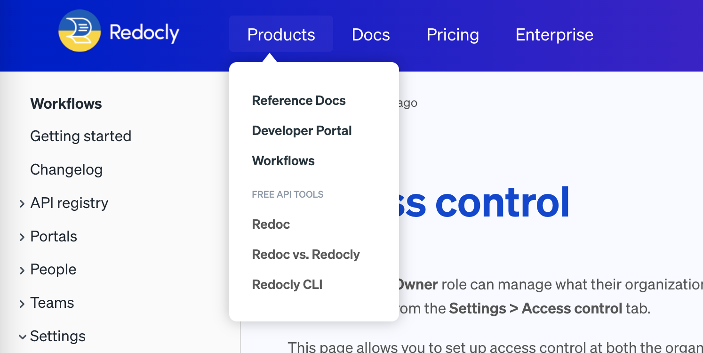

---
products:
  - Redoc
  - Revel
  - Reef
  - Realm
plans:
  - Pro
  - Enterprise
  - Enterprise+
---
# `navbar`

The `navbar` appears across the top of the website.
You can configure the links and groups of links that appear on the navbar of your site, or hide the navbar altogether.
The navbar is a good location for top-level category or frequently-used links.

## Options



- Option
- Type
- Description

---

- items
- [Item](#item-object) | [Group](#group-object)
- List of items in the Navbar.

---

- hide
- boolean
- Specifies if the navbar should be hidden.
  Default: `false`.

  



### Group object



- Option
- Type
- Description

---

- group
- string
- **REQUIRED.** Name of the group.

---

- groupTranslationKey
- string
- Specifies the group name key used for [localization](./l10n.md).

---

- items
- [Item](#item-object)
- **REQUIRED.**
  List of items.
  The navbar for the default theme may only have one level of depth to groups.

---

- linkedSidebars
- [string]
- Array of relative paths to sidebar files.
  This option will add the navbar item to a sidebar's breadcrumbs.
  Only effective for top-level navbar items.

---

- icon
- string
- Either:
  - A [Font Awesome](https://fontawesome.com/icons) icon name.
    Realm has the following icon packs built in: Classic Regular, Classic Solid, Duotone Solid, and Classic Brands.
    The icons automatically adjust their colors when users change the color mode.

    To add an icon from the Classic Regular pack, you can provide the icon name only or prefix the name with `regular`.
    To add an icon from other built-in packs, prefix the icon name with: `solid` (for Classic Solid), `duotone` (for Duotone Solid), or `brands` (for Classic Brands).

    **Examples:** `book`, `duotone book`, `brands github`

    Using other prefixes, including the `fa-` prefix, causes the icon to not render.
  - Relative path to an icon image file.

    **Example:** `./images/config-icon.svg`


---

- external
- boolean
- Open link in new browser tab. Default is `false`.

---

- page
- string
- **MUTUALLY EXCLUSIVE.** Path to the file which represents the page to link to.
  Mutually exclusive with the `href` option.
  If you use the `page` option, and do not include the `label` option,
  the text for the link on the sidebar will match the level 1 heading of the page.

---

- href
- string
- **MUTUALLY EXCLUSIVE.** URL to link to.
  Mutually exclusive with the `page` option.
  If you use the `href` option, and do not include the `label` option,
  the text for the link on the sidebar will match the `href` option's value.




### Item object



- Option
- Type
- Description

---

- page
- string
- **CONDITIONALLY REQUIRED.** Path to the file which represents the page to link to.
  Mutually exclusive with the `href` option.
  If you use the `page` option, and do not include the `label` option,
  the text for the link on the sidebar will match the level 1 heading of the page.

---

- href
- string
- **CONDITIONALLY REQUIRED.** URL to link to.
  Mutually exclusive with the `page` option.
  If you use the `href` option, and do not include the `label` option,
  the text for the link on the sidebar will match the `href` option's value.

---

- label
- string
- Link text displayed for the item.

---

- labelTranslationKey
- string
- Link text key for the item used for internationalization.

---

- icon
- string
- Either:
- A [Font Awesome](https://fontawesome.com/icons) icon name.
    Realm has the following icon packs built in: Classic Regular, Classic Solid, Duotone Solid, and Classic Brands.
    The icons automatically adjust their colors when users change the color mode.

    To add an icon from the Classic Regular pack, you can provide the icon name only or prefix the name with `regular`.
    To add an icon from other built-in packs, prefix the icon name with: `solid` (for Classic Solid), `duotone` (for Duotone Solid), or `brands` (for Classic Brands).

    **Examples:** `book`, `duotone book`, `brands github`

    Using other prefixes, including the `fa-` prefix, causes the icon to not render.
  - Relative path to an icon image file.

    **Example:** `./images/config-icon.svg`

---

- external
- boolean
- Open link in new browser tab. Default is `false`.

---

- linkedSidebars
- [string]
- Array of relative paths to sidebar files. This option will add navbar item to sidebar's breadcrumbs. Only effective for top-level navbar items.



## Examples

### Simple navigation

The following is an example configuration for a simple flat navbar.

```yaml 
navbar:
  items:
    - page: index.md
      label: Home
    - page: docs/getting-started.md
      label: Getting Started
    - page: api-reference.yaml
      label: API Reference
    - label: Support
      href: https://support.example.com
      external: true
```

The following is a screenshot of that navbar.


### Complete navigation setup

The following example shows a comprehensive navbar configuration for a documentation site with multiple sections, localization support, and external links:

```yaml 
navbar:
  items:
    - page: index.md
      label: Home
      labelTranslationKey: nav.home
    - group: Documentation
      groupTranslationKey: nav.docs
      items:
        - page: docs/getting-started.md
          label: Getting Started
          labelTranslationKey: nav.getting-started
        - page: docs/guides/index.md
          label: Guides
          labelTranslationKey: nav.guides
        - page: docs/tutorials/index.md
          label: Tutorials
    - group: API Reference
      items:
        - page: users-api.yaml
          label: Users API
        - page: orders-api.yaml
          label: Orders API
        - page: webhooks-api.yaml
          label: Webhooks API
    - page: changelog.md
      label: Changelog
    - label: Support
      href: https://support.example.com
      external: true
      icon: ./images/support-icon.svg
```

### Multi-product navigation

For sites with multiple products, organize content using groups and linked sidebars:

```yaml 
navbar:
  items:
    - page: index.md
      label: Home
    - group: Products
      items:
        - page: product-a/index.md
          label: Product A
          linkedSidebars:
            - product-a/sidebars.yaml
        - page: product-b/index.md
          label: Product B
          linkedSidebars:
            - product-b/sidebars.yaml
    - page: support.md
      label: Support
```

### Dropdown menu with separators

The following is an example of a dropdown menu with visual separators for better organization:

```yaml 
navbar:
  items:
    - group: Products
      items:
        - page: platform/index.md
          label: Platform
        - page: api-gateway/index.md
          label: API Gateway
        - separator: Developer Tools
        - page: cli/index.md
          label: CLI
        - page: sdk/index.md
          label: SDK
    - label: Pricing
      page: pricing.md
    - label: Enterprise
      page: enterprise.md
```

The following is the visual screenshot of the navbar.


### Hide navbar

To hide the navbar globally or on specific pages:

```yaml 
# Hide navbar on all pages
navbar:
  hide: true
```

Or in page front matter:
```yaml
---
navbar:
  hide: true
---
```

## Resources

- **[Navigation elements](../navigation/index.md)** - Overview of all navigation components and patterns for creating comprehensive site navigation structures
- **[Footer configuration](./footer.md)** - Configure the footer navigation with links, copyright information, and organizational elements
- **[Logo configuration](./logo.md)** - Configure the logo that appears in the navbar with brand customization and display options
- **[Localization](./l10n.md)** - Configure navbar labels and text for multiple languages to support international audiences
- **[Front matter configuration](./front-matter-config.md)** - Use front matter to show or hide the navbar on individual pages for custom page layouts
- **[Configuration options](./index.md)** - Explore other project configuration options for comprehensive documentation and platform customization
