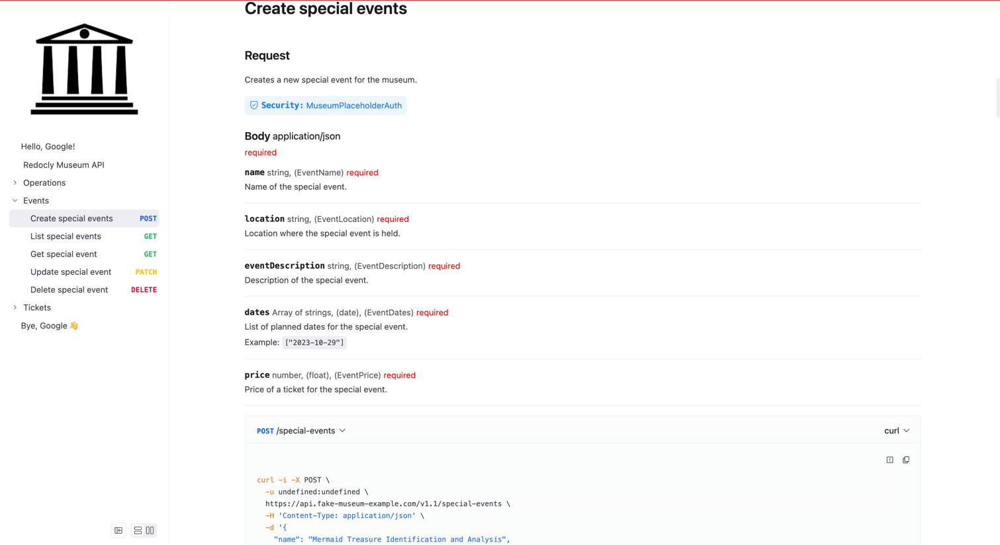
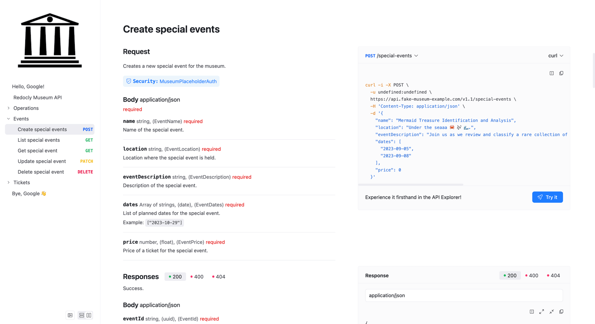

---
products:
  - Redoc
  - Realm
plans:
  - Pro
  - Enterprise
  - Enterprise+
---
# `layout`

Controls the layout of the API docs page, affecting how the panels are displayed.
The default value is `three-panel` which uses the default layout with the sidebar, middle panel, and right panel with code samples.
Set the value to `stacked` to move the entire right panel into the middle panel.
The `stacked` layout is identical to the layout activated by selecting the **Change View** button on the API documentation page.





The `layout` option is a string that sets the layout of the API documentation page.

## Options



- Option
- Type
- Description

---

- layout
- string
- Controls the layout of the API docs page.
  Possible values: `three-panel` or `stacked`.
  Default value is `three-panel`.



## Examples

The following example configures the layout for the API documentation page to be set to `stacked`:

```yaml 
openapi:
  layout: 'stacked'
```



```yaml 
openapi:
  layout: 'three-panel'
```



## Resources

- **[OpenAPI configuration](./index.md)** - Complete guide to OpenAPI configuration options for customizing API reference documentation
- **[OpenAPI Specification](https://spec.openapis.org/oas/latest.html)** - Official OpenAPI Specification documentation for understanding API description standards
- **[OpenAPI visual reference](https://redocly.com/learn/openapi/openapi-visual-reference)** - Visual guide to OpenAPI specification structure and layout configuration principles
- **[Configuration options](../index.md)** - Explore other project configuration options for comprehensive documentation customization
