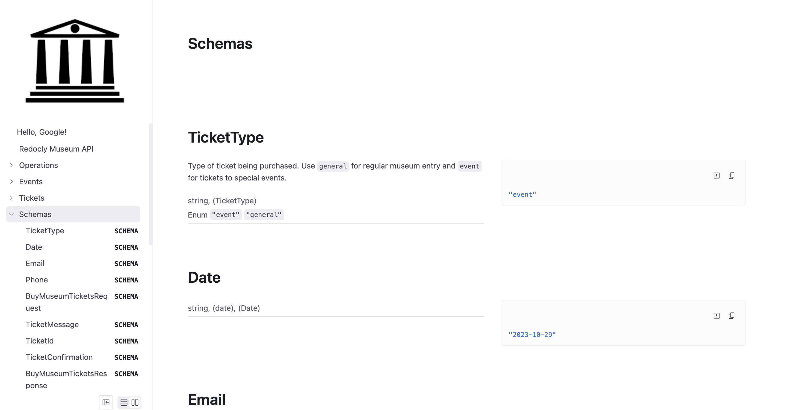

---
products:
  - Redoc
  - Realm
plans:
  - Pro
  - Enterprise
  - Enterprise+
---
# `schemaDefinitionsTagName`

If a value is set, all of the schemas are rendered with the designated tag name.
The schemas then render and display in the sidebar navigation (with that associated tag name).
To display only specific schemas, use the [`x-tags` specification extension](https://redocly.com/docs/api-reference-docs/specification-extensions/x-tags/).

The `schemaDefinitionsTagName` option is a string that sets the tag name for schema definitions.

## Options



* Option
* Type
* Description

---

* schemaDefinitionsTagName
* string
* Schema definition tag name.



## Examples

The following example sets the schema definition tag name to `Schemas`.

```yaml 
openapi:
  schemaDefinitionsTagName: Schemas
```

Using the Museum API as an example, all the schemas are shown in the section called "Schemas" at the bottom of the navigation menu:



## Resources

- **[OpenAPI configuration](./index.md)** - Complete guide to OpenAPI configuration options for customizing API reference documentation
- **[x-tags specification extension](../../content/api-docs/openapi-extensions/x-tags.md)** - Use x-tags extension to control which schemas display in specific sections for fine-grained output customization
- **[OpenAPI Specification](https://spec.openapis.org/oas/latest.html)** - Official OpenAPI Specification documentation for understanding API description standards
- **[Configuration options](../index.md)** - Explore other project configuration options for comprehensive documentation customization
