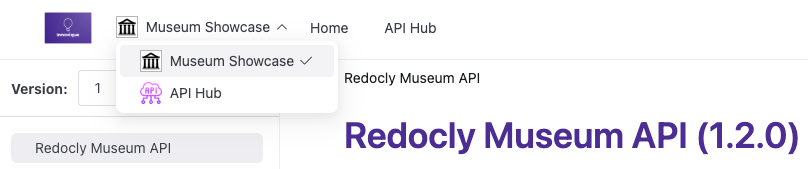

---
products:
  - Revel
  - Realm
plans:
  - Pro
  - Enterprise
  - Enterprise+
---
# `products`

Use the `products` section to set up multiple product documentation sets in your project.
This option configuration creates a product picker in the navbar and offers the ability to customize the look of each product's documentation set.



## Options



- Option
- Type
- Description

---

- products
- Map[string, [Product](#product-object)]
- **REQUIRED**
  Map of strings allows for the definition of multiple products.
  Strings represent product only in configuration file - they do not appear in published product.
  Example: `acme-us`.



### Product object



- Option
- Type
- Description

---

- name
- string
- **REQUIRED**
  Name of the product that appears in product picker.
  Example: `Acme`.

---

- icon
- string
- Path to the product icon file.
  Displays next to the product name in product picker.

---

- folder
- string
- **REQUIRED**
  Path to the product content folder.
  Cannot be a subfolder in another product's folder.



## Examples

### Basic multi-product setup

The following example shows a simple multi-product configuration:

```yaml 
products:
  acme:
    name: Acme
    folder: products/acme/
  museum:
    name: Museum
    folder: products/museum/
```

### Complete multi-product configuration

The following example shows a comprehensive multi-product setup with icons and proper folder structure:

```yaml 
products:
  platform:
    name: Platform API
    icon: images/platform-icon.svg
    folder: products/platform/
  mobile:
    name: Mobile SDK
    icon: images/mobile-icon.svg
    folder: products/mobile/
  integrations:
    name: Integrations
    icon: images/integrations-icon.svg
    folder: products/integrations/
```

This configuration creates a product picker in the navbar and organizes content as follows:

```treeview
project/
├── images/
│   ├── platform-icon.svg
│   ├── mobile-icon.svg
│   └── integrations-icon.svg
├── products/
│   ├── platform/
│   │   ├── index.md
│   │   ├── api-reference.yaml
│   │   └── redocly.yaml        # Optional product-specific config
│   ├── mobile/
│   │   ├── index.md
│   │   ├── guides/
│   │   └── sidebars.yaml       # Product-specific navigation
│   └── integrations/
│       ├── index.md
│       └── webhooks.yaml
├── index.md                    # Project landing page
└── redocly.yaml               # Main configuration
```

### Product-specific configuration

Each product folder can include its own `redocly.yaml` file to customize that product's documentation. Product-specific configurations override the root configuration for:

- breadcrumbs
- codeSnippet
- feedback
- footer
- logo
- navbar
- sidebar
- search

```yaml 
# Platform-specific customization
navbar:
  items:
    - page: index.md
      label: Platform Overview
    - page: api-reference.yaml
      label: API Reference
    - page: guides/index.md
      label: Platform Guides

footer:
  copyrightText: "© 2024 Platform Team. All rights reserved."
```

### Search behavior in multi-product

When users search from a product page, results are automatically filtered to that product.
Users can remove the filter to search all content.

## Resources

- **[Multi-product overview](../navigation/multi-product.md)** - Conceptual guide to multi-product documentation including product switching and organization strategies
- **[Navigation elements](../navigation/index.md)** - Configure navigation elements and structures for multi-product sites with product-specific navigation
