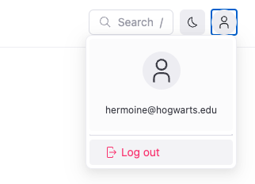

---
products:
  - Redoc
  - Revel
  - Reef
  - Realm
plans:
  - Pro
  - Enterprise
  - Enterprise+
description: Set the visibility of the user menu in your project.
---
# `userMenu`




The user menu is displayed in the far right side of the navbar.
Users can click the user avatar and a dropdown menu displays with the avatar, the user's email address, links to pages you can configure, and a log out option.





You must also have `sso` and either `rbac` or `requiresLogin` configured for the userMenu to display.



## Options



- Option
- Type
- Description

---

- hide
- boolean
- Specifies if the User menu should be hidden.
  Only required if you do not add any other options to the configuration.
  Default: `false`.

---

- hideLoginButton
- boolean
- Specifies if the login button that displays in the far right side of the navbar should be hidden.
  Default: `false`.

---

- items
- [Item](#item-object)
- List of links in the User menu dropdown.

---




### Item object



- Option
- Type
- Description

---

- page
- string
- **CONDITIONALLY REQUIRED.** Path to the file which represents the page to link to.
  Mutually exclusive with the `href` option.
  If you use the `page` option, and do not include the `label` option, the text for the link on the sidebar will match the level 1 heading of the page.

---

- href
- string
- **CONDITIONALLY REQUIRED.** URL to link to.
  Mutually exclusive with the `page` option.
  If you use the `href` option, and do not include the `label` option, the text for the link on the sidebar will match the `href` option's value.

---

- label
- string
- Link text displayed for the item.

---

- labelTranslationKey
- string
- Link text key for the item used for [localization](./l10n.md).

---

- external
- boolean
- Open link in new browser tab.
  Default is `false`.



## Examples

```yaml
userMenu:
  hide: false
  hideLoginButton: true
  items:
    - href: /my-settings/
      label: Settings
```

## Resources

- **[Configure RBAC](../access/index.md)** - Configure role-based access control to manage user permissions and access levels for user menu functionality
- **[Configure SSO](../reunite/organization/sso/configure-sso.md)** - Set up single sign-on integration to enable seamless user authentication and menu personalization
- **[RBAC concepts](../access/rbac.md)** - Understand how role-based access control works in Redocly products for comprehensive user menu and permission management
- **[Navbar configuration](./navbar.md)** - Add additional links to the navbar and configure navbar appearance to complement the user menu
- **[SSO configuration](./sso.md)** - Configure SSO authentication required for user menu display and functionality
- **[RBAC configuration](./rbac.md)** - Set up role-based access control as an alternative to requiresLogin for user menu access management
- **[Requires login configuration](./requires-login.md)** - Configure login requirements as an alternative to RBAC for enabling user menu functionality