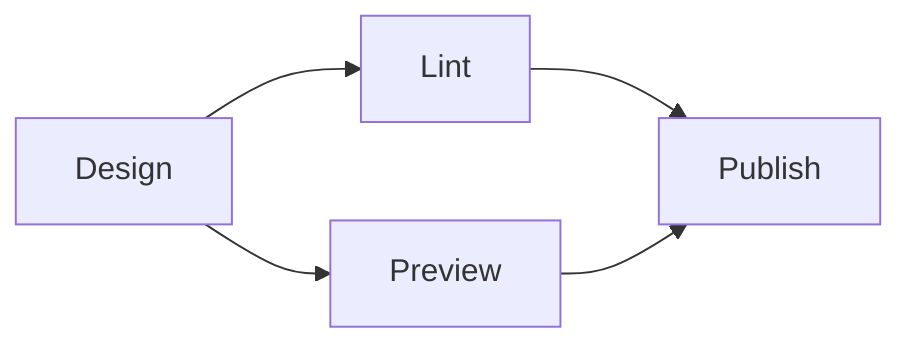
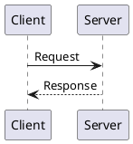
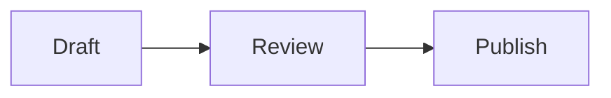

---
products:
  - Revel
  - Reef
  - Realm
plans:
  - Pro
  - Enterprise
  - Enterprise+
keywords:
  includes:
    - mermaid
    - plantuml
    - excalidraw
---
# Add diagrams



Redocly projects have built-in support for three diagram types: [Mermaid](https://mermaid.js.org/), [PlantUML](https://plantuml.com/), and [Excalidraw](https://excalidraw.com/).
Use diagrams to help your users quickly grasp the structure or concept that your content conveys.
It's good practice to use diagrams alongside explanatory text to make sure that all users can access the information.

## Mermaid

Use Mermaid to add flowcharts, sequence diagrams, pie charts, and other visualizations using a text-based syntax.

Add a Mermaid diagram by using a fenced code block with the `mermaid` language identifier:

````text 

````

The diagram that is produced looks like the following:


## PlantUML

Use PlantUML for UML diagrams such as sequence diagrams, class diagrams, and activity diagrams.

Add a PlantUML diagram by using a fenced code block with the `plantuml` language identifier:

````text 

````

The diagram that is produced looks like the following:


## Excalidraw

Use Excalidraw for hand-drawn style diagrams and sketches.

Add an Excalidraw diagram by using a fenced code block with the `excalidraw` language identifier:

````text 
```excalidraw
{
  "elements": [
    {
      "type": "rectangle",
      "x": 10,
      "y": 10,
      "width": 200,
      "height": 100,
      "strokeColor": "#000000",
      "backgroundColor": "#a5d8ff",
      "label": { "text": "Hello Excalidraw" }
    }
  ]
}
```
````

The diagram that is produced looks like the following:

```excalidraw
{
  "elements": [
    {
      "type": "rectangle",
      "x": 10,
      "y": 10,
      "width": 200,
      "height": 100,
      "strokeColor": "#000000",
      "backgroundColor": "#a5d8ff",
      "label": { "text": "Hello Excalidraw" }
    }
  ]
}
```

## Use diagrams from files

Instead of writing diagram source inline, you can store it in a separate file and reference it with the `diagram` Markdoc tag.
File references keep your Markdown pages clean and make diagrams easier to edit independently.

```markdoc 

```

```markdoc 

```

```markdoc 

```

The `file` attribute accepts a relative path (resolved from the current page) or an absolute path (resolved from the content directory root).
The `type` attribute must be one of `mermaid`, `plantuml`, or `excalidraw`.

## Control alignment and width

You can control diagram layout in Markdown by adding Markdoc attributes to either the fenced code block or the `diagram` tag.

Use standard Markdoc string attribute syntax for these options:

````text 

````


```markdoc 
{% diagram file="./architecture.mermaid" type="mermaid" align="center" width="100%" /%}
```

- `align` supports `left`, `center`, and `right`.
- `width` accepts any CSS width value, such as `480px`, `40rem`, `75%`, or `100%`.
- When you set `width`, the SVG scales proportionally and its height adjusts automatically.

## AsciiDoc

Diagrams are also supported in AsciiDoc (`.adoc`) files with the [AsciiDoc plugin](./asciidoc.md).
Use an open block with a style that matches the diagram type:

```adoc
[mermaid]
--
graph LR;
  A --> B
--
```

```adoc
[plantuml, format="png", id="myId"]
--
@startuml
Alice -> Bob: Hello
Bob --> Alice: Hi
@enduml
--
```

```adoc
[excalidraw]
--
{ "elements": [ ... ] }
--
```

Realm always renders diagrams as SVG.
If you include a `format` attribute for compatibility with Asciidoctor diagram syntax, it is ignored.

See [Use AsciiDoc content](asciidoc.md) for more information about the AsciiDoc plugin.

## Resources

- **[Mermaid documentation](https://mermaid.js.org/intro/#diagram-types)** - Complete guide to Mermaid diagram types and syntax
- **[PlantUML documentation](https://plantuml.com/)** - Reference for UML and other diagram types in PlantUML
- **[Excalidraw documentation](https://docs.excalidraw.com/)** - Guide to creating hand-drawn style diagrams with Excalidraw
