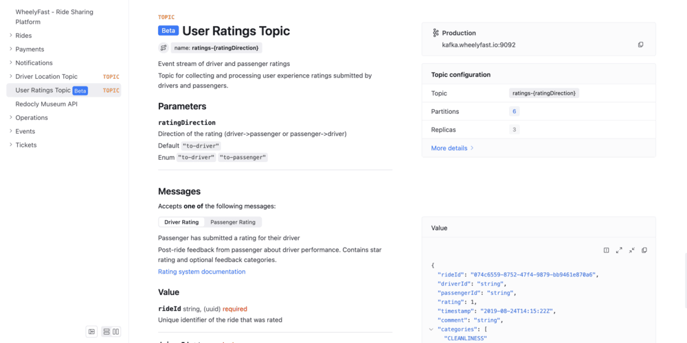

# AsyncAPI extension: `x-badges`

The `x-badges` option allows you to add badges to an channel or operation, to use as an indicator in documentation.
The badges are displayed in API reference documentation in the following locations:
- the title of a channel or an operation in the header of the page
- the channel or operation item when it displays in a navigation list

Each channel or operation can have multiple badges, and the displayed color is also configurable.

## Location

Add an array of `x-badges` to any Channel or Operation object.

## Options



* Option
* Type
* Description

---

* x-badges
* [ [Badge Object](#badge-object) ]
* A list of badges.



### Badge Object



* Option
* Type
* Description

---

* name
* string
*  **REQUIRED**. The text that displays in the badge.

---

* position
* string
* The position of the badge in relation to the header. Possible values: `before`, `after`. The default value is `after`.

---

* color
* string
* The color of the badge. It can be defined in various formats such as color keywords, RGB, RGBA, HSL, HSLA, and Hexadecimal. The default value is `#1f7cff`.



## Examples

The following example sets a `Beta` badge on the `User Ratings Topic` channel:

```yaml 
asyncapi: 3.0.0
...
channels:
  ratings:
    address: ratings-{ratingDirection}
    title: User Ratings Topic
    summary: Event stream of driver and passenger ratings
    description: Topic for collecting and processing user experience ratings submitted by drivers and passengers.
    servers:
      - $ref: '#/servers/production'
    x-badges:
      - name: 'Beta'
        position: before
    messages:
      driverRating:
        $ref: '#/components/messages/driverRating'
```


## Resources

- See a full [list of supported AsyncAPI extensions](./index.md).
