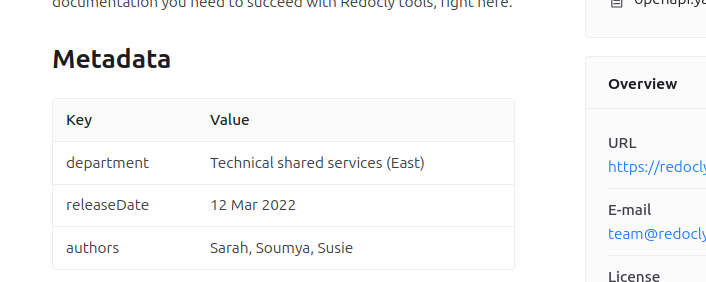

# OpenAPI extension: `x-metadata`

Use `x-metadata` to add a table of additional data to the top of your API reference documentation.
You can add any keys or values that you want users to easily find at the top level of the documentation.





The data is formatted as a table and added as part of the description section at the top of the page.

## Location

The `x-metadata` extension can be added to Info Object.

## Options



- Option
- Type
- Description

---

- x-metadata
- Object
- Custom metadata in key/value format.



## Examples

### `x-metadata` example

Metadata keys can be any string.
The values can be any primitive type, or a list of strings.

The following is an example of an `x-metadata` section of an OpenAPI description file:

```yaml
info:
  x-metadata:
    department: Technical shared services (East)
    releaseDate: '12 Mar 2022'
    authors:
      - Sarah
      - Soumya
      - Susie
```

The data is presented as shown in the following screenshot:



### `x-metadata` as filters in classic catalog

The following snippets are examples of `x-metadata` sections with configured `tags` you can use to [filter APIs in classic catalog](../../../config/catalog-classic.md#x-metadata-filters-in-classic-catalog).

```yaml 
info:
  x-metadata:
    tags:
      - Books
```

```yaml 
info:
  x-metadata:
    tags: ["Magazines"]
```

To use `tags` as filters, the values must be a list.

## Resources

- **[Hide info metadata configuration](../../../config/openapi/hide-info-metadata.md)** - Hide metadata from API reference documentation when you want it in descriptions but not displayed
- **[Show extensions configuration](../../../config/openapi/show-extensions.md)** - Control which extensions are included in your API reference documentation for optimal presentation
- **[OpenAPI configuration settings](../../../config/openapi/index.md)** - Complete reference for all available OpenAPI configuration options and customization settings
- **[Supported OpenAPI extensions](./index.md)** - Complete list of all OpenAPI extensions supported by Redocly for enhanced API documentation
