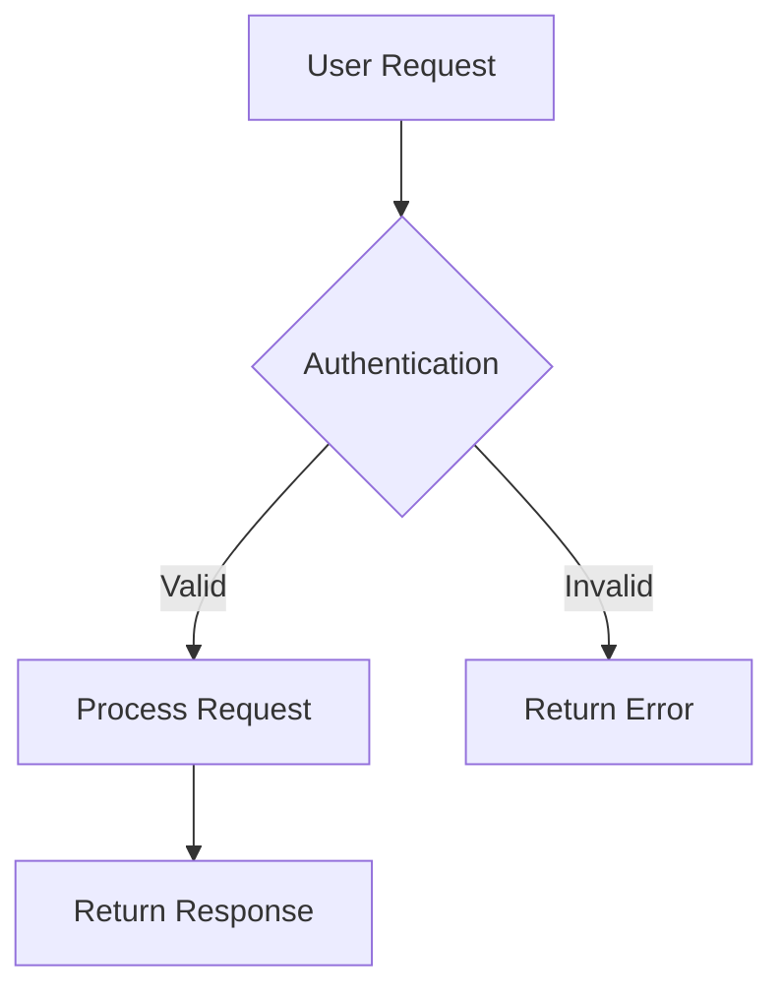

# Markdown in Redocly

Redocly projects support enhanced Markdown that combines standard Markdown syntax with powerful Markdoc extensions, giving you rich formatting options and interactive components for your documentation.

## Standard Markdown

All standard Markdown syntax works in Redocly projects:

### Text formatting

```markdown
**Bold text** and *italic text*

~~Strikethrough text~~

`Inline code`

> Blockquotes for callouts and emphasis
```

### Headings and structure

```markdown
# Page title (H1)
## Section heading (H2)  
### Subsection heading (H3)

- Bulleted lists
- With multiple items

1. Numbered lists
2. In sequential order
```

### Links and references

```markdown
[Link text](./relative-page.md)
[External link](https://example.com)


```

### Code blocks

````markdown
```javascript
// Syntax highlighting for many languages
function example() {
  return "Hello world";
}
```
````

## Redocly enhancements

Redocly extends standard Markdown with additional capabilities:

### Front matter configuration

Control page behavior with YAML front matter:

```yaml
---
title: Custom page title
description: Page description for SEO
---
```

### Enhanced code blocks

Add titles, line highlighting, and annotations:

````markdown 
```javascript 
function processData() {
  const data = fetchData(); // [!code highlight]
  
  if (!data) { // [!code error] // [!code error]
    throw new Error('No data'); // [!code error] // [!code error]
  } // [!code error] // [!code error]
  
  return data.map(item => ({ // [!code ++] // [!code ++]
    id: item.id, // [!code ++] // [!code ++]
    name: item.name // [!code ++] // [!code ++]
  })); // [!code ++] // [!code ++]
}
```
````

Learn more about [code snippet configuration](../config/code-snippet.md) for all highlighting and annotation options.

### File trees

Display project structure with the `treeview` format:

````markdown
```treeview
project/
├── docs/
│   ├── api/
│   │   └── openapi.yaml
│   └── guides/
│       └── getting-started.md
├── images/
└── redocly.yaml
```
````

### Diagrams

Add visual diagrams using Mermaid syntax:

````markdown

````

Learn more about [adding diagrams](./add-diagram.md) with additional examples and chart types.

## Markdoc tags

Redocly includes powerful Markdoc tags for interactive elements:

### Content organization

```markdoc 


Content for the first tab.


Content for the second tab.


```

Learn more about the [tabs tag](./markdoc-tags/tabs.md) for organizing content.

### Visual elements

```markdoc 

This is an informational callout with custom styling.




Description of the first feature.


Description of the second feature.


```

Learn more about [admonitions](./markdoc-tags/admonition.md) and [cards](./markdoc-tags/cards.md) for enhanced visual presentation.

### Images and icons

Enhanced image display with sizing, lightbox, and captions:

```markdoc 

A screenshot showing the main application interface.

```

Add inline icons for visual enhancement:

```markdoc 
 Highlighted feature
 Important note
```

Learn more about [image handling](./markdoc-tags/img.md) and [icons](./markdoc-tags/icon.md) for visual elements.

### Code and examples

```markdoc 



This shows how Markdoc syntax renders in practice.

```

```markdoc 


fetch('/api/users')
  .then(response => response.json())
  .then(data => console.log(data));


import requests
response = requests.get('/api/users')
data = response.json()
print(data)


```

Learn more about [code snippets](./markdoc-tags/code-snippet.md), [code groups](./markdoc-tags/code-group.md), and [Markdoc examples](./markdoc-tags/markdoc-example.md) for displaying code.

### Content reuse

```markdoc 

```

Learn more about [partials](./markdoc-tags/partial.md) for reusing content across pages.

### API documentation

```markdoc 



```

Learn more about [OpenAPI code samples](./markdoc-tags/openapi-code-sample.md) and [JSON schema](./markdoc-tags/json-schema.md) for API documentation.

## Tables

Redocly uses enhanced table formatting:

```markdoc 

- Column 1
- Column 2  
- Column 3
---
- Row 1, Cell 1
- Row 1, Cell 2
- Row 1, Cell 3
---
- Row 2, Cell 1
- Row 2, Cell 2
- Row 2, Cell 3

```

Learn more about [table formatting](./markdoc-tags/table.md) for structured data presentation.

## Best practices

### File organization

- Use descriptive filenames with kebab-case: `user-authentication.md`
- Organize related content in folders
- Place reusable content in `_partials/` folders

### Writing style

- Start with a clear H1 heading
- Use descriptive link text instead of "click here"
- Include alt text for images
- Break up long content with headings and lists

### Cross-references

- Use relative links for internal pages: `./other-page.md`
- Link to specific sections with anchors: `./page.md#section-name`
- Test links to ensure they work correctly

### Images and assets

- Store images in organized folders like `./images/`
- Use descriptive filenames for images
- Optimize image sizes for web display
- Consider using [static assets](../customization/static-assets.md) for predictable URLs

## Resources

- [Markdoc tags reference](./markdoc-tags/tag-library.md) - Complete list of available tags
- [Content reuse with partials](./markdoc-tags/partial.md) - Share content across pages
- [Project structure](./project-structure.md) - Organize your content files
- [Add links](./links.md) - Link between pages and sections
- [Static assets](../customization/static-assets.md) - Host files with predictable URLs
- [Markdoc configuration](../config/markdown.md) - Customize Markdown processing
