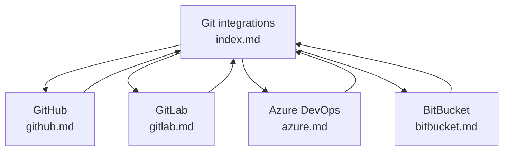

---
products:
  - Revel
  - Realm
plans:
  - Pro
  - Enterprise
  - Enterprise+
---
# SEO in Realm



Discover how Realm ensures that your published project works well with search engines and what you can do to further optimize your content.

## SEO automation

Realm's features automate many aspects of SEO:

**Link validation**

Realm validates both your links and redirects as you add content to your project.
You can catch broken links and stale redirects early, and the built-in CI/CD jobs prevent projects with link errors from publishing.

**Lazy-loading**

Images and heavy components like the Replay console are loaded only when needed, improving the speed with which pages load.

**Site map generation**

[Configure `siteUrl`](../config/seo.md#generate-a-sitemap) in `redocly.yaml` and build your project.
After the build is finished, Realm automatically generates a sitemap for your project.
The sitemap is available at `https://<your-domain.com>/sitemap.xml`.
You can then submit it to [Google Search Console](https://search.google.com/search-console/).

**Link canonicalization**

After you [configure `siteUrl`](../config/seo.md#generate-a-sitemap), Realm also adds a `<link rel="canonical">` element to the `<head>` of each of your pages.
This element points to the page that represents the latest version of that content.

When your project contains versioned content, only the pages generated from files in the default version subfolder are marked as canonical.
If you later change the default version, Realm automatically moves the `<link rel="canonical">` to the new default version pages.

## Optimize your project for search engines

Use the following strategies and techniques to boost the discoverability of your documentation both for external search engines, and internal search in Realm projects.

### Build a pillar structure for your pages

Rather than a flat structure, consider grouping your content into related topics and placing them into separate folders.
Then dedicate one page to be the "pillar": an overview of content in the folder that links to each content file.
Finally, link back the content files to the pillar page.

This method reinforces the authority of the page over the given topic, and also makes your content easier to find.



### Add unique page titles and descriptions

Use unique, descriptive titles.
Repeated titles like "Overview", "Settings", or "Getting started" can negatively affect search results and also become confusing for users and authors.
Instead, use product or feature names: "Authentication overview", "RBAC settings", "Getting started in Reunite".

### Add meta tags

HTML `<meta>` tags describe your content for search engines.
The tags and their values affect how your project pages are indexed and displayed in the search results.
In Realm, you can set the values for `<meta>` tags under the [`seo` option](../config/seo.md):

- in `redocly.yaml` for the entire project
- in the front matter of individual pages to override global configuration

The following options are available to configure in `seo`:

- `description`: Add up to 150 characters to have a better control over the text snippet that appears in external search engines.
- `keywords`: While keywords lost their importance in SEO, you still can add them to your project.
- `meta`: You can add additional meta tags to your project and individual pages.

Realm also provides options for social media sharing:

- `image`: Add a path to an image you want to appear on social media link previews.

Example of metadata on a blogpost page:

```yaml
---
seo:
  title: SEO the API docs
  description: SEO is an excellent API marketing technique.
  keywords: 'seo, documentation, api'
  image: ./images/seo.jpg
---
```

#### JSON-LD

Realm supports JSON-LD parameters in `redocly.yaml` and in the front matter to add structured data to your project.
You can choose from among the schemas available on [Schema.org](https://schema.org/docs/schemas.html) that best describe your project or individual pages.
Structured data is essential for creation of rich snippets and improving the click-through rate of your project.

The `jsonLd` object can be used alongside other `seo` options.

Example of JSON-LD metadata on a blogpost page:

```yaml
---
seo:
  jsonLd:
      "@context": https://schema.org
      "@type": BlogPosting
      author:
        - "@type": Person
          name: Adam Altman
          url: https://twitter.com/adamaltman
      headline: SEO the API docs
---
```

## Resources

- **[seo](../config/seo.md)** - Explore configuration options that optimize your content for search engines
- **[Front matter configuration](../config/front-matter-config.md)** - Configure information for the `<head>` tag for specific pages
- **[SEO best practices for documentation](https://redocly.com/blog/seo-best-practices-documentation)** - Read Redocly's blog post about making your project work better with search engines