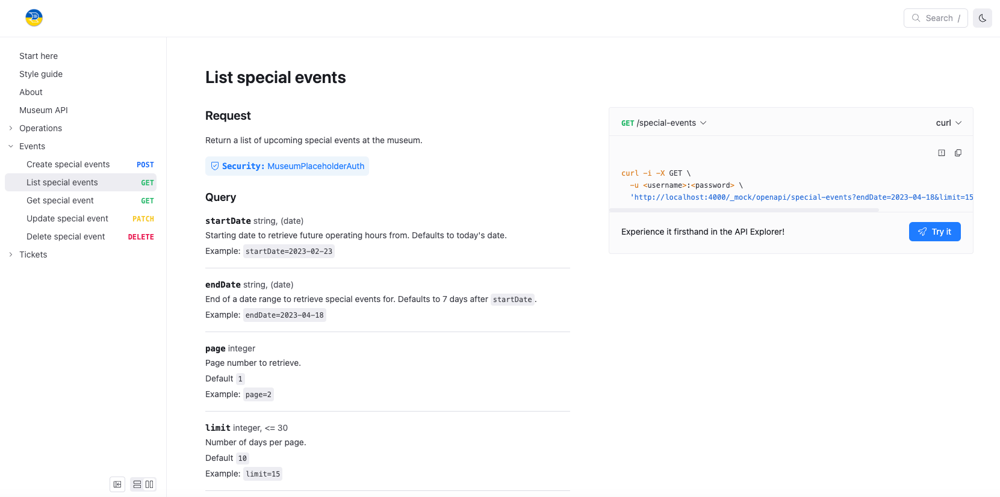
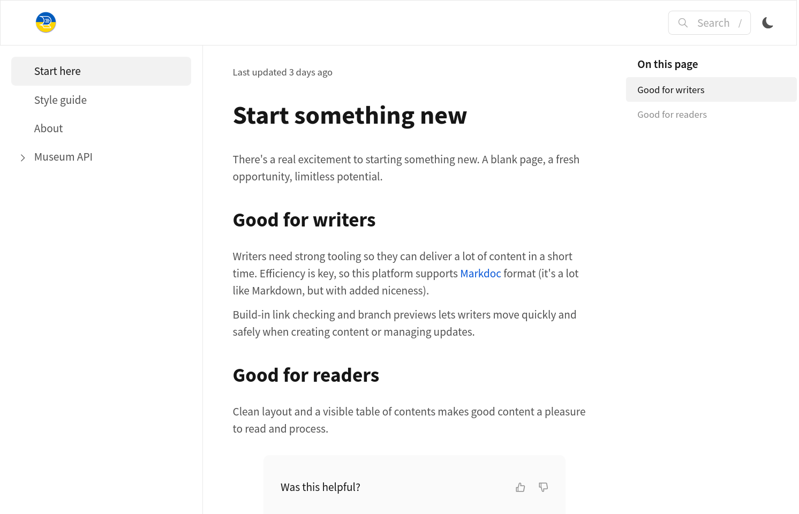
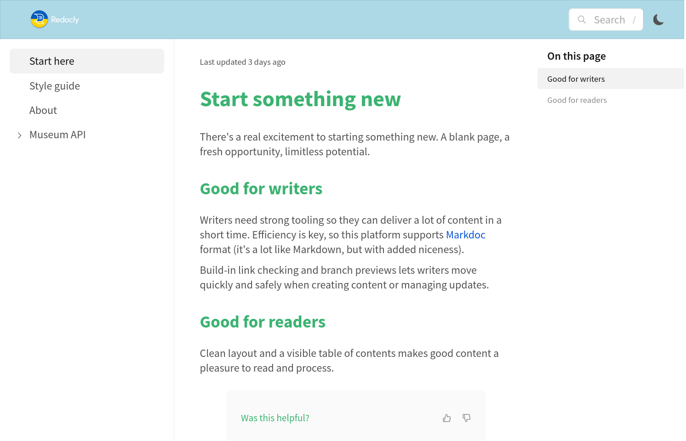

# Get started locally

Create and preview a Redocly documentation project on your local machine.
This guide shows you how to set up a project, add content, configure navigation, and customize styling.

## Before you begin

Make sure you have the following:

- [Node.js](https://nodejs.org/en) LTS version or later.

## Start with an index page

The landing page for each directory in your project is `index.md`.
Create a fresh directory for your new project, and then add a file named `index.md`.

Create your own content or use the following Markdown in your `index.md` file:



Preview your content.


Using a particular source control is outside of the scope of this guide, but it's recommended to add your files to a Git repository or equivalent, and commit your changes after each step as you go along.



## View the project

Redocly has a local development server that you can use to preview your work on your local machine.
Start the preview by running the following command in your terminal, in your project directory:

```bash
npx @redocly/cli preview
```

You'll see some output while the project is building.
When it is ready, it will be available on <http://localhost:4000>.

## Add more pages, and a sidebar

Add more pages to create a complete site.


These examples use Markdown, but Markdoc is also supported.
Learn more about [Markdown in Redocly](../content/markdown.md) for all available formatting options and Markdoc features.


Create files named `style-guide.md` and `about.md`.
Add your own content or use the following examples:





When you add more pages, a sidebar is automatically generated to list them all.
If you want more control over the navigation, such as specifying the order, changing the link text, or grouping pages, then you'll want to configure the sidebar yourself.

To configure the sidebar for your project, create a file named `sidebars.yaml` and add the following content:

```yaml 
- page: index.md
- page: style-guide.md
- page: about.md
```

This displays the pages in a specific order, and you can also change the display labels.
For example, edit the file as shown in the following example to change the link to the index page:

```yaml 
- page: index.md
  label: Start here
- page: style-guide.md
- page: about.md
```

If you don't specify a label, the page title is used.
Add more pages and customize navigation by reordering items and changing labels.
There's more information and examples in the documentation pages for [working with sidebars](../navigation/sidebars.md).

## Fine-tune your configuration

Customize your project further with configuration options.
All the configuration for Redocly projects is done using [configuration options](../config/index.md) in a file named `redocly.yaml`.
By changing the settings in this file, you can adjust the project behavior to fit your use case.

Create a file called `redocly.yaml`, then try the following examples (or pick some other configuration settings) to change how the site looks.
Make changes incrementally and preview each update.

1. Published sites should match your company's brand.
   Styling is covered in a later section, but as a first step let's configure a logo file to use.

   Create an `images/` folder and add your logo there.
   Use this sample logo if you don't have your own:

   

   Use the following configuration to set the logo for your site:

    ```yaml 
    logo:
      image: ./images/logo.png
   ```

1. For bigger or more complex projects, the breadcrumbs feature displays above each page and helps users to understand where they are in the site structure.
   Turn off breadcrumbs for simpler projects:

    ```yaml 
    breadcrumbs:
      hide: true
    ```

1. Some links are useful on every page, so it's a good idea to add a footer to accommodate them.
   The setting for this is in `footer`, try adding something like the following example:

    ```yaml 
    footer:
      items:
        - group: Redocly
          items:
            - href: https://redocly.com
              label: Redocly.com
            - href: https://redocly.com/docs
              label: Redocly docs
        - group: Docs Resources
          items:
            - href: https://markdoc.dev/
              label: Markdoc
            - href: https://openapis.org
              label: OpenAPI
    ```

View the [full configuration options list](../config/index.md) to see what else you can change.

## Add API reference documentation

API reference documentation is a major feature of the Redocly products, so add an OpenAPI description and try the feature yourself.
If you already have an API description then you can use that, or you can download the [Museum API example](https://github.com/Redocly/museum-openapi-example/blob/main/openapi.yaml) to use as a test API.

Create an `apis/` directory in your project and add the OpenAPI file(s) there.

To include the API in the sidebar, add the root file to `sidebars.yaml`.
The API reference adds sidebar entries for the user to navigate the various sections, so try adding the API description as the page for a group sidebar entry, like the following example:

```yaml 
- group: Museum API
  page: apis/openapi.yaml
```

Explore the generated documentation and see how the API you picked is presented.
API reference documentation is a vital part of API experience, and our Redoc rendering makes it a good experience.



Many aspects of the API documentation are configurable, visit the [openapi configuration page](../config/openapi/index.md) for more information and ideas.

## Style to suit

Apply your company brand identity by customizing the site styling.
Redocly uses [CSS variables](../branding/customize-styles.md) for most of the styling on the site.
Set key variables to deliver consistent styling throughout the project.

To customize the styles:

- Add a folder called `@theme` in the root of your project.
- Add a `styles.css` file in the @theme folder.
- Add entries to `style.css` to override any CSS variables you'd like to change.

For example, set your company brand color:

```css 
:root {
  --heading-text-color: mediumseagreen;
}
```

CSS variables apply changes consistently throughout the site.
For example, changing `--font-size-base` scales all text proportionally.
Set background colors on the navbar and footer to reinforce brand identity:

```css 
:root {
  --heading-text-color: mediumseagreen;
  --footer-bg-color: lightblue;
  --navbar-bg-color: lightblue;
  --font-size-base: 18px;
}
```

Your site looks a bit different to the default, as you can see in the following pair of screenshots:





Explore the [CSS variables reference](../branding/css-variables/index.md) or inspect your site with web developer tools in your browser to identify the variables to change.

## Publish your site

The preview feature is not licensed for production use.
Publish your content to Redocly when you're satisfied with the results:

1. Add your files to a Git repository if you haven't already.

1. Push the files to your Git provider (we support GitHub, GitLab, Azure DevOps, and Bitbucket).

1. Log in to Reunite and create a new project; [connect to your Git remote repository](../reunite/project/connect-git/connect-git-provider.md).

1. Your project is created and your site is built automatically.

## Resources

- **[Multi-sidebar example project](https://github.com/Redocly/warp-multi-sidebars)** - Complete template project demonstrating API documentation with multiple sidebars, guides, tutorials, and advanced navigation
- **[Configuration options](../config/index.md)** - Complete reference for all `redocly.yaml` configuration settings and customization options
- **[Working with sidebars](../navigation/sidebars.md)** - Advanced sidebar configuration including nested navigation, groups, and custom labels
- **[CSS variables reference](../branding/css-variables/index.md)** - Complete dictionary of available CSS variables for styling customization
- **[OpenAPI configuration](../config/openapi/index.md)** - Configure API reference documentation rendering and behavior options
- **[Connect Git provider](../reunite/project/connect-git/connect-git-provider.md)** - Set up automatic builds and deployment from your Git repository
