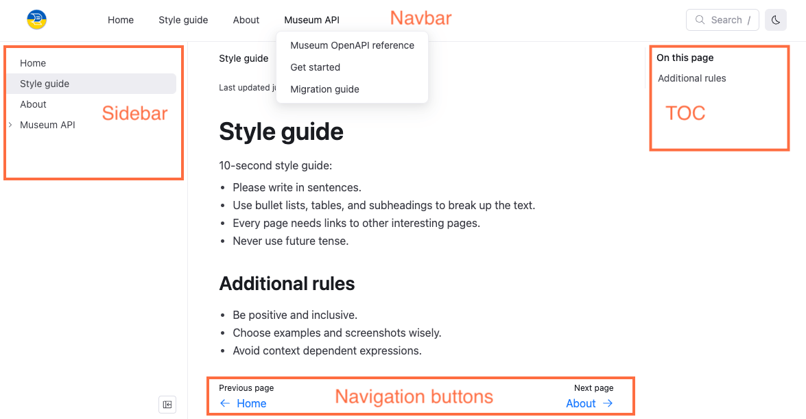

# Navigation elements

You can customize or hide multiple navigation elements for your projects.
These navigation elements include menus, both automatic and configured, and buttons.

The following screenshot is an example project that includes the four main navigation elements:




## Sidebar menu

The sidebar is a navigation menu that is generated automatically based on your project's file structure if no `sidebars.yaml` file exists.
By default, items in the sidebar menu are sorted using natural ordering, that is, multi-digit numbers are treated as a single character.
An exception to this rule is the `index.md` file that by default appears as the first item in any sidebar.
For example, the following files: `index.md`, `concept-1.md`, `concept-11.md`, and `concept-2.md`, result in the following sidebar:

```treeview 
├── index.md
├── concept-1.md
├── concept-2.md
└── concept-11.md
```

Additionally, API description files automatically add items to the sidebars.
These items are generated according to the internal structure of the tags and endpoints described in the file and preserve the order of this structure.

However, you can configure the sidebar by adding a `sidebars.yaml` file to your project, and or add a configuration to your `redocly.yaml` file to hide the sidebar by page or for the entire project.

Link titles in the sidebar are by default the first heading title on the page, or are configured with a label in the `sidebars.yaml` file.
You can nest groups in the sidebar and have multiple sidebars.
If you have a `sidebars.yaml` file in your project, any content you want included in your published project must be added to it.
Some components, such as the `catalog` component also generate sidebars for each item in the catalog.

The sidebar is located on the left side of the page when on desktop devices.
On smaller devices, a slide drawer navigation menu icon displays in the upper-right corner of the page.


Clicking this icon displays the sidebar.

See [On the sidebar](./sidebar.md) for more information on how to configure navigation on the sidebar.

## Navbar menu

The navbar is a persistent navigation menu that is configured in the `redocly.yaml` file.
You can add links, icons to items in the navbar, and group items in the navbar to create a drop-down list.

The navbar is located in the upper-left part of the page when on desktop devices.
On smaller devices, a slide drawer navigation menu icon displays in the upper-right corner of the page.


Clicking this icon displays the sidebar with an option for the **Main Menu**, which is the navbar.

See [On the navbar](./navbar.md) for more information on configuring navigation on the navbar.

## Footer links and copyright

The footer is an optional collection of links and a copyright statement.
It is customized in the `redocly.yaml` file and allows you to add some quick links that appear at the bottom of every page in configurable groups.
You can also add icons to footer items as you can in the navbar.

The footer is located at the bottom of the page on all device sizes.

See [On the footer](./footer.md) for more information on configuring navigation on the footer.

## TOC (table of contents)

The TOC, or table of contents, is a navigation menu that automatically populates based on the headings on the current page.
You can customize the title of the TOC or hide the TOC in either the front matter of select Markdown pages, or in your `redocly.yaml` file for all pages.

The TOC is located on the upper-right side of the page on desktop devices.

See [On the TOC](./toc.md) for more information on configuring navigation on the TOC (table of contents).

## Navigation buttons

Navigation buttons are buttons that display by default at the bottom of Markdown and API reference pages in your project.
These buttons guide the user to the next or previous pages based on the order in the sidebar.
If a page is the first item on a sidebar, only a single navigation button displays on the bottom-right side of the page directing the user to the next item in the sidebar.
Similarly, if an item is the last item on a sidebar, only a single navigation button displays on the bottom-left side of the page directing the user to the previous item in the sidebar.

You can configure the text on the navigation buttons in either the front matter for select pages, or in your `redocly.yaml` file for all pages.

If you add the `external: true` option to a page in your sidebar, that page opens in a separate browser tab and does not have navigation buttons.

See [Navigation buttons](./navigation-buttons.md) for more information on configuring your navigation buttons.
