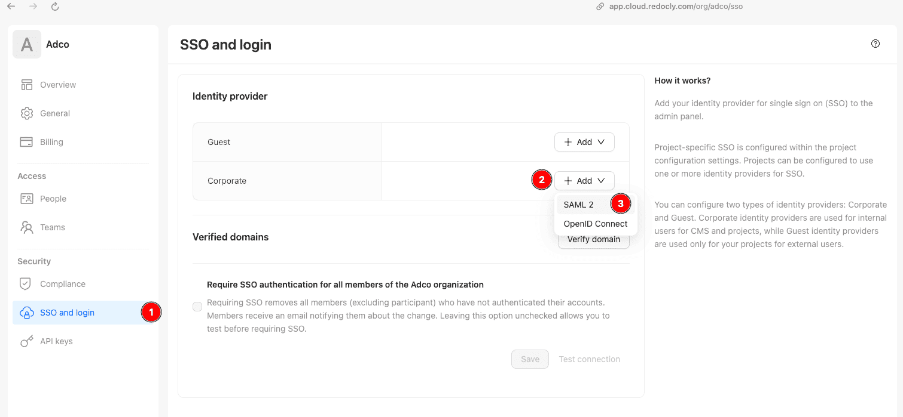

# Configure SSO and RBAC with Microsoft Entra ID

This guide explains how to configure Microsoft Entra ID (formerly known as Azure Active Directory or Azure AD) with Redocly SSO and role-based access controls.


You need to complete all steps before you can test that the integration is working.


## Begin setup in Redocly

Start configuring SSO in Redocly to get the values needed for the next steps.

1. Go to the Redocly Reunite dashboard and select **SSO and login** in the navigation.
1. Select **Add** in the Guest or Corporate Identity Provider section.
1. Select **SAML2**.

The following screenshot shows the SSO configuration screen.



Keep this page open for reference, the values here are used in the next steps.
After adding the required configuration in Microsoft Entra, return to this page to complete the final setup.

## Install Redocly Enterprise in Microsoft Entra

Install the [Redocly Enterprise application](https://azuremarketplace.microsoft.com/en-US/marketplace/apps/aad.redocly?tab=Overview) from the Microsoft Entra gallery.

Assign some users and/or groups to the application:

1. Go to the newly created Redocly application in and select **Users and groups** in the navigation.
1. Select **Add user/group**.
1. Select the users or groups that should have access to the Redocly application.
1. Select the _Default Access_ role
1. Select **Assign** to grant their access.

## Configure Single sign-on in Microsoft Entra

Add the information needed for Microsoft Entra to connect to Redocly.

1. Go to the application and select **Single sign-on** in the navigation.
1. Select **Edit** on the _Basic SAML Configuration_ card.
1. Use the following values as appropriate for your region:




- Identifier (Entity ID): `<COPY VALUE FROM REDOCLY SAML SETUP PAGE>`
- Reply URL (ACS URL): https://auth.cloud.redocly.com/sso/saml/callback
- Sign on URL: `https://auth.cloud.redocly.com/org/<organization-id>`

You can copy your organization ID from the URL: `https://app.cloud.redocly.com/org/<organization-id>`/`




- Identifier (Entity ID): `<COPY VALUE FROM REDOCLY SAML SETUP PAGE>`
- Reply URL (ACS URL): https://auth.cloud.eu.redocly.com/sso/saml/callback
- Sign on URL: `https://auth.cloud.eu.redocly.com/org/<organization-id>`

You can copy your organization ID from the URL: `https://app.cloud.eu.redocly.com/org/<organization-id>`




Once you have entered the values for your region, select **Save** and then close the drawer.

## Configure the group claim for RBAC in Microsoft Entra

Get ready to use group information from Microsoft Entra with Redocly RBAC by configuring the group claim.

1. Go to the application in the Microsoft Entra and select **Single sign-on** in the navigation.
1. Select **Edit** on the _Attributes & Claims_ card.
1. Select **Add a group claim**.
1. Select the type of groups to use.
1. Select **Group ID** as the attribute.
1. Select **Customize the name of the group claim** and use `https://redocly.com/sso/teams` as the **Name**, as illustrated in the following screenshot.
   

## Finish SSO configuration in Redocly

Go back to the Redocly SSO configuration screen that was opened earlier, and fill in the values from Microsoft Entra:

- **Single sign on URL**: Use the `Login URL` from the Microsoft Entra Single sign-on screen.
- **Issuer ID**: Use `Microsoft Entra Identifier` from the SAML SSO setup screen.
- **X509 Certificate**: Download the **Base64 Certificate** from the Microsoft Entra Single sign-on screen and paste the contents into this field.

Microsoft Entra doesn't send group names in the SAML response, so you may need to configure the team claim mapping
in order to use human-readable team names for RBAC.

To do this, you need to Select **Configure team claim mapping** checkbox and add the mapping from the group ID to the team name.


Select **Save** to finish the configuration.

## Optional. Verify a domain to enable SSO login into Redocly Reunite

To enable SSO login into Redocly Reunite, first verify the domain in the Redocly Reunite settings.

1. Go to the Redocly Reunite dashboard and select **SSO and login** in the navigation.
1. Select **Verify domain**.
1. Enter the domain you want to verify and select **Save**.
1. Let our support team know that you have requested domain verification.

## Optional. Configure SSO for the Project login

To enable SSO for a specific project, add the `sso` section to the `redocly.yaml` file in the project repository.

```yaml
sso:
  - CORPORATE # or GUEST
```

This change must be committed to the `main` branch to take effect.

See the [sso reference](../../../config/sso.md) for more details.

### Configure RBAC

You can configure RBAC using team names from Microsoft Entra.

Example configuration:

```yaml
rbac:
  content:
    '**':
      anonymous: none
      authenticated: read

    apis/Team A/**:
      authenticated: read
      TeamA_member: maintain
      TeamA_owner: admin

    apis/Team B/**:
      authenticated: read
      TeamB_member: maintain
      Team_B_owner: admin
```

## Resources

- [`sso` reference](../../../config/sso.md)
- [`rbac` reference](../../../config/rbac.md)
