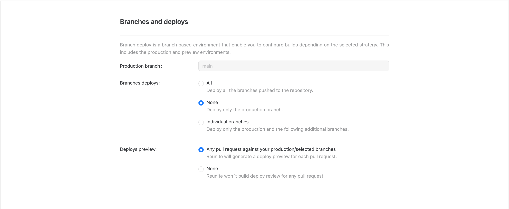

# Branches deploys

In the **Branches and deploys** configuration, you can control which branches Reunite deploys and how it handles preview deployments for your project. This configuration gives you precise control over your deployment strategy, allowing you to balance development workflow needs with resource management.

## Production branch

The **Production branch** setting defines your main branch (typically `main`) that triggers production deployments when changes are merged. This is the branch that represents your live, published content.

## Branch deployment options

For **Branches deploys**, you have three options to control which branches are deployed:

- **All**: Deploys every branch pushed to your repository
- **None**: Deploys only the production branch
- **Individual branches**: Lets you specify additional branches alongside production for deployment

## Preview deployments

The **Deploy preview** setting determines whether Reunite generates preview deployments for pull requests:

- **Any pull request**: Enables previews for pull requests against your selected branches, allowing you to review changes before merging
- **None**: Disables preview builds entirely to conserve resources

## Build process and API bundling

When Reunite processes your project during a build, it performs several important steps in a specific order to ensure your APIs are properly validated, transformed, and optimized:

1. **Configuration discovery**: Reunite reads your `redocly.yaml` configuration file to understand your project settings, including linting rules, decorators, and output parameters.

2. **API discovery**: Reunite scans your repository to find all API description files (OpenAPI, AsyncAPI, etc.) that need to be processed.

3. **Linting and validation**: Each API is validated against the configured rules in your `redocly.yaml`. This includes:
   - Built-in rules from rulesets like `minimal`, `recommended`, or `recommended-strict`
   - Custom rules you've defined
   - Scorecard rules if configured

4. **Decorator application**: Reunite applies any configured [decorators](https://redocly.com/docs/cli/decorators) to transform your API descriptions. Decorators can modify content, add information, or restructure your APIs before bundling.

5. **Bundle generation**: Reunite runs bundle commands on all discovered APIs, creating optimized, self-contained API description files. The bundling process:
   - Resolves all `$ref` references
   - Applies the `output` parameter settings from your configuration
   - Generates the final API descriptions used for documentation and other downstream processes

This systematic approach ensures that all your APIs are consistently processed according to your project's standards and requirements, regardless of which branch or deployment environment they're being built for.

## Resources

- **[Redocly CLI rules documentation](https://redocly.com/docs/cli/rules)** - Configure linting rules in your redocly.yaml file to maintain API description quality and consistency
- **[Decorators configuration](https://redocly.com/docs/cli/decorators)** - Transform and enhance your API descriptions with custom decorators during the build process
- **[Bundle command reference](https://redocly.com/docs/cli/commands/bundle)** - Understand the API description bundling process for optimized deployment and distribution
- **[Redocly CLI cookbook](https://github.com/Redocly/redocly-cli-cookbook)** - Practical examples of rules, decorators, and advanced CLI configurations for your projects
