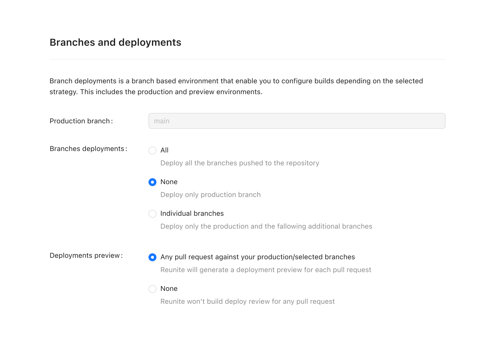

# Branches deploys

In the **Branches and deploys** configuration, you can control which branches Reunite deploys and how it handles preview deployments for your project. This configuration gives you precise control over your deployment strategy, allowing you to balance development workflow needs with resource management.

## Production branch

The **Production branch** setting defines your main branch (typically `main`) that triggers production deployments when changes are merged. This is the branch that represents your live, published content.

## Branch deployment options

For **Branches deploys**, you have three options to control which branches are deployed:

- **All**: Deploys every branch pushed to your repository
- **None**: Deploys only the production branch
- **Individual branches**: Lets you specify additional branches alongside production for deployment

## Preview deployments

The **Deploy preview** setting determines whether Reunite generates preview deployments for pull requests:

- **Any pull request**: Enables previews for pull requests against your selected branches, allowing you to review changes before merging
- **None**: Disables preview builds entirely to conserve resources
