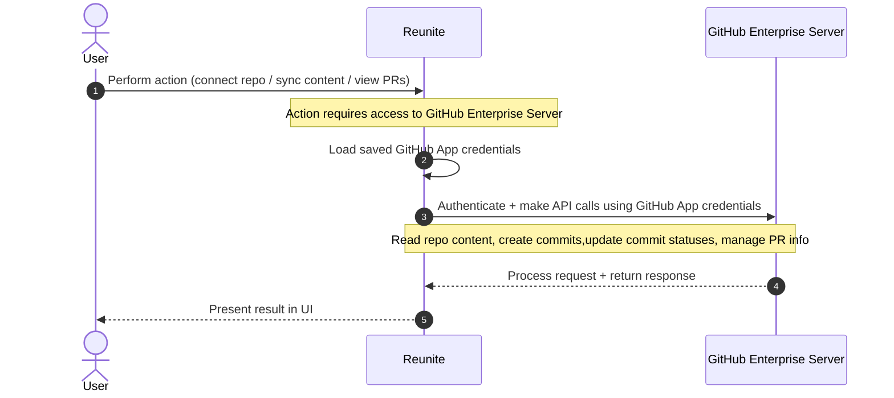

# GitHub Enterprise Server connection to Reunite

When you [connect a GitHub Enterprise Server](./github.md) to Reunite, a GitHub App is created and its credentials (App ID, Client ID, Client secret, and Private key) are securely stored within Reunite.
Reunite uses these stored credentials exclusively to make API calls to your GitHub Enterprise Server instance.
No credentials are shared with external services or used for any purpose other than communicating with the specified GitHub Enterprise Server.

The following diagram illustrates the interaction flow:

The flow works as follows:

1. User interacts with Reunite.
    A user performs an action in Reunite that requires access to the GitHub Enterprise Server, such as connecting a repository, syncing content, or viewing pull requests.
1. Reunite authenticates with the GitHub Enterprise Server.
    Reunite uses the saved GitHub App credentials to authenticate and make API calls to the GitHub Enterprise Server.
    These API calls handle operations like reading repository content, creating commits, updating commit statuses, and managing pull request information.
1. GitHub Enterprise Server responds.
    The GitHub Enterprise Server processes the request and returns the response to Reunite, which then presents the result to the user.

In addition to API-initiated communication, your GitHub Enterprise Server sends webhook events (such as `push`, `pull request`, `create`, and `delete`) to Reunite.
These webhooks notify Reunite about changes in your repositories, triggering actions like preview deployments and content synchronization without requiring the user to manually refresh.

## Resources

- **[Connect a GitHub Enterprise Server](./github.md)** - Step-by-step setup for creating or adding a GitHub App and connecting your GitHub Enterprise Server instance to Reunite
- **[Connect a Git provider](../connect-git-provider.md)** - Overview of connecting Git providers to Reunite projects, including self-hosted instances and allowed IP addresses
- **[Manage self-hosted Git providers](../manage-self-hosted.md)** - Add and manage self-hosted Git providers at the organization level so they are available for all projects
