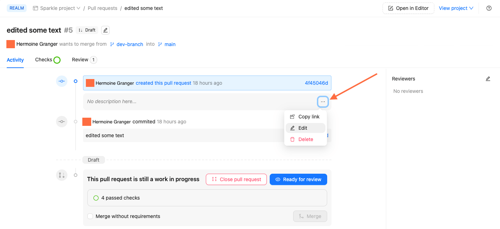
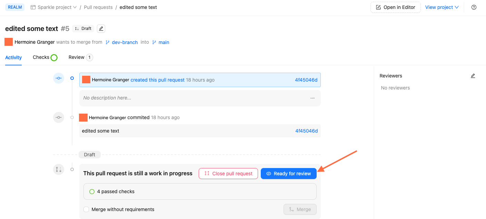

# Manage pull requests in Reunite

The **Pull requests** page in Reunite includes a list of all open and closed pull requests.
From this page you can search and filter and select a specific pull request.

After selecting a specific pull request you can complete the following tasks:

- edit the title and description
- update the state
- invite reviewers

You can also [review a pull request](./review-pull-request.md), if you are not the pull request author.

## Before you begin

Make sure you have the following before you begin:

- a [project](../projects.md) in Reunite
- the [member or the owner role](../../../access/roles.md#organization-roles) in the organization for your project

## View a pull request

To view a pull request you can either click the **View pull request** button next to the branch name in the editor, or navigate to the **Pull requests** page and select it from the open pull requests list, which displays by default.

To view closed pull requests, click the **Closed** side of the toggle.

Selecting a pull request opens the **Activity** tab for that pull request.
The **Activity** tab of the pull request includes the pull request's title, description, and all the commits with commit messages, hashes, and who made them and when.
You can click on the commit hashes to see the changes introduced with that commit.

After you create a pull request in Reunite, it is still in draft form.
You need to edit the title and description, update the state, and assign reviewers.

## Search and filter

When you have a long list of pull requests, you can search for a specific pull request by entering letters and words that occur in its title.

You can also filter the pull requests list by the following attributes:

- **Type:** You can filter by the following two types:
  - **Manual:** This type includes all pull requests created in Reunite and through a connected Git repository.
  - **Automatic:** This type includes all pull requests created by remote content updates.
- **Number:** You can filter by the pull request number. Pull request numbers are assigned by order of creation.
- **State:** You can filter by the following two states:
  - **Draft:** This state is when you have committed changes to a development branch and Reunite automatically creates a pull request for you. Draft pull requests can be closed, but not merged until you click **Ready for review**.
  - **Ready for review:** This state is when you have clicked the **Ready for review** button on a draft pull request. Ready for review pull requests can be closed or merged.
- **Checks:** You can filter by the following two checks statuses:
  - **Passed:** This check status is for when all of your checks that haven't been disabled have passed.
  - **Failed:** This check status is for when one or more of your enabled checks have failed.
- **Creator:** You can filter by the user who created the pull request. If you have a long list of possible users, you can search for the user by entering their name in the search field.

You can add multiple filters at one time and remove them by clicking **Delete** in the filter drop down.
You can also remove all filters by clicking **Clear all** and add additional filters by clicking **+ Add filter**.
Filters apply to both the open and closed pull request lists.

### Edit title and description

After you have selected a pull request, you can edit the title and description to better reflect the changes to help reviewers know what you have done.

To edit a pull request title, click the pencil icon next to the current pull request title.
After making your changes to the title, click **Save**.

To edit the description of a pull request, click the more options dropdown menu and select **Edit**.

You can use the toolbar at the top of the text field to format your description text, add links, or images.
You can also copy a link to a pull request that you can share with a reviewer by selecting **Copy link** from the more options drop down menu.

After making your changes to the description, click **Update comment**.

## Update state

After a pull request is opened, you can continue to make commits to the branch, which are then added to the open pull request until you are sure you are ready for others to review your changes.
By default, pull requests are opened in a draft state.
Draft pull requests can be closed, but not merged until you click **Ready for review**.
When you are ready for others to review your changes, click the **Ready for review** button and assign reviewers.

## Assign reviewers

Before you merge your changes to the main branch, you should have them reviewed by a colleague to check for inconsistencies or errors.
When you assign reviewers to your pull request they are sent notification emails to inform them they have been requested to review your pull request.

To assign reviewers to a pull request, click the pencil icon next to **Reviewers** on the right side of the page, and select from the list of reviewers, or enter the reviewer's name if the list is long and you can't see the reviewer you want to select.

If the reviewer is not currently a member of the organization, you can select **Invite member** if you have the [permissions to invite users](../../../access/roles.md#organization-roles) to your organization.

## Resources

- Learn more about [using the editor](../use-editor.md) to create content in Markdown and Markdoc.
- If you are working on multiple projects, see [Switch between projects](../switch-between-projects.md).
- Learn more about the different parts of [Reunite](../../reunite.md), Redocly's cloud platform.
- Configure [reunite](../../../config/reunite.md) to allow publishing a build even if it contains broken links.
