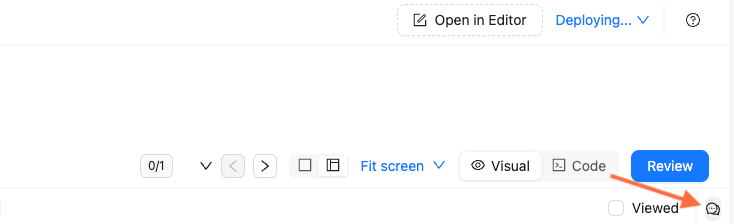
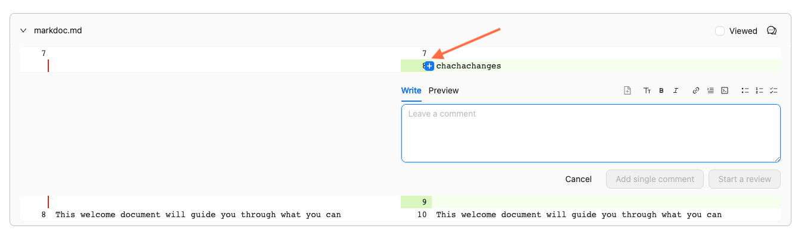

# Review a pull request in Reunite

Select a pull request from the list on the **Pull requests** page and click the **Review** tab to begin your review.

You cannot review a pull request if you authored it.

## Review visual and code diff

The **Review** tab opens with the **Visual** view by default, showing rendered pages before and after updates for visual comparison.

Click **Code** on the toggle to view the Markdown diff instead.
For multi-page updates, select different pages from the sidebar navigation to review each one.

Use the file tree filter on the left to find specific pages.

## Add comments to reviews

Add feedback as comments in either visual or code diff views.

To add comments in the visual or code diff view:

1. Click the comments icon on the right side.

    

1. Enter your feedback.
1. Click **Comment**.

To add line-specific comments in code diff view:

1. Hover over the line numbers.
1. Click the plus icon.

    

1. Enter your feedback.
1. Select one option:
   - **Add a single comment**: For a standalone comment.
   - **Start a review**: For multiple comments in a complete review.

Use the text field toolbar to format text, add links, or insert images.
Mention people or teams with the `@` symbol followed by their name.

## Approve or request changes

After reviewing the pull request, click the **Review** button, add your final thoughts, and select one option:

- **Comment:** Provide feedback without explicit approval or rejection.
- **Approve:** Indicate the pull request is ready to merge.
- **Request changes:** Specify issues that require resolution before approval.

Format your review comment using the toolbar options, then click **Submit review**.

After the review is submitted, if your project uses a [connected Git provider](../../project/connect-git/connect-git-provider.md) (GitHub, GitLab, Azure DevOps, or Bitbucket), you will see a **Visual review** check on it.

The check links back to the **Visual review** tab in Reunite and displays a short status (for example, **Pending**, **Approved**, **Changes requested**, or **No changes**).

**Visual review** check updates automatically when you add comments or change a review in Reunite.

If you also connected your Git provider and Reunite accounts before submitting your review, it will post a review to your Git repository.


If your accounts are connected but you do not have review permissions in the provider, your review appears in Reunite only and is never posted to the provider.


## Merge a pull request

After a **Ready for review** pull request receives approval and passes checks, click **Merge**.


Check **Merge without requirements** only for urgent changes when you're certain they won't cause build issues.


After merging, the updates appear in the main branch and trigger a deployment to publish changes to the production project.

## Resources

- **[Use the editor](../use-editor.md)** - Create and edit content in Markdown and Markdoc with collaborative editing features and real-time preview capabilities
- **[Reunite platform](../../reunite.md)** - Understand Redocly's cloud platform features for collaborative content management and workflow automation
- **[Reunite configuration reference](../../../config/reunite.md)** - Configure deployment settings to allow publishing builds despite broken links or Markdoc syntax issues
