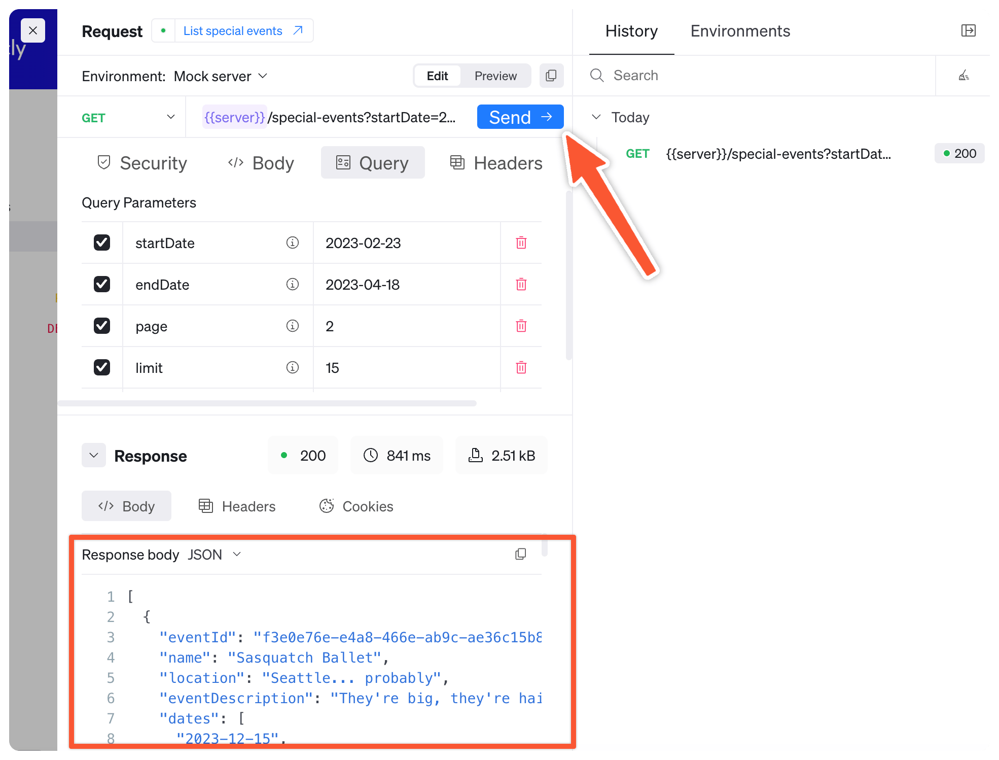

# Replay the API explorer

Replay the API explorer allows your users to make API calls directly from the API reference documentation in your project.
By using the OpenAPI description, Replay presents users with an interactive API client to make requests to either your API, a sandbox, or the built-in mock server.

Click "Try It" on any operation in your Redoc reference docs to open Replay for this request.

Replay uses the API description and `mockServer` configuration in your `redocly.yaml` file to create an interactive interface for your API users.

## Interactive API client

Use Replay to explore an API, with fully editable template requests and responses that match your API description.
Replay keeps a history of your past requests, so you can go back to an earlier API call.

Connect Replay to your live servers, the built-in mock server, or another environment.
The mock server uses a combination of your API description and the user input to produce realistic responses to make API development and integrations a much smoother experience.

## Setup tasks

For Replay the API explorer to send requests, you must have configured the following in your OpenAPI description:

- Security schemas
- Servers



Your servers must support CORS (cross-origin resource sharing) requests, or you can configure a CORS proxy using the [openapi.cors-proxy-url](../../config/openapi/cors-proxy-url.md) configuration option in your `redocly.yaml` file.



You can also use our `mockServer`, which can also be configured in the `redocly.yaml` file.

## User tasks

Users can complete the following tasks with Replay the API explorer:

- Edit any field in sample requests, unrestricted by API description schemas
- Save requests and view request history
- Set up and use different environments with customizable variables

## Related how-tos

- Generate reference documentation for your users by [Adding OpenAPI reference docs](../../content/api-docs/add-openapi-docs.md)
- See how to [Try APIs with the mock server](../../content/api-docs/try-apis-with-mock-server.md) to get Replay set up how you like it
- Learn how to [Configure the mock server](../../content/api-docs/configure-mock-server.md) and optimize how users use Replay to interact with API descriptions

## Resources

- See [Mock server config reference](../../config/mock-server.md) docs for more information about mock server settings
- Control your API reference with the settings in [OpenAPI config reference](../../config/openapi/index.md)
