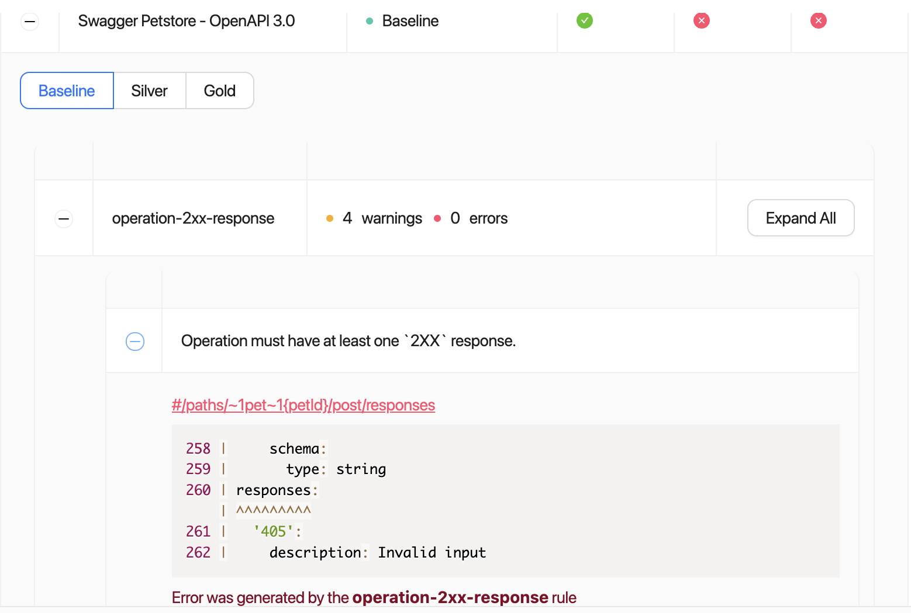
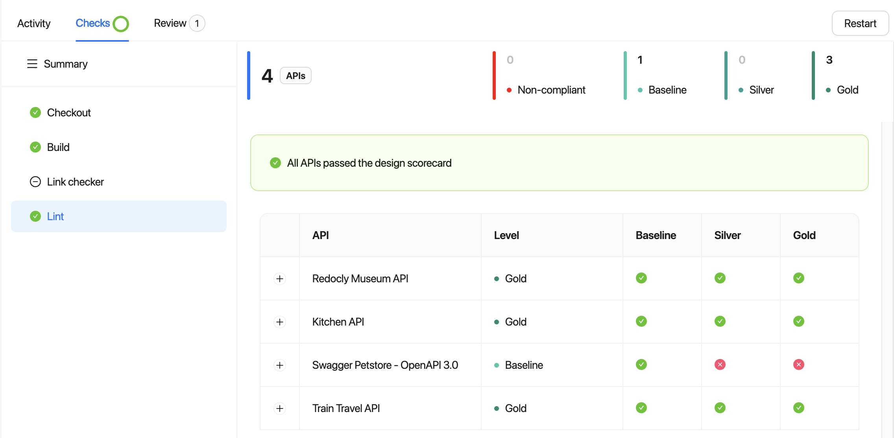

# API Scorecard

Reunite's scorecard feature enables you to add and create sets of rules and test your API description files against them.
Using these rules you can maintain quality across your existing APIs and ensure that newly-added or updated APIs match your criteria.
An API scorecard can include multiple sets of rules, corresponding to different quality levels.

When new quality criteria arise, you can add more levels to reflect the evolving standards.
There is no limit to the number of levels you can have.

You can set up a baseline ruleset and prevent APIs that do not meet this standard from publishing to your production project.

## Scorecard information

After you define the rules for the API scorecard, reports display in Reunite and on your production project.
If you have versioned APIs, each version displays as a separate row.
Reports show if an API description file complies with the applied rulesets.

### Scorecard reports in the Lint CI job

You can view scorecard reports on Reunite's **Deploys** page.
Choose a preview or production deploy and click it to open its status page.
Under **Summary**, click **Lint** to display the report.

You can expand each row of the table, switch between the scorecard levels and drill down the table to display warnings and errors.

If you have an open pull request, you can access the same report by opening the pull request, selecting the **Checks** tab, and clicking **Lint**.

### Scorecard status in API registry

The API description details on the **API Registry** page contains a summarized version of the scorecard reports.
You can find this information by clicking an API.
The summarized scorecard report is on the **Details** tab.

## Scorecard labels

After you define scorecard levels and commit the changes, labels representing the scorecard levels display next to the names of your API descriptions in Reunite and on your published project.

## Related how-tos

- Learn how to add either Redocly built-in rulesets or custom rulesets to the scorecard for your projects in [Configure scorecard](../how-to/configure-scorecard.md).
- If you have a lot of API descriptions, [Add a catalog](../../author/how-to/add-catalog.md) for an organized way to display them in your project.

## Resources

- Check out the [Scorecard reference](../../config/scorecard.md) page to see the different options you can configure.
- Learn more about the different ways you can configure an API catalog, using the [Catalog reference](../../config/catalog-legacy.md).
