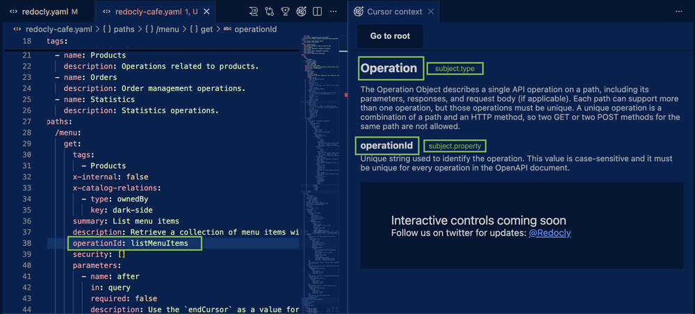

# Type hints Cursor context

The Redocly OpenAPI VS Code extension now includes [Type hints](./type-hints.md), a lightweight alternative to [Cursor context](./cursor-context.md) for identifying node types.
With type hints you can find the `subject` and `property` values you need for [configurable rules](../cli/rules/configurable-rules#configurable-rules) by hovering over any node in your API description (OpenAPI, AsyncAPI, Arazzo, and others).

## Example: enforcing snake_case operation IDs

Suppose you need to change all operation IDs to use snake_case instead of camelCase.
To avoid missing any operation, let's create a configurable linting rule that checks every operation ID in the OpenAPI document.

When writing your rule, you need to target a specific [node](../../learn/openapi/openapi-visual-reference/openapi-node-types) with the `subject` and `property` to which the rule applies.
To find these values, you can either use Cursor context or Type hints.

### Use [Type hints](./type-hints.md)

To use [Type hints](./type-hints.md) to find the values of `subject` and `property`:

1. Hover over `operationId`.
1. Read `subject` and `property` directly from the tooltip.


This approach requires fewer steps and keeps you inside the immediate context of your work, without affecting your focus.

### Use Cursor context

To use [Cursor context](./cursor-context.md) to find the values of `subject` and `property`:

1. Place your cursor on `operationId`.
1. Open the Cursor context panel.
1. Find `subject` and `property` in the panel.



### Rule configuration

```yaml
extends:
  - recommended
rules:
  struct: error
  rule/id-casing:
    subject:
      type: Operation
      property: operationId
    assertions:
      casing: snake_case
```
