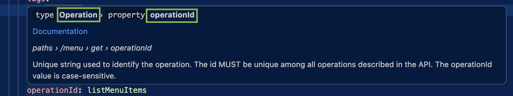

# Type hints

Type hints is an easy-to-use hover feature that helps you identify the correct [node types](https://redocly.com/learn/openapi/openapi-visual-reference/openapi-node-types) used in [configurable rules](https://redocly.com/docs/cli/rules/configurable-rules#configurable-rules) and [custom plugins](https://redocly.com/docs/cli/custom-plugins) for writing rules or decorators.

When you hover over a node in your API description, a tooltip displays the node type, a short description, and a link to the corresponding documentation section.

## Type hints example




## Type hints structure

```md
type [subject.type] › property [subject.property]

[Documentation link when available]

paths › [node tree path]

[description]
```

