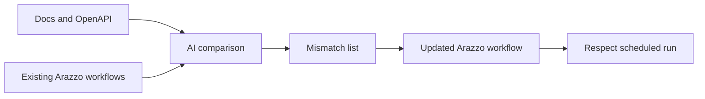

---
seo:
 title: Use AI to keep API monitoring in sync with your docs
 description: Use AI to compare your docs against your Respect Arazzo workflows, catch mismatches in either direction, and update both together.
---

# Use AI to keep API monitoring in sync with your docs

Most teams set up API monitoring once, when a workflow first ships, and then move on to the next thing. The docs keep changing after that: a new endpoint gets documented, an example gets updated, a deprecated field drops out of the prose. The monitoring file that watches the live API rarely gets touched at the same time.

That mismatch is not the same problem as an API drifting from its spec. It is the monitoring itself falling behind docs that moved on without it. This article shows how to use AI to compare the two artifacts, find what each one is missing, and turn the difference into an update instead of a "blind spot" nobody notices.

## Monitoring drifts from docs in its own direction

[Use AI to detect drift between your docs and your live API](https://redocly.com/learn/ai-for-docs/ai-detect-drift-docs-live-api) covers the failure most teams worry about: production changes and the docs become wrong without anyone updating them. This article covers the opposite direction, where the docs are the ones that moved and the monitoring file is the one left behind.

An Arazzo workflow file gets written once, when someone stands up a Respect check for a critical path. Docs keep evolving on their own schedule, so a writer adds a new documented workflow, a field gets renamed in an example, or a deprecated parameter disappears from the guide. None of those changes touch the Arazzo file automatically, which means the monitoring dashboard can stay green while it keeps checking a version of the API the docs no longer describe.

The mismatch shows up two ways. A newly documented workflow can go live with zero monitoring coverage because nobody remembered to add a Respect check for it. Or an existing Respect workflow can keep asserting on a field name or response format the docs stopped mentioning months ago, so a passing check no longer proves what the reader thinks it proves.



## Use AI to compare your docs against what monitoring covers today

The comparison is a reading task, not an execution task, which makes it a good fit for AI. Give it the documented steps for a workflow alongside the Arazzo file that is supposed to monitor it, and ask it to name where the two disagree.

```markdown 
You are comparing documentation for an API workflow against the Arazzo
file that monitors it in Respect.

Inputs:
1. Documented workflow steps and examples (from the doc page)
2. Arazzo workflow YAML (steps, parameters, assertions)

Tasks:
- List documented steps that have no matching Arazzo step
- List Arazzo assertions that reference fields, parameters, or paths
  no longer present in the docs
- Flag documented response fields that no Arazzo step checks
- Do not invent steps; cite the doc heading or YAML key for each finding

Docs:
[paste]

Arazzo workflow:
[paste]
```

Run this whenever a workflow feels old, not only after an incident. [Use AI to find gaps in your documentation coverage](https://redocly.com/learn/ai-for-docs/ai-find-gaps-documentation-coverage) treats missing content and missing workflows as two problems needing two different checks; this comparison adds a third check on top, one that catches the space between what is documented and what a schedule is currently watching.

## Turn a monitoring blind spot into an updated Arazzo workflow

Say a docs update adds a bulk export flow: create an export job, poll its status, then download the finished file. The team documents all three steps with examples, but the Arazzo file monitoring that API still covers only the older single-item endpoints, because someone wrote it before bulk export existed. The comparison prompt above would flag the whole flow as documented with no matching Arazzo step, since nothing in the workflow file references it yet.

From there, paste the doc examples back to AI and ask it to draft the missing [Arazzo](https://redocly.com/learn/arazzo/what-is-arazzo) steps: request formats, expected status codes, and the polling pattern the docs describe. [Documenting multiple APIs using Arazzo](https://redocly.com/learn/arazzo/documenting-multiple-apis-using-arazzo) explains how to model a flow like this across steps that no single OpenAPI operation captures alone. Review the draft against the real API before it ships, because AI can propose a plausible workflow without confirming that your polling endpoint returns the fields it assumed.

Once a human confirms the steps, add the workflow to your [Respect](https://redocly.com/docs/respect/use-cases) schedule so the new documented flow gets the same ongoing coverage as everything else. The fix is not a one-time patch, since it closes the distance between what the docs promise and what gets checked on a recurring basis, and that distance can reopen the next time either side changes.

## Make the sync check part of the doc-change workflow

Waiting for someone to notice a mismatch by accident means it can sit for months. Fold the comparison into the same pull request where docs change, so the question gets asked every time instead of occasionally.

1. A docs pull request adds or changes a workflow's documented steps.
2. The comparison prompt runs against the updated docs and the current Arazzo files for that API.
3. AI returns a short list of mismatches: new steps with no coverage, or assertions that reference something the docs no longer say.
4. The API owner or writer drafts the Arazzo update, using the doc examples as the source of truth for request and response fields.
5. [Redocly CLI's lint command](https://redocly.com/docs/cli/commands/lint) validates the updated Arazzo file the same way it validates OpenAPI, catching formatting errors before the workflow ever runs against a live server.
6. A Respect run confirms the new or updated workflow passes before the pull request merges.

This mirrors the alert-to-fix loop that already exists for live-API drift, just triggered by a docs change instead of a Respect failure. Either direction, the goal stays the same: docs and monitoring move together instead of one waiting to notice the other fell behind.

## What AI cannot verify on its own

AI can read a doc page and an Arazzo file side by side and tell you where they disagree, but it cannot run the workflow against your environment. It has no way to confirm that the export endpoint it drafted a polling step for returns a `status` field; it only knows that the docs said it should.

Respect stays the source of truth here. A comparison prompt can narrow the search and draft a starting point, but only a scheduled Respect run against a live API proves the new workflow behaves the way both the docs and the Arazzo file now claim. Treat AI's output as a reviewed draft, not a verified check, until Respect has run it at least once.

## How Redocly can help

Keeping monitoring in sync with docs works best when both live in the same scheduled system instead of two disconnected files. [Respect](https://redocly.com/respect) runs your Arazzo workflows on a schedule against real endpoints and alerts by Slack or email the moment a check and your documented behavior fall out of step, whether the API changed or the workflow file did. Use AI to compare docs against existing workflows and draft the missing steps, then let Respect confirm the update holds before you trust the dashboard again.
