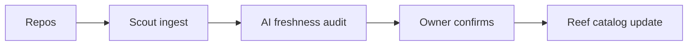

---
seo:
 title: Use AI to keep your API service catalog current
 description: Use AI to catch stale owners, tags, and lifecycle fields in your API catalog, then let Scout and Reef keep ingestion continuous so the catalog matches production.
---

# Use AI to keep your API service catalog current

A catalog entry rarely breaks all at once. An owner changes teams and the contact field stays pointed at someone who left months ago. A service moves from "experimental" to "stable" and the lifecycle tag never catches up. Each mismatch looks small on its own, but a developer who hits one dead end starts to distrust the whole catalog.

[Use AI to build a searchable API catalog for your team](https://redocly.com/learn/ai-for-docs/ai-build-searchable-api-catalog) covers the first enrichment pass: turning a flat service list into a catalog with real descriptions, tags, and owners. This piece covers what comes after that first pass, when the specs keep changing and the catalog has to keep up without a person re-checking every row by hand.

## Why a catalog goes stale between releases

Catalogs decay for ordinary reasons, not dramatic ones. A team ships a new version and forgets to retire the old lifecycle tag, so both versions still read as "stable" months later. Another team reorganizes, and the owner field keeps naming a group that no longer exists, which means the next person who needs help messages a dead channel. Because these changes happen in the codebase and the catalog lives somewhere else, nothing forces the two to update together.

The cost shows up unevenly. A human developer who finds a wrong owner can shrug, ask a colleague, and move on. An AI agent working from the same catalog cannot improvise that way: it will call whatever the catalog tells it is current, so a stale entry becomes a failed workflow step instead of a minor annoyance. [API catalogs for agentic software](https://redocly.com/blog/api-catalogs-agentic-software) makes this point directly, since an agent that plans a multi-step task around a catalog definition has no fallback when that definition turns out to be outdated.

## What "current" means for a catalog entry

Before you can check freshness, you need a short list of fields worth checking. A useful baseline: the summary still matches what the API does, the owner or team channel is a real, reachable contact, the lifecycle tag (experimental, stable, deprecated) matches reality, and any successor link points to the API that replaced it. [Catalog metadata configuration](https://redocly.com/docs/realm/config/metadata) is where you define which of these fields your catalog tracks, so pick the small set that matters most before asking AI to audit against it.

Treat that list as a contract, not a wish list. If a field is not in the schema, AI has nothing to check it against, and you are back to guessing.

## Use AI to catch drift before developers do

Once the fields are defined, AI is well suited to running a "freshness audit": comparing catalog entries against current specs and recent commits at a scale no reviewer would attempt by hand. Give it the catalog row alongside the OpenAPI file it describes and a short window of recent changes, and ask it to flag mismatches instead of rewriting anything.

```markdown 
You are auditing an API catalog entry for freshness.

Rules:
- Do not invent an owner, lifecycle stage, or successor; flag "unknown" instead.
- Compare only against the OpenAPI file and change log provided.
- Note the specific field that looks stale and why.

Catalog entry:
[paste current title, summary, owner, tags, lifecycle]

OpenAPI file and recent changes:
[paste]

Return: field, current value, suspected issue, confidence.
```

Review the output the way you would review any other AI draft. A flagged field is a lead worth checking, not a change ready to commit on its own.

## Before and after: a lifecycle field nobody updated

Before:

```yaml 
title: Payments API v1
lifecycle: stable
successor: null
```

After:

```yaml 
title: Payments API v1
lifecycle: deprecated
successor: payments-api-v2
```

The AI pass can propose that change once it sees a v2 spec with overlapping paths and a newer deploy date. A person still confirms the migration is complete before the tag goes live, since a premature "deprecated" label can send developers toward a version that is not ready for their traffic yet.

## Automate ingestion so the catalog updates with the code

A single cleanup pass fixes today's drift and says nothing about next month's. [What is Scout?](https://redocly.com/docs/realm/scout/what-is-scout) describes how Scout pulls API definitions straight from your repositories on an ongoing basis, so the catalog reflects what is deployed right now instead of what someone remembered to export. Point AI's freshness audit at Scout's collected inventory, not at a snapshot from last quarter, and the two checks reinforce each other: [Scout](https://redocly.com/docs/realm/scout) keeps the raw inventory current, and AI keeps the metadata layered on top of it honest.



[Australia Post](https://redocly.com/customers/australia-post) automated its catalog and portal publishing this way and cut its bounce rate from 30 percent to under 2 percent, because visitors stopped landing on pages that described services that no longer matched what shipped. That is what near-zero latency between a deploy and a catalog update buys you.

## Gate changes with governance checks

Freshness audits work best when paired with a rule that blocks bad data before it reaches the catalog, rather than a report that only flags it afterward. [API catalog configuration](https://redocly.com/docs/realm/config/catalog-classic) lets you require fields like owner and lifecycle before an entry publishes, so a missing value fails the same way a missing required parameter fails [Redocly CLI lint](https://redocly.com/docs/cli/commands/lint) on an OpenAPI file. Once that gate exists, AI's job moves from finding missing fields after the fact to reviewing edge cases the gate cannot decide on its own, like whether two similarly named services are duplicates.

The payoff compounds. Modeled return on comprehensive API catalogs runs [roughly 24:1 to 52:1](https://redocly.com/blog/hidden-cost-of-an-enterprise-api) once you count avoided rebuilds and faster onboarding, and most of that value depends on the catalog staying accurate long after the first cleanup earns the initial win.

## Best practices

Run the freshness audit on a schedule tied to releases, not only when someone complains about a dead link. Keep the field list short enough that owners can confirm changes in minutes, not hours. Log every AI-flagged field with a link to the spec or commit that triggered the flag, so a reviewer can check the reasoning instead of taking the flag on faith. Pair freshness work with [Use AI to find duplicate and underused APIs in your codebase](https://redocly.com/learn/ai-for-docs/ai-find-duplicate-underused-apis), since a stale entry and a duplicate entry often trace back to the same missing ownership.

## What AI cannot verify

AI can compare a catalog entry against a spec and a change log, but it cannot confirm that a migration is finished, that an owner still wants the role assigned to them, or that a "deprecated" tag will not break a partner integration nobody documented. Those calls need a person with context the catalog does not capture. Treat every AI-flagged field as a question for that person, not as an automatic fix.

## How Redocly can help

Keeping a catalog current takes more than one enrichment pass. [Reef](https://redocly.com/reef) gives every API a searchable catalog entry backed by real metadata, so the result stays one centralized source of truth instead of drifting back into a spreadsheet nobody trusts. Pair Reef's catalog with the AI freshness audit in this article, and the catalog keeps matching production, not only the day someone last reviewed it.
