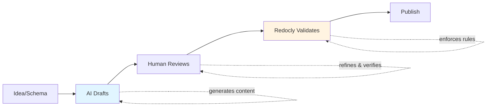
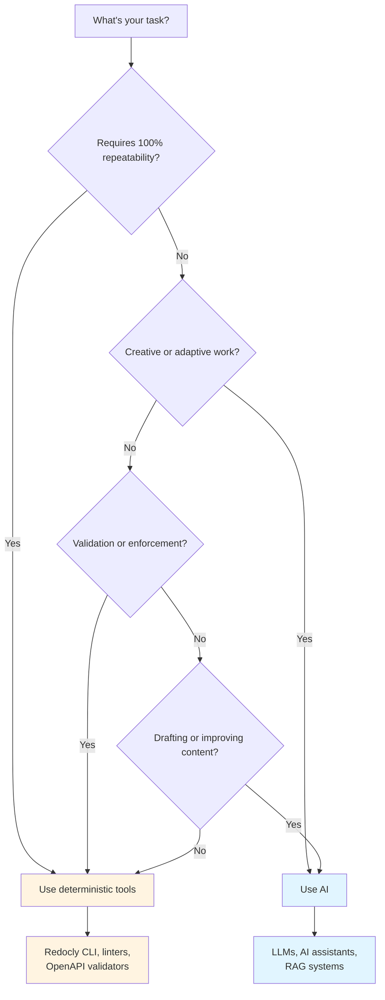

---
seo:
    title: How AI fits into modern API documentation
    description: How AI enhances writing, editing, and review workflows while Redocly ensures structure, validation, and consistency.
---

# How AI fits into modern API documentation

AI is changing how teams write and manage API documentation — but not by replacing writers or tools.
Its real value comes from helping people work faster, review smarter, and improve the quality of content.

The key is knowing where AI actually adds value, and where deterministic tools (rule-based systems that produce the same output every time) still do a better job.

## The workflow

Here's how AI and deterministic tools work together in the documentation lifecycle:

**AI writes. Redocly verifies.** This separation keeps your workflow fast while ensuring accuracy.

---

## AI in the writing process

Large language models (LLMs) are great at getting you unstuck.
They can generate outlines, fill in skeletal content, and turn OpenAPI schemas into usable first drafts.

For example:
- Generate endpoint summaries or request/response examples.
- Turn parameter lists into readable tables.
- Draft overviews or tutorials based on your spec's structure.

The output isn't final — but it's far better than starting from a blank page.
AI accelerates ideation and early drafting so technical writers and developers can focus on accuracy, structure, and clarity.

---

## AI in the editing process

Once a draft exists, AI becomes an adaptive editor. It can:
- Rewrite text to match your style guide and tone.
- Simplify overly technical phrasing.
- Standardize patterns across many docs.

This is where AI helps maintain polish at scale.
When you have dozens or hundreds of docs written over time by different people, AI offers a fast way to enforce consistency without heavy manual editing.

---

## AI in the review process

AI can act like a junior reviewer — not to replace human judgment, but to catch what humans miss.

Useful applications include:
- **Fact checking:** Compare drafts against OpenAPI specs or schemas to flag missing or incorrect details.
- **Flow and clarity:** Suggest reordering content or simplifying steps.
- **Goal alignment:** Check if a doc actually fulfills its intended purpose — onboarding, troubleshooting, or reference.

At Redocly, we use AI the same way in our development workflow.
We have a script that automatically reviews changelog entries written by developers.
It checks each one against our internal style guide and the context of the pull request.

- If it meets our quality standards, the bot comments:  
  > "Good job on the changelog."
- If it needs improvement, it posts a **GitHub suggestion** the developer can commit directly — along with a short explanation of what to change and why.

For example, it might transform:

❌ **Before:** "Fixed bug in API"

✅ **After:** "Fixed authentication timeout in OAuth2 flow when refresh tokens exceed 60-minute expiration window"

It's a small automation that saves review time and encourages good writing habits through instant feedback.

---

## AI in feature design

AI can contribute even earlier — before documentation or code exist.

For example:
- **Naming consistency:** AI might notice that your `/users/{id}` endpoint uses `camelCase` for properties while `/products/{id}` uses `snake_case`, and suggest standardizing.
- **Nesting complexity:** It can flag when objects are nested too deeply, making them harder to use.
- **Missing patterns:** It might suggest that if you have `GET /orders` and `POST /orders`, you're probably missing `GET /orders/{id}` and `DELETE /orders/{id}`.

Used this way, AI becomes a design reviewer — helping teams improve usability and clarity before features even ship.

---

## AI in using docs and APIs

AI doesn't just help create docs — it helps people *use* them.
Developers increasingly expect conversational experiences where they can ask questions like:
> “How do I authenticate?”
>
> “Can I batch this endpoint?”
>
> “Show me an example in Python.”

This is where AI assistants, retrieval-augmented generation (RAG), and Model Context Protocol (MCP) servers come in:

- **RAG (Retrieval-Augmented Generation):** Combines the power of LLMs with real-time retrieval from your actual documentation. Instead of relying on what the model was trained on, it searches your docs first, then generates answers grounded in your content. This dramatically reduces hallucinations and keeps responses accurate.

- **MCP (Model Context Protocol):** A standardized way to connect AI assistants to your documentation, APIs, and tools directly inside the IDE. Developers can ask questions, explore endpoints, and even test API calls without leaving their code editor.

We use both internally at Redocly.
Our **AI Assistant** and **MCP servers** support our engineers' day-to-day work — answering questions about internal components, APIs, and async events.
They act as a **first line of support** before escalating to subject-matter experts, saving time and spreading knowledge more evenly across the team.

---

## Tools and boundaries

AI is powerful — but it's not a validator.
For tasks that require precision and repeatability, deterministic tools still win.

### Where AI falls short

AI has real limitations that matter in documentation workflows:

- **Hallucinations:** AI might confidently describe API endpoints that don't exist, or invent parameter names that aren't in your schema.
- **Inconsistency:** Run the same prompt twice, and you might get different results — a problem when you need reproducible builds.
- **No domain knowledge:** Without proper context (like RAG), AI doesn't know your product's specific behavior, edge cases, or architectural decisions.

This is why validation must be deterministic.

### Where deterministic tools excel

- **Validation and linting:** handled by **Redocly CLI**.
- **Specification correctness:** validated against **OpenAPI 3.x** or custom lint rules.
- **Rendering and structure:** powered by **Redocly**, ensuring consistent, performant presentation.

For example: AI might suggest adding a new field to your API schema, and even generate documentation for it. But **Redocly CLI** will catch that it breaks backward compatibility based on your versioning rules — something AI can't reliably enforce.

AI can generate or revise configurations for these tools — for example, by helping define new lint rules — but the enforcement itself should remain deterministic.

---

## The balance that works

AI is best used to **draft, enhance, and review** — not to **validate or publish**.
Redocly provides the foundation that keeps AI-assisted workflows accurate and consistent.

Here's a quick decision tree to help you choose the right tool:

In short:

**AI writes. Redocly verifies.**

Together, they accelerate the path from idea to trusted documentation.
