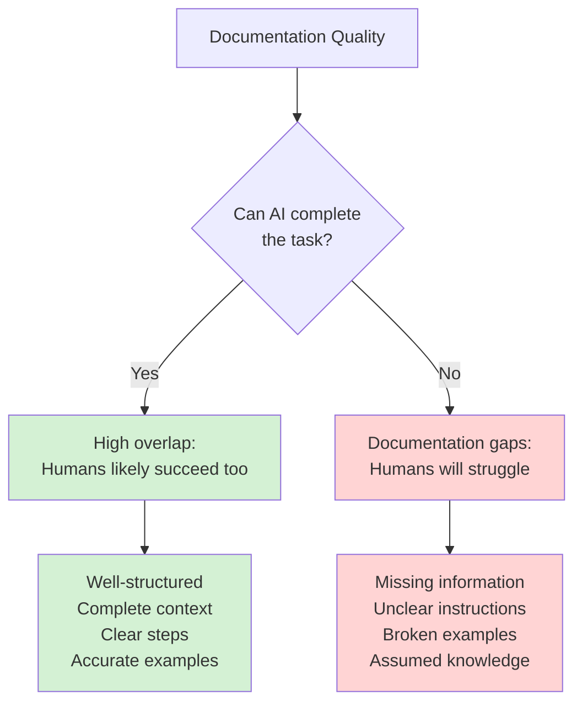
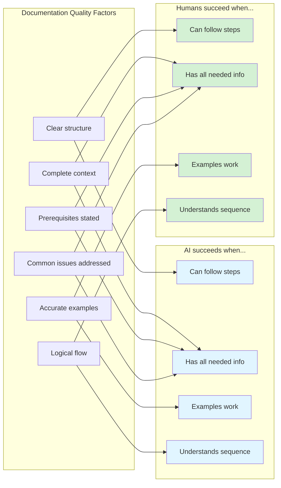

---
seo:
    title: Use AI as a usability tester
    description: Test your documentation by asking AI to complete real-world tasks. If AI struggles, your users will too. If AI succeeds, you've built truly usable docs.
---

# Use AI as a usability tester

The best test of documentation isn't whether it exists — it's whether someone can use it to accomplish real tasks.

At Redocly, we have a program called [Phronesis](/blog/phronesis) where every employee works through customer workflows each week.
It reveals where documentation is confusing, incomplete, or out of sync with the actual product.
This practice led to a 630% increase in free trial conversions.

Now, AI can run this same test continuously and at scale.

## The fundamental principle

There's remarkable overlap between what makes documentation usable for AI and what makes it usable for humans:



**If AI struggles with your documentation, humans will struggle too.**
**If AI completes tasks successfully, you've built documentation that actually works.**

This isn't about replacing human testing — it's about finding obvious gaps before humans waste time on them.

---

## How to test with AI

The process mirrors [Phronesis projects](/blog/phronesis), but with AI as your test subject.

### 1. Define a real-world task

Choose something a customer would actually need to do. Not just "read about authentication" — but "authenticate to the API and make your first request."

**Good task examples:**
- Set up OAuth2 authentication and retrieve an access token
- Create a webhook subscription and handle incoming events
- Implement pagination to retrieve all users from a large dataset
- Handle rate limiting and implement exponential backoff
- Upload a file using multipart form data

**Bad task examples:**
- Read the authentication docs (no completion criteria)
- Learn about webhooks (too vague)
- Understand the API (no specific goal)

### 2. Give AI access to your documentation

Provide the relevant documentation to the AI — either by:
- Pasting it directly into the conversation
- Using RAG (Retrieval-Augmented Generation) to search your docs
- Using an MCP (Model Context Protocol) server that connects to your docs

Don't give AI any extra context beyond what's in your public documentation.
If you have to explain something verbally, that's a documentation gap.

### 3. Ask AI to complete the task

Give AI the task and documentation, then step back. Watch where it:
- Asks clarifying questions (documentation is unclear)
- Makes incorrect assumptions (documentation is ambiguous)
- Gets stuck completely (documentation is missing critical information)
- Succeeds smoothly (documentation is working!)

### 4. Document the gaps

Where did AI struggle? Common patterns:

- **Missing prerequisites:** "To do X, you first need Y" — but Y isn't documented or linked
- **Assumed knowledge:** Documentation assumes you know terminology or concepts
- **Incomplete examples:** Code samples that don't run without modification
- **Unclear sequencing:** Steps are documented but not in the right order
- **Context gaps:** Individual pieces are documented but the whole workflow isn't

---

## Real example: Testing webhook documentation

Let's walk through a concrete example.

### The task

> "Set up a webhook to receive order notifications, verify the signature, and parse the payload."

### What AI needs from documentation

1. **Where to configure webhooks** (URL, settings location)
2. **What events are available** (order.created, order.updated, etc.)
3. **Payload structure** (JSON schema or examples)
4. **Signature verification** (algorithm, header name, secret location)
5. **Error handling** (retry logic, timeout expectations)

### Where AI typically struggles

If your documentation only covers topics 1-3, AI will ask:
> "How do I verify that webhook requests are actually from your service?"
>
> "What should I do if my webhook endpoint is temporarily down?"

These questions reveal **documentation gaps**.
Your documentation might be technically accurate for what it covers, but incomplete for actually using the feature.

### The fix

Add sections your AI tester revealed as missing:
- Security: Verifying webhook signatures
- Reliability: Retry behavior and idempotency
- Debugging: How to test webhooks locally

Now when you test again, AI completes the task successfully — and so will your human users.

---

## Testing different documentation types

AI can test multiple types of documentation for different kinds of usability.

### API reference docs

**Task:** "Make a successful API call to [endpoint] and handle common errors."

**What this tests:**
- Are authentication instructions clear?
- Are request/response examples accurate?
- Are error codes and their meanings documented?
- Is it clear which parameters are required vs optional?

### Conceptual/overview docs

**Task:** "Explain when I should use feature X vs feature Y for [use case]."

**What this tests:**
- Does the documentation explain trade-offs?
- Are use cases clearly described?
- Does it help with decision-making, or just describe features?

### Tutorials and guides

**Task:** "Complete this tutorial and report any steps where you needed information not provided."

**What this tests:**
- Are steps in the right order?
- Are prerequisites clearly stated?
- Do code examples actually work?
- Is the expected outcome clear?

### Troubleshooting docs

**Task:** "Debug this error: [error message]. Find the solution using only the documentation."

**What this tests:**
- Are error messages searchable/findable?
- Do error docs link to relevant solutions?
- Are workarounds documented?
- Is the diagnostic process clear?

---

## Advanced: Automated usability testing

You can run AI usability tests automatically as part of your documentation pipeline.

### When docs change

Whenever documentation is updated, run a suite of AI tasks to verify:
- Existing tasks still complete successfully
- New features have complete task coverage
- Changes didn't break previously working instructions

### When products change

When you ship a new API version or feature:
- Test whether AI can complete common workflows with the new version
- Compare AI success rate between old and new versions
- Identify breaking changes that aren't clearly documented

### Example automation

```markdown
On every docs PR:
1. Run AI through 5 critical user tasks
2. Flag tasks where AI asks clarifying questions (doc gaps)
3. Flag tasks where AI fails (doc errors or major gaps)
4. Pass only if all tasks complete successfully

Example output:
✅ Task 1: Authentication - Completed
✅ Task 2: Create resource - Completed
⚠️  Task 3: Webhook setup - AI asked: "Where do I find the signing secret?"
❌ Task 4: File upload - AI failed: Code example returns 415 error
✅ Task 5: Pagination - Completed

Status: BLOCKED - 1 failure, 1 gap
```

This catches documentation issues before they reach users.

---

## The overlap: AI success = Human success

Why does this work? Because usable documentation has the same characteristics whether the reader is human or AI:



The overlap is almost complete.
Both AI and humans need:
- **Clear instructions** (not vague or ambiguous)
- **Complete information** (all steps, no assumptions)
- **Working examples** (code that actually runs)
- **Proper sequencing** (logical order of operations)

The main difference?
Humans bring domain knowledge and can make intuitive leaps.
AI can't, which makes it an even stricter test.
If AI succeeds with only the documentation, humans definitely will.

---

## Limitations and considerations

AI usability testing is powerful, but it's not perfect.

### What AI catches well

- Missing information (gaps in documentation)
- Ambiguous instructions (multiple interpretations)
- Broken examples (code that doesn't work)
- Poor sequencing (steps out of order)
- Unclear prerequisites

### What AI might miss

- **Visual UI issues:** If your docs include screenshots, AI can't verify they're current or correct
- **Performance problems:** AI won't notice that a workflow is technically correct but painfully slow
- **Cultural context:** Some documentation issues are about tone, localization, or cultural assumptions
- **Accessibility:** AI won't catch that your examples don't work with screen readers

### The balance

Use AI usability testing to catch objective, factual issues with documentation completeness and accuracy.

Use human testing (like [Phronesis](/blog/phronesis)) to catch subjective issues with tone, flow, and user experience.

Together, they create documentation that's both technically correct and actually enjoyable to use.

---

## Getting started

### Start simple

Pick one critical workflow.
Ask AI to complete it using only your documentation. Watch where it struggles.

### Document the pattern

Create a template for AI usability tests:
```markdown
Task: [Specific, completable goal]
Documentation provided: [Links or content]
Success criteria: [How you know it worked]
AI model: [GPT-4, Claude, etc.]
Date: [When you ran the test]

Results:
- Completed: Yes/No
- Clarifying questions asked: [List them]
- Errors encountered: [Describe them]
- Documentation gaps identified: [List them]
- Time to completion: [Rough estimate]
```

### Build a test suite

Over time, collect 10-20 critical tasks that represent your users' most common workflows. Run them regularly:
- When documentation changes
- When product changes
- On a schedule (weekly/monthly)

### Make it actionable

Every failed AI test should result in one of:
- Documentation improvement
- Code example fix
- New tutorial or guide
- Link between related docs

If AI struggled, fix it so humans don't have to.

---

## Real impact

At Redocly, our [Phronesis program](/blog/phronesis) with human testers led to a 630% increase in conversions.
When people can actually accomplish tasks with your product, they convert.

AI usability testing multiplies this impact:
- **Run tests continuously** instead of weekly
- **Cover more workflows** than humans have time for
- **Catch regressions** immediately when docs change
- **Scale testing** to every feature, every time

The principle remains the same: **if someone can complete real tasks with your documentation, you've built something that works**.

AI just lets you test this hypothesis faster, more often, and at greater scale.

---

## Summary

AI usability testing is simple:

1. **Give AI a real task** that users need to accomplish
2. **Provide only your public documentation** (no extra help)
3. **Watch where AI struggles** (these are documentation gaps)
4. **Fix the gaps** so both AI and humans can succeed

The overlap between AI success and human success is nearly complete.
Both need clear, complete, accurate documentation.
When AI completes tasks successfully using your docs, you've built documentation that actually works.

And that's the only kind of documentation worth having.
