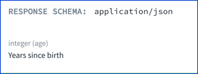
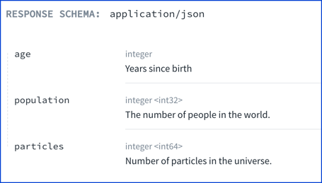

# `integer`

> The `integer` type is used for integral numbers. JSON does not have distinct types for integers and floating-point values. Therefore, the presence or absence of a decimal point is not enough to distinguish between integers and non-integers. For example,`1` and `1.0` are two ways to represent the same value in JSON. JSON Schema considers that value an integer no matter which representation was used.

## Visuals

The following is an example of an integer type of property.

```yaml Schema
age:
  type: integer
  description: Years since birth
  example: 16
```
```yaml Components
components:
  schemas:
    age:
      type: integer
      description: Years since birth
      example: 16
```

The following image displays that age schema.



Integers can be included inside of objects and arrays.
The following example shows an integer included in an object.

```yaml Schema
type: object
properties:
  age:
    type: integer
    description: Years since birth
    example: 16
```

The following image displays that schema.


### Integer data formats

There are two OAS-supported integer formats: `int32` (signed 32 bits), and `int64` (signed 64 bits).

```yaml
type: object
properties:
  age:
    type: integer
    title: age
    description: Years since birth
  population:
    type: integer
    description: The number of people in the world.
    format: int32
  particles:
    type: integer
    description: Number of particles in the universe.
    format: int64
```



## Types

- SchemaProperties

```ts
const SchemaProperties: NodeType = {
  properties: {},
  additionalProperties: 'Schema',
};
```
