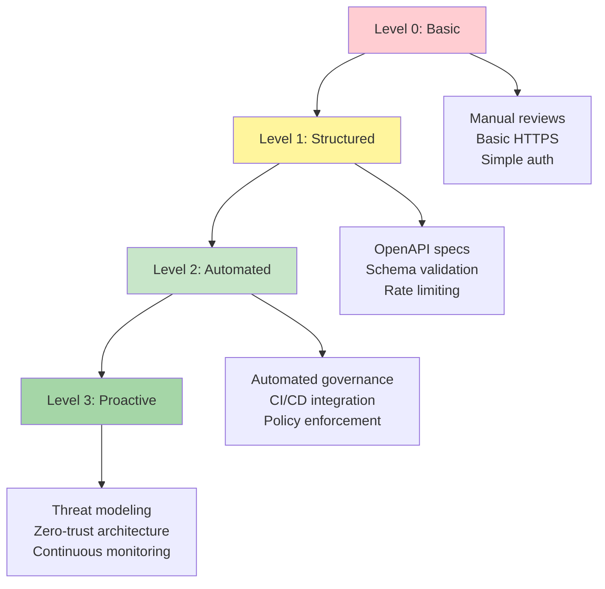

# Design-First Security Governance and Automation

_Scale security practices through automated governance, policy-as-code, and organizational maturity._

---

## Key Takeaways

Manual security reviews don't scale. As organizations grow their API portfolios, the traditional approach of reviewing each specification manually becomes a bottleneck that slows development and introduces inconsistencies. Design-first security governance transforms this challenge by encoding security requirements as automated policies that enforce standards across every API, every time.

In this guide, we'll explore how to implement automated security governance that shifts security left in the development lifecycle, reduces review overhead, and ensures consistent security standards across your entire API ecosystem.

**We'll cover how to:**
- Transform security requirements into automated governance policies
- Integrate security validation into CI/CD pipelines
- Scale security practices across large development organizations
- Measure and improve security governance effectiveness
- Build organizational security maturity through automation

---

## From Manual Reviews to Automated Governance

Traditional security approaches treat reviews as gates staffed by humans who check for common issues like missing [authentication](authentication-authorization-openapi.md), weak [input validation](api-input-validation-injection-prevention.md), or insecure [transport](api-tls-encryption-https-best-practices.md). This approach has fundamental limitations:

- **Doesn't scale**: Review time increases linearly with team size
- **Inconsistent**: Different reviewers catch different issues
- **Reactive**: Problems discovered late in the development cycle
- **Limited coverage**: Humans miss edge cases that machines catch consistently

### The Policy-as-Code Approach

Design-first security governance treats security requirements as executable code. Instead of documenting that "all write operations must have [authentication](authentication-authorization-openapi.md)," you write a governance rule that automatically validates this requirement:

```yaml 
rules:
  require-auth-on-mutations:
    description: "All write operations must have security requirements"
    severity: error
    given: "$.paths[*][*]"
    when:
      function: enumerated
      functionOptions:
        values: ["post", "put", "patch", "delete"]
    then:
      field: "security"
      function: truthy
```

When this rule runs in your CI/CD pipeline, any OpenAPI specification that violates the policy fails the build automatically. The developer gets immediate feedback and must fix the issue before the code can be merged.

### Automated Governance Benefits

**Consistent Enforcement:**
- Every API specification is validated against the same rules
- No human variation in what gets flagged or missed
- New team members get consistent security feedback

**Immediate Feedback:**
- Developers learn about security issues within minutes, not days
- Problems are caught before code review, reducing back-and-forth
- Security becomes part of the development flow, not a separate gate

**Comprehensive Coverage:**
- Machines don't get tired or miss obvious issues
- Complex cross-reference validation that humans struggle with
- Scales to hundreds of APIs without adding review overhead

## Core Security Governance Principles

Effective security governance requires well-defined policies that map business security requirements to technical implementation details. These policies should be comprehensive, actionable, and automatically enforceable.

### Transport Security Governance

**Enforce HTTPS-Only Server URLs:**
```yaml 
rules:
  https-only-servers:
    description: "All server URLs must use HTTPS"
    severity: error
    given: "$.servers[*].url"
    then:
      function: pattern
      functionOptions:
        match: "^https://"
    message: "Server URLs must use HTTPS for secure transport"
```

**Prevent Placeholder Domains in Production:**
```yaml 
rules:
  no-placeholder-domains:
    description: "Production specs cannot use example.com domains"
    severity: error
    given: "$.servers[*].url"
    then:
      function: pattern
      functionOptions:
        notMatch: "(example\\.com|localhost|127\\.0\\.0\\.1)"
    message: "Use actual production domains, not placeholders"
```

### Input Validation Governance

**Require Length Constraints on Strings:**
```yaml 
rules:
  string-maxlength-required:
    description: "All string properties must have maxLength constraints"
    severity: error
    given: "$..[?(@.type === 'string')]"
    then:
      field: "maxLength"
      function: truthy
    message: "String properties must have maxLength to prevent resource exhaustion"
```

**Enforce Numeric Bounds:**
```yaml 
rules:
  numeric-bounds-required:
    description: "Numeric properties must have minimum and maximum constraints"
    severity: error
    given: "$..[?(@.type === 'integer' || @.type === 'number')]"
    then:
      - field: "minimum"
        function: truthy
      - field: "maximum"
        function: truthy
    message: "Numeric properties must have bounds to prevent overflow attacks"
```

**Prevent Mass Assignment Vulnerabilities:**
```yaml 
rules:
  no-additional-properties:
    description: "Object schemas must set additionalProperties: false"
    severity: error
    given: "$..[?(@.type === 'object')]"
    then:
      field: "additionalProperties"
      function: falsy
    message: "Set additionalProperties: false to prevent mass assignment attacks"
```

### Access Control Governance

**Require Authentication on Write Operations:**
```yaml 
rules:
  auth-required-on-writes:
    description: "Write operations must have security requirements"
    severity: error
    given: "$.paths[*][post,put,patch,delete]"
    then:
      field: "security"
      function: truthy
    message: "Write operations must require authentication to prevent unauthorized access"
```

**Validate Security Scheme References:**
```yaml 
rules:
  valid-security-references:
    description: "All security references must have corresponding definitions"
    severity: error
    given: "$.paths[*][*].security[*]"
    then:
      function: security-scheme-defined
    message: "Security scheme must be defined in components.securitySchemes"
```

### Rate Limiting Governance

**Require Rate Limiting on Authentication Endpoints:**
```yaml 
rules:
  rate-limits-on-auth:
    description: "[Authentication endpoints](authentication-authorization-openapi.md) must have [rate limiting](api-rate-limiting-abuse-prevention.md) policies"
    severity: error
    given: "$.paths[*][*]"
    when:
      - field: "tags"
        function: pattern
        functionOptions:
          match: "(?i)auth"
      - field: "@key"
        function: pattern
        functionOptions:
          match: "(post|put)"
    then:
      field: "x-rateLimit"
      function: truthy
    message: "Authentication endpoints must have x-rateLimit extension to prevent brute force attacks"
```

## Implementing Automated Governance

### CI/CD Pipeline Integration

Integrating security governance into your CI/CD pipeline ensures that every API change is automatically validated against your security policies.

**GitHub Actions Example:**
```yaml 
name: API Security Governance

on:
  pull_request:
    paths:
      - '**/*.yaml'
      - '**/*.yml'
      - '**/*.json'

jobs:
  security-governance:
    runs-on: ubuntu-latest
    steps:
      - uses: actions/checkout@v3
      
      - name: Install governance CLI
        run: npm install -g @redocly/cli
      
      - name: Validate OpenAPI specifications
        run: |
          find . -name "*.yaml" -o -name "*.yml" | grep -E "(openapi|api)" | while read file; do
            echo "Validating $file..."
            redocly lint "$file" --config .redocly.yaml
          done
      
      - name: Security governance check
        run: |
          find . -name "*.yaml" -o -name "*.yml" | grep -E "(openapi|api)" | while read file; do
            echo "Security governance check for $file..."
            redocly lint "$file" --config security-governance.yaml
          done
```

**GitLab CI Example:**
```yaml 
api-security-governance:
  stage: test
  image: node:18
  before_script:
    - npm install -g @redocly/cli
  script:
    - |
      find . -name "*.yaml" -o -name "*.yml" | grep -E "(openapi|api)" | while read file; do
        echo "Validating $file against security policies..."
        redocly lint "$file" --config security-governance.yaml
      done
  rules:
    - changes:
        - "**/*.yaml"
        - "**/*.yml"
        - "**/*.json"
```

### Governance Configuration Management

**Complete Security Governance Configuration:**
```yaml 
extends:
  - recommended

rules:
  # Transport Security
  https-only-servers:
    severity: error
    given: "$.servers[*].url"
    then:
      function: pattern
      functionOptions:
        match: "^https://"
  
  no-placeholder-domains:
    severity: error
    given: "$.servers[*].url"
    then:
      function: pattern
      functionOptions:
        notMatch: "(example\\.com|localhost|127\\.0\\.0\\.1)"
  
  # Input Validation
  string-maxlength-required:
    severity: error
    given: "$..[?(@.type === 'string')]"
    then:
      field: "maxLength"
      function: truthy
  
  numeric-bounds-required:
    severity: error
    given: "$..[?(@.type === 'integer' || @.type === 'number')]"
    then:
      - field: "minimum"
        function: truthy
      - field: "maximum"
        function: truthy
  
  no-additional-properties:
    severity: error
    given: "$..[?(@.type === 'object')]"
    then:
      field: "additionalProperties"
      function: falsy
  
  # Access Control
  auth-required-on-writes:
    severity: error
    given: "$.paths[*][post,put,patch,delete]"
    then:
      field: "security"
      function: truthy
  
  # Rate Limiting
  rate-limits-on-auth:
    severity: warning
    given: "$.paths[*][*]"
    when:
      field: "tags"
      function: pattern
      functionOptions:
        match: "(?i)auth"
    then:
      field: "x-rateLimit"
      function: truthy

  # Documentation Quality
  operation-description-required:
    severity: warning
    given: "$.paths[*][*]"
    then:
      field: "description"
      function: truthy
  
  response-schema-required:
    severity: error
    given: "$.paths[*][*].responses[2-3][0-9][0-9]"
    then:
      field: "content"
      function: truthy

# Custom functions for complex validation
functions:
  security-scheme-defined:
    code: |
      function(targetVal, options, paths, otherValues) {
        const schemes = otherValues?.components?.securitySchemes || {};
        for (const requirement of targetVal) {
          for (const schemeName in requirement) {
            if (!(schemeName in schemes)) {
              return [
                {
                  message: `Security scheme '${schemeName}' is not defined in components.securitySchemes`
                }
              ];
            }
          }
        }
        return [];
      }
```

### Progressive Enforcement

When implementing governance in existing organizations, start with warnings and gradually increase severity to avoid disrupting active development.

**Phased Implementation Strategy:**

**Phase 1: Observability (Weeks 1-2)**
```yaml
rules:
  auth-required-on-writes:
    severity: info  # Start with info level
    given: "$.paths[*][post,put,patch,delete]"
    then:
      field: "security"
      function: truthy
```

**Phase 2: Warnings (Weeks 3-4)**
```yaml
rules:
  auth-required-on-writes:
    severity: warn  # Escalate to warnings
    given: "$.paths[*][post,put,patch,delete]"
    then:
      field: "security"
      function: truthy
```

**Phase 3: Enforcement (Week 5+)**
```yaml
rules:
  auth-required-on-writes:
    severity: error  # Full enforcement
    given: "$.paths[*][post,put,patch,delete]"
    then:
      field: "security"
      function: truthy
```

## Organizational Security Maturity

### API Security Maturity Model

Organizations typically progress through distinct maturity levels as they build more sophisticated security practices:



*API security maturity progression showing the evolution from basic manual practices to proactive, automated security governance with comprehensive threat detection and prevention.*

**Level 0 - Basic Security (Manual, Ad-hoc):**
- Manual code reviews for obvious security issues
- HTTPS enabled but not enforced through specifications
- Basic authentication (API keys or simple passwords)
- Ad-hoc security practices without consistent standards
- Security discovered through incident response

**Level 1 - Structured Security (Documented, Consistent):**
- OpenAPI specifications document all APIs with security requirements
- [Schema-based input validation](api-input-validation-injection-prevention.md) prevents basic injection attacks
- [Rate limiting](api-rate-limiting-abuse-prevention.md) implemented on [authentication](authentication-authorization-openapi.md) and sensitive endpoints
- Consistent security patterns across API teams
- Security reviews are systematic but still manual

**Level 2 - Automated Security (Policy-as-Code):**
- Automated governance tools enforce security standards in CI/CD pipelines
- Security policies defined as code and validated automatically
- Breaking changes to security configurations fail builds
- Security metrics tracked and monitored systematically
- Governance rules prevent common vulnerabilities automatically

**Level 3 - Proactive Security (Threat-Aware, Adaptive):**
- Comprehensive threat modeling integrated into the design process
- Zero-trust architecture with [mutual TLS](api-tls-encryption-https-best-practices.md#mutual-tls-mtls-two-way-authentication) for service-to-service communication
- Continuous security monitoring with behavioral analysis and anomaly detection
- Security feedback loops drive iterative improvements to governance policies
- Security practices adapt based on emerging threats and attack patterns

### Building Governance Teams

**Security Champions Program:**
Embed security-minded developers in each team rather than centralizing all security knowledge:

- **Champions**: One security-focused developer per 5-8 person team
- **Training**: Regular security training and threat modeling workshops
- **Responsibility**: Champions help teammates understand and implement governance rules
- **Feedback**: Champions provide feedback on governance rule effectiveness

**Governance Center of Excellence:**
Create a small, centralized team responsible for governance policy development:

- **Policy Development**: Create and maintain governance rules
- **Tool Management**: Manage governance tooling and CI/CD integration
- **Training**: Develop security training materials and documentation
- **Metrics**: Track governance effectiveness and security posture improvements

### Measuring Governance Effectiveness

**Security Metrics Dashboard:**
```yaml 
metrics:
  governance_adoption:
    - specs_with_security_schemes
    - specs_with_input_validation
    - specs_with_rate_limiting
    - specs_passing_all_checks
  
  vulnerability_prevention:
    - accidentally_public_endpoints_prevented
    - missing_auth_caught_in_ci
    - validation_bypass_attempts_blocked
    - governance_rule_violations_per_week
  
  development_velocity:
    - average_security_review_time
    - security_feedback_loop_duration
    - governance_rule_false_positive_rate
    - developer_security_question_frequency
```

**Monthly Security Governance Report:**
```markdown
## API Security Governance Report - March 2025

### Governance Coverage
- 🟢 **98%** of APIs have authentication requirements defined
- 🟢 **94%** of APIs have input validation constraints
- 🟡 **78%** of APIs have rate limiting policies
- 🔴 **45%** of APIs have comprehensive error handling

### Vulnerabilities Prevented
- **23** accidentally public endpoints caught in CI/CD
- **67** missing input validation constraints flagged
- **12** insecure server URLs rejected
- **8** undefined security schemes blocked

### Developer Experience
- **2.3 minutes** average governance check time
- **0.8%** false positive rate on governance rules
- **94%** developer satisfaction with governance feedback

### Recommendations
1. Increase rate limiting coverage through new governance rules
2. Improve error handling governance with custom validation functions
3. Add governance rules for API versioning consistency
```

## Advanced Governance Patterns

### Context-Aware Validation

Some security requirements depend on the context in which an API operates. Advanced governance can implement conditional logic:

```yaml 
rules:
  external-apis-require-strict-auth:
    description: "External APIs must use OAuth2, internal APIs can use API keys"
    severity: error
    given: "$.paths[*][*]"
    when:
      field: "tags"
      function: pattern
      functionOptions:
        match: "external"
    then:
      field: "security[*].oauth2Auth"
      function: truthy
    message: "External APIs must use OAuth2 authentication"
  
  pii-endpoints-require-additional-validation:
    description: "Endpoints handling PII must have enhanced validation"
    severity: error
    given: "$.paths[*][*]"
    when:
      field: "tags"
      function: pattern
      functionOptions:
        match: "(?i)pii|personal"
    then:
      function: enhanced-pii-validation
```

### Custom Validation Functions

For complex business rules that can't be expressed in standard governance syntax:

```javascript 
// Custom function for validating PII handling
function enhancedPiiValidation(targetVal, options, paths, otherValues) {
  const errors = [];
  
  // Check for required audit logging
  if (!targetVal['x-audit-logging']) {
    errors.push({
      message: "PII endpoints must have x-audit-logging extension"
    });
  }
  
  // Check for data retention policies
  if (!targetVal['x-retention-policy']) {
    errors.push({
      message: "PII endpoints must specify data retention policy"
    });
  }
  
  // Check for enhanced rate limiting
  const rateLimit = targetVal['x-rateLimit'];
  if (!rateLimit || rateLimit.limit > 10) {
    errors.push({
      message: "PII endpoints must have strict rate limiting (≤10 requests/minute)"
    });
  }
  
  return errors;
}

// Custom function for validating security scheme consistency
function consistentSecuritySchemes(targetVal, options, paths, otherValues) {
  const errors = [];
  const allOperations = Object.values(otherValues.paths || {})
    .flatMap(pathItem => Object.values(pathItem));
  
  const securitySchemes = new Set();
  allOperations.forEach(operation => {
    if (operation.security) {
      operation.security.forEach(requirement => {
        Object.keys(requirement).forEach(scheme => {
          securitySchemes.add(scheme);
        });
      });
    }
  });
  
  // Warn if too many different auth schemes are used
  if (securitySchemes.size > 2) {
    errors.push({
      message: `API uses ${securitySchemes.size} different auth schemes. Consider standardizing.`
    });
  }
  
  return errors;
}
```

### Multi-Environment Governance

Different environments may require different security standards:

```yaml 
# Strict production rules
extends:
  - security-governance.yaml

rules:
  # Production-specific overrides
  no-mock-servers:
    severity: error
    given: "$.servers[*].url"
    then:
      function: pattern
      functionOptions:
        notMatch: "(mock|sandbox|test)"
  
  require-monitoring-extensions:
    severity: error
    given: "$.paths[*][*]"
    then:
      field: "x-monitoring"
      function: truthy
```

```yaml 
# More permissive development rules
extends:
  - security-governance.yaml

rules:
  # Allow mock servers in development
  no-mock-servers:
    severity: off
  
  # Relax some requirements for faster iteration
  string-maxlength-required:
    severity: warn  # Warning instead of error
```

## Governance Tooling Ecosystem

### Popular Governance Tools

**Spectral:**
```yaml 
extends: ["@redocly/spectral-config"]
functions:
  - custom-security-functions.js
rules:
  security-governance:
    severity: error
    given: "$.paths[*][*]"
    then:
      function: security-requirements-check
```

**Redocly CLI:**
```yaml 
apis:
  main:
    root: openapi.yaml
    
lint:
  extends:
    - recommended
  rules:
    security-governance/auth-required: error
    security-governance/https-only: error
    security-governance/input-validation: error
```

**Custom Governance Scripts:**
```python 
#!/usr/bin/env python3

import yaml
import sys
from pathlib import Path

def check_security_governance(spec_path):
    """Check OpenAPI spec against security governance rules"""
    with open(spec_path) as f:
        spec = yaml.safe_load(f)
    
    errors = []
    
    # Check for HTTPS-only servers
    for server in spec.get('servers', []):
        if not server['url'].startswith('https://'):
            errors.append(f"Server {server['url']} must use HTTPS")
    
    # Check for auth on write operations
    for path, methods in spec.get('paths', {}).items():
        for method in ['post', 'put', 'patch', 'delete']:
            if method in methods and 'security' not in methods[method]:
                errors.append(f"{method.upper()} {path} missing security requirements")
    
    # Check for input validation
    for schema_name, schema in spec.get('components', {}).get('schemas', {}).items():
        if schema.get('type') == 'object' and schema.get('additionalProperties', True):
            errors.append(f"Schema {schema_name} should set additionalProperties: false")
    
    return errors

if __name__ == "__main__":
    spec_file = sys.argv[1]
    errors = check_security_governance(spec_file)
    
    if errors:
        print("❌ Security governance violations found:")
        for error in errors:
            print(f"  - {error}")
        sys.exit(1)
    else:
        print("✅ All security governance checks passed")
```

### Integration with API Lifecycle Tools

**API Design Tools:**
- **Stoplight Studio**: Built-in governance rules and real-time validation
- **SwaggerHub**: Automated governance checks on specification save
- **Insomnia Designer**: Custom governance plugins for design-time validation

**Code Generation:**
- **OpenAPI Generator**: Generate security middleware from governance-validated specs
- **Speakeasy**: Type-safe SDKs with built-in security handling
- **Fern**: End-to-end API development with governance integration

**Documentation:**
- **Redoc**: Display governance-validated security requirements clearly
- **Stoplight Elements**: Interactive documentation with security testing
- **Readme.io**: Governance-aware API documentation with security examples

## Troubleshooting Governance Issues

### Common Governance Problems

**False Positives:**
```yaml
# Problem: Rule triggers incorrectly
rules:
  auth-required:
    given: "$.paths[*][*]"  # Too broad - includes OPTIONS, HEAD
    then:
      field: "security"
      function: truthy

# Solution: More specific selector
rules:
  auth-required:
    given: "$.paths[*][post,put,patch,delete]"  # Only write operations
    then:
      field: "security"
      function: truthy
```

**Performance Issues:**
```yaml
# Problem: Complex rules that slow down CI/CD
rules:
  expensive-validation:
    given: "$..[*]"  # Searches entire document
    then:
      function: complex-custom-function

# Solution: More targeted selectors
rules:
  efficient-validation:
    given: "$.paths[*][*].security"  # Target specific areas
    then:
      function: simple-validation-function
```

**Rule Conflicts:**
```yaml
# Problem: Rules that contradict each other
rules:
  require-oauth2:
    given: "$.paths[*][*]"
    then:
      field: "security[*].oauth2"
      function: truthy
      
  allow-api-keys:
    given: "$.paths[*][*]"
    then:
      field: "security[*].apiKey"
      function: truthy

# Solution: Context-specific rules
rules:
  external-apis-oauth2:
    given: "$.paths[*][*]"
    when:
      field: "tags"
      function: pattern
      functionOptions:
        match: "external"
    then:
      field: "security[*].oauth2"
      function: truthy
      
  internal-apis-flexible:
    given: "$.paths[*][*]"
    when:
      field: "tags"
      function: pattern
      functionOptions:
        match: "internal"
    then:
      # Allow either oauth2 or apiKey
      function: has-any-auth-scheme
```

### Debugging Governance Rules

**Verbose Logging:**
```bash
# Enable detailed governance output
redocly lint openapi.yaml --config security-governance.yaml --verbose

# Test specific rules
redocly lint openapi.yaml --config security-governance.yaml --rule auth-required-on-writes
```

**Rule Testing:**
```yaml 
# Create minimal test cases for each rule
rules:
  auth-required-test:
    description: "Test auth requirement rule"
    severity: error
    given: "$.paths['/test'][post]"
    then:
      field: "security"
      function: truthy

# Test with minimal OpenAPI spec
---
openapi: 3.1.0
info:
  title: Test API
  version: 1.0.0
paths:
  /test:
    post:
      summary: Test endpoint
      # Should fail governance check
      responses:
        '200':
          description: Success
```

**Rule Validation Workflow:**
```bash
#!/bin/bash
# validate-governance-rules.sh

echo "Testing governance rules..."

# Test with known-bad spec (should fail)
if redocly lint test/bad-spec.yaml --config security-governance.yaml > /dev/null 2>&1; then
    echo "❌ Governance rules are too permissive"
    exit 1
fi

# Test with known-good spec (should pass)
if ! redocly lint test/good-spec.yaml --config security-governance.yaml > /dev/null 2>&1; then
    echo "❌ Governance rules are too strict"
    exit 1
fi

echo "✅ Governance rules are working correctly"
```

## Best Practices Summary

### Policy Development
- Start with high-impact, low-controversy rules (HTTPS enforcement, auth on writes)
- Use progressive enforcement: info → warning → error over time
- Test governance rules with both positive and negative test cases
- Document the business rationale for each governance rule

### Implementation
- Integrate governance checks early in the development process (IDE, pre-commit hooks)
- Provide clear, actionable error messages with examples
- Create escape hatches for legitimate exceptions (with approval process)
- Monitor governance rule effectiveness and false positive rates

### Organizational Change
- Train developers on security principles, not just governance tool usage
- Establish security champions in each development team
- Create feedback loops to improve governance rules based on developer experience
- Measure and communicate the security improvements from governance

### Technical Excellence
- Use specific JSONPath selectors to minimize false positives
- Implement custom functions for complex business logic
- Version governance configurations alongside API specifications
- Maintain separate governance rules for different environments

## Frequently Asked Questions

### How do I get buy-in for governance automation?
Start with metrics that demonstrate the problem: count manually-found security issues, measure time spent on security reviews, track inconsistencies across teams. Then pilot governance on a single team and measure improvements in both security posture and developer velocity.

### What's the difference between linting and governance?
Linting typically focuses on style, formatting, and basic structural issues. Governance enforces business rules and security policies that are specific to your organization. Good governance builds on solid linting foundations.

### How do I handle exceptions to governance rules?
Create an exception process with clear criteria: document the business justification, get security team approval, set expiration dates for temporary exceptions, and track all exceptions for periodic review.

### Should governance rules be the same across all environments?
No. Production should have the strictest rules, while development environments can be more permissive to enable faster iteration. Use environment-specific governance configurations that inherit from a common base.

### How do I measure the ROI of governance automation?
Track metrics like: time saved on manual security reviews, number of vulnerabilities caught before production, consistency improvements across teams, and developer satisfaction with security feedback quality.

## Resources

### Governance Tools and Standards
- [Spectral](https://stoplight.io/open-source/spectral) - Open-source API linting and governance tool with custom rule support
- [Redocly CLI](https://redocly.com/docs/cli/) - Comprehensive OpenAPI toolchain with built-in governance capabilities
- [OpenAPI Specification](https://spec.openapis.org/oas/v3.1.0) - Official specification for defining governance-friendly API contracts

### Security Standards and Frameworks
- [OWASP API Security Top 10](https://owasp.org/www-project-api-security/) - Essential security risks that governance should address
- [NIST Cybersecurity Framework](https://www.nist.gov/cyberframework) - Comprehensive framework for organizational security maturity
- [DevSecOps Reference Architecture](https://csrc.nist.gov/Projects/devsecops) - NIST guidance on integrating security into development processes

### Organizational Change and Maturity
- [API Governance Best Practices](https://swagger.io/resources/articles/api-governance/) - Practical guidance on implementing API governance programs  
- [Building Security Champions Programs](https://owasp.org/www-project-security-champions-playbook/) - OWASP playbook for distributed security expertise
- [Measuring DevSecOps Success](https://www.sans.org/white-papers/measuring-devsecops-success/) - Metrics and KPIs for security automation programs

### Related Security Topics
- [API TLS Encryption and HTTPS Best Practices](api-tls-encryption-https-best-practices.md) - Enforce HTTPS requirements through governance
- [API Input Validation and Injection Prevention](api-input-validation-injection-prevention.md) - Automate validation rule enforcement
- [API Rate Limiting and Abuse Prevention](api-rate-limiting-abuse-prevention.md) - Govern rate limiting policies consistently
- [Authentication and Authorization with OpenAPI](authentication-authorization-openapi.md) - Automate security requirement validation
- [API Security by Design: Complete Guide](index.md) - Overview of all API security domains

---

**Next Steps:** You now have the knowledge to implement comprehensive API security governance. Start with the [API Security by Design: Complete Guide](index.md) to see how all these security domains work together in practice.
